# TDT4145 Databases and database management systems

Storage, Indexes, Query Processing and Transactions

Svein Erik Bratsberg

IDI/NTNU

25 Feb 2026

## 1. The architecture of a DBMS (Database management system)

A typical software architecture for a SQL DBMS is shown in the figure below:

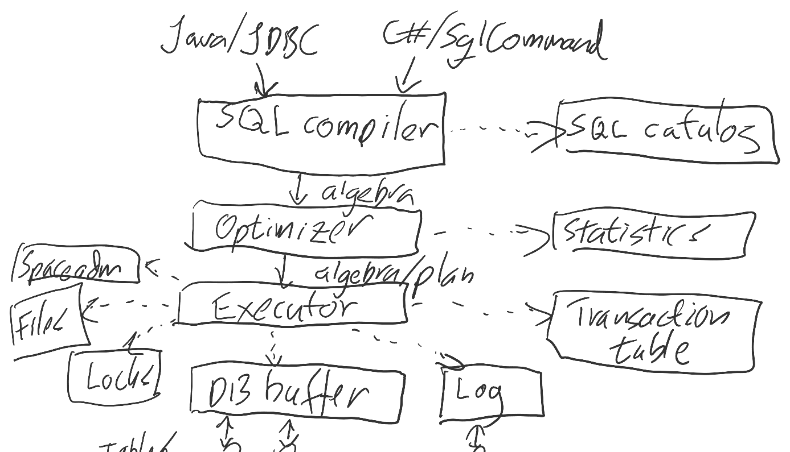


The SQL compiler takes SQL as input and returns tuples/records to the client. By using the SQL Catalog it can translate the SQL query to an algebra tree. The optimizer transforms the algebra tree to a more optimized algebra tree including a concrete access plan to the data using statistics about the data. The executor interprets the tree/plan and uses many modules in the system to execute the query and access data, logging transactions, locking data, etc. The database buffer keeps data in memory and will periodically write data to disk. The data is read/written as blocks, but the blocks contain data in the form of records being rows in specific tables. The data may also be indexes. The log is responsible for storing log records, which are used to let transactions be atomic and durable. Sometimes, the executor uses Just-In-Time (JiT) compilation, where queries are translated to machine instructions, instead of being interpreted. Most of these concepts will be explained in the rest of the course of TDT4145.

---

## 2. Database storage

A database needs to be stored permanently, i.e., it resides on a disk, either a SSD or a HDD (rotating disk). The database may be stored as a file in the file system in the operating system, or it may reside as «raw devices» on special partitions of the disk. The advantage of having special partitions is that the DBMS gets full control of the layout of the data. This is typically combined with the ability to have full control on when data is written to disk. Thus, the DBMS may have full control of what data resides in the buffer (main memory). The DBMS has more knowledge than the operating systems about which data should reside in the memory of the computer. The trend nowadays is to let the file system of the operating system do the file management, and to use operating system support for direct I/O and pinning (“locking”) data in main memory. SSDs have a different layout of files compared to HDDs. There are multiple tasks related to file management:

1. We need to know which data is related (belonging together) by having files. Thus, data needs to be linked together.

2. The free space of the disk needs to be managed. The DBMS needs to allocate and deallocate data as the database is “living”. To do this a special or standard data structure, like B+-trees, are used.

Further, in this text, we will not make any assumption about which solution is chosen, i.e., databases are stored in a device identified by a deviceId. We may think of a deviceId as a file name or as a native deviceId.

## 3. Record format

A traditional DBMS uses what is called a row store, in which every row of a table is stored as a record in the database. There are multiple possible record formats. The SQL catalog describes the format of the table. When the table has fixed length attributes, each attribute resides on a fixed offset within the record. Thus, to decode a record the DBMS knows where in the record each attribute resides. This is illustrated by the figure below: A record with 4 attributes.


When you have variable length fields, e.g., VARCHAR (or TEXT), we need to store the record differently. Below we show the «record vector» format, where each field of the record may be of variable length. The record is almost self-describing by having pointers to each field. Often this is combined with a special field telling the number of attributes, the number of keys, etc. Type information may also be combined with each field pointer. However, this is usually described in the SQL catalog.

---

110 Per Hansen perh

Another format to support variable length fields is to use delimiter characters to indicate the end of the field. The delimiter character is a special value used to show that a field is ending. This may also be supported by a special end of record character. Some databases also support column stores, where columns of the tables are stored together. This is used in analytical queries (aggregations) and makes compression of data more easy.

## 4. Block format

A block is a basic storage unit used by the DBMS to store data in a database. Every time the DBMS reads or writes data to/from the disk, it is in the unit of blocks. Very often the data is stored both on disk and in memory as blocks, such that it is easy to write or read data from the disk. However, higher level DBMS software typically sees data as collections of records, e.g., tables or results of queries. A block is usually identified by a BlockId, which may consist of a deviceId and an index into the device. A BlockId could be a 4 byte or a 8 byte field. With 4 bytes, one byte is used for the deviceId and 3 bytes to the index within the device. E.g., if each block is 16 KiB), each device may store 2^24 blocks of 16 KiB, which makes altogether 256 GiB (GibiBytes). By using 8 bytes identifiers, you may e.g. use 1 byte for deviceId and 7 bytes for offset, creating the ability to span really large devices. We may think of a block as a collection of slots, where a record is identified by (BlockId, slot number). This is often named as a RID, Record Identifier. Thus, a RID is a semilogical identifier, which identifies the block on the device, but which is logical within the block, creating the possibility to move a record inside the block using an appropriate block format. Note that a record could be accessed by a record key as well, e.g. in B+-trees, where the records are sorted according to the search key of the B+-tree. There are multiple possible block formats used in DBMSes. In its simplest form the fixed length records are simply aligned after each other, and the DBMS may calculate the positions by simple arithmetic using the RID and the record size found in the SQL catalog. If the records are of variable length, e.g., using VARCHAR attributes, we need a more advanced scheme. We may use delimiter characters of attributes and records. Delimiter characters are special values to show the end of an attribute and the end of a record. Another scheme used is to have a format as shown in the figure below. This allows for variable length records, for sorted records, easy delete and insert operations, etc. It is also possible to compact a block easily by «copying records downwards». This is done when a sufficient number of records has been deleted, and there are multiple “holes” between the records. Records (“tuples” in the figure) are aligned from the start of the block while the record pointer vector (“page directory” in the figure) is aligned from the end of the block. The page directory is sorted according to key value, with the smallest key at the end of the block, and the largest key at the other end towards the middle of the block. This means that the two data structures grow towards each other in the data block. In the

---

figure below the records are inserted in sorted order, since both the record vector an the records are in the same order. In addition to what is shown in the figure below, it is typical to support flip/flop, i.e., an atomic read/write stamp at the start and end of the block. These are numbers which should match when reading a complete block, preventing reading of half-written blocks. Thus, the numbers are updated prior to write of the block. There are other header fields of the block as well, used for identification, recovery purposes, and possibly checksums.

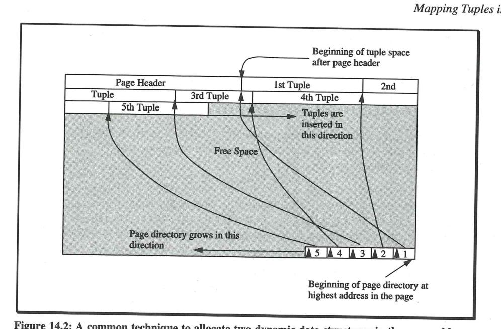

## 5. Database buffer

Blocks are read from the disk into database buffers to be used the DBMS. The database buffer is usually a large buffer comprising big parts of the main memory of the computer. Blocks are accessed on disk using the BlockId, which identifies the device or the file, and the index into the device or the file. When a block is residing in the database buffer, it is also identified by the BlockId, and there exists a hash index to find the block in the buffer. Blocks belonging to the same hash value may be chained together. The nice thing about this organization is that blocks may be read and written directly into / from the database buffer without reformatting any data. The DBMS likes to use its own database buffer instead of the operating systems virtual memory. The reason for this is that it gets full control of which blocks reside in memory or not. The DBMS knows more about the semantics of the data and how it is going to be used. Thus, it may use prefetching of data when it sees that a scan of a table is happening, for example. Another task that a DBMS needs to do is to force blocks to disk as a part of transaction processing. This means that it needs to write data blocks which are changed as a part of the processing of user transactions. More often, it needs to force log blocks as a part of transaction processing. This is treated in the last chapter of this report.

---

## 6. Heap Files

The most basic storage of tables is in heap files. The data in a heap is not ordered in any particular way. The records are simply stored in the order that they are inserted. A record in the file may be found by iterating through the records of the file. Thus, the operations on the file is to create and delete the file, to read, insert and delete records in the file, and to scan through the records of the file. When there are sufficiently many deletes to a heap file, a reorganization may take place. This will compact the blocks. There are multiple ways of implementing heap files. Usually, they use a linked list scheme where there are forward and backward pointers between the blocks. The pointers are BlockIds, i.e., logical pointers which may point to blocks in memory or at the disk. One way is to allocate blocks one at a time when necessary. Another way is to allocate multiple blocks at the time. The reason for this is that disks get more throughput when blocks of a file are allocated in sequence. Where to allocate blocks on disk is a separate theme. Operating systems (file systems) also have good support for smart allocation of blocks onto devices. Some implementations differ between full blocks and blocks having some free space. They will have two separate linked lists. Thus, it is easy to find blocks that have available space for new records.

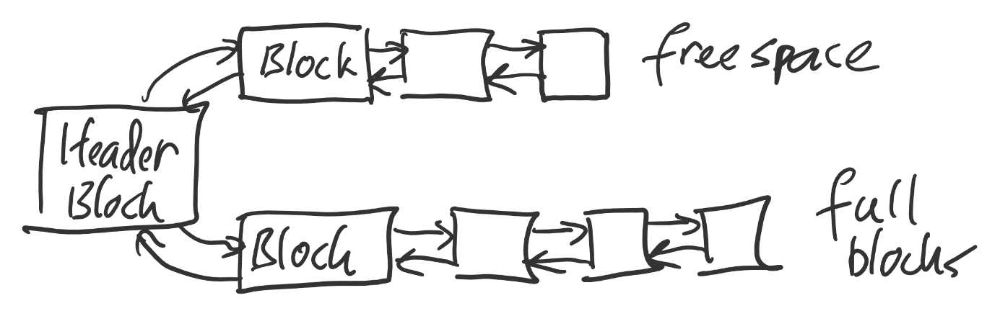

Heap files are mainly used to store tables when there is an index to the table, or it may be used to store records in temporary files during query processing.

## 7. Static hashing

Static hashing is hashed storage in its basic form. A file is composed of N blocks, which store the records. By applying a hash formula to the search key, the record is placed in a block of the file. The hash formula spreads the records evenly onto the blocks. To retrieve a record, the formula is applied to the key, and the appropriate block is found. A simple formula to use is h(K) = K mod N, where N is the number of blocks in the hash file. The essence to good hashing performance is to have a hash function which spreads records evenly. In case of skewed load on the hash file, the hashing is not performing very well. Anyway, it becomes a need to have overflow storage in one or another form:

---

1. Open addressing/internal overflow: Store the record in the first (or a fixed “hop”) successive block having free space.

2. Separate overflow/external overflow: Separate blocks storing overflow records. The overflow blocks may be shared among many blocks, or may be separate for each block needing overflow storage

3. Multiple hashing: Use another hash function to calculate the block to store the record. This may be considered as distributed overflow.

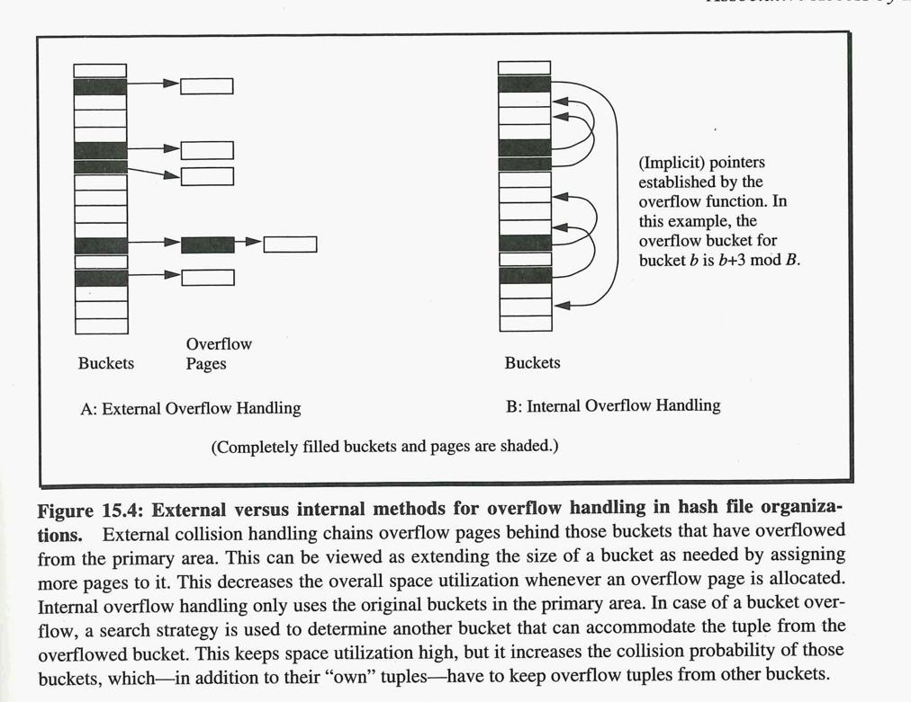

The figure above shows examples of two types of overflow handling. The left part shows the case where we have separate overflow pages which are not shared. The right part shows open addressing, where the same hash file is used for the overflow blocks (or pages as it is called in the figure). The main problem with static hashing is that it is not dynamic. This is a big problem when the number of records is hard to estimate, and it is a dynamic nature of the data. Long overflow chains kill the performance of static hashing.

## 8. Extendible hashing

Extendible hashing is designed to allow for dynamic hash files, i.e., a hash file where the number of records is not known in advance. When using static hashing the number of records must be estimated at start and the length of the hash file must be decided. When a block in a static hash file

---

becomes full, it is possible to double the length of the file and rehash all the records to fit the new file. However, this requires us to read and write every block of the file. Usually, overflow blocks are used to handle this situation. Extendible hashing uses a directory to point into the hash file. The directory points to the logical structure of the hash file, while the blocks in the hash file might be differently allocated. We describe the hash structure by showing an example. Assume a hash function h(K) = K MOD 16. Insert the following keys (K), where we have shown the key, the hash of the key in decimal and binary:

| K | h(K) | binary |
|---:|---:|:---|
| 4068 | 4 | 0100 |
| 1752 | 8 | 1000 |
| 3429 | 5 | 0101 |
| 2130 | 2 | 0010 |
| 2854 | 6 | 0110 |
| 1591 | 7 | 0111 |
| 2203 | 11 | 1011 |
| 1423 | 15 | 1111 |
| 3017 | 9 | 1001 |
| 2333 | 13 | 1101 |
| 3923 | 3 | 0011 |
| 4817 | 1 | 0001 |
| 4876 | 12 | 1100 |

We start by having a directory with 4 slots and 4 data blocks in the hash file. Each block has space for three keys. The key 4068 has hash value 4 (decimal) or 0100 (binary). The directory is indexed by the two last digits of the binary number. Thus, the key 4068 is hashed to block 0. After inserting the first 10 records we get the following hash file:

---

Global depth = 2

| Directory slot | Local depth | Keys |
|---|---:|---|
| 00 | 2 | 4068, 1752 |
| 01 | 2 | 3429, 3017, 2333 |
| 10 | 2 | 2130, 2854 |
| 11 | 2 | 1591, 2203, 1423 |

The number 2 attached to both the directory (global depth) and the data blocks (local depth) tells that we have used two bits in the hashing. We always start by having local depth==global depth. When inserting the 11th record (3923) we get a directory doubling. After inserting all 13 records we get this structure:

Global depth = 3 (directory slots sharing a block point to the same physical block)

| Directory slot | Local depth | Keys |
|---|---:|---|
| 000 | 2 | 4068, 1752, 4876 |
| 001 | 3 | 3017, 4817 |
| 010 | 2 | 2130, 2854 |
| 011 | 3 | 2203, 3923 |
| 100 | 2 | 4068, 1752, 4876 |
| 101 | 3 | 3429, 2333 |
| 110 | 2 | 2130, 2854 |
| 111 | 3 | 1591, 1423 |

After the directory doubling we use three bits for the hashing when inserting new records and when splitting existing blocks. We do the splitting by using the bits from the right (less significant bits), meaning the three last bits.

---

The insert of the key 3923 results in a block split. Thus, the keys in this block (11) are rehashed into two blocks (011 and 111). Thus, keys 1591 and 1423 are moved to 111 (7 in decimal), while the new key 3923 ends in 011 together with the existing key 2203. Similarly, for the insert of key 4817, it results in a split of block 01 to 001 and 101. Note that blocks that are not split retain their attached number, i.e. the local depth. The number attached to the directory is named global depth. When a block is full and we try to insert a new key and the local depth for the block equals the global depth, we get a directory doubling. Extendible hashing is regarded as a good solution to dynamic hash files. However, for lookups the directory result in two accesses to the hash file instead of one as in the normal case in static hashing. For many years the existence of a directory was considered as a problem, since it could become large compared to the size of main memory. Fortunately, hardware has evolved since that time.

## 9. Indexing

This chapter is intended as a definition of central indexing and storage concepts used within the course TDT4145 at NTNU. There are two reasons for doing indexing.

1. Improve retrieval speed when accessing through the indexed field.

2. Ensure uniqueness for the indexed field.

The disadvantage for doing indexing is that you need to update the index when doing inserts or updates of the indexed records. Index field: Field/attribute of the record/row that is indexed. Primary index: An index structure which indexes the primary key of the records/rows. Clustered index: Index on table where the records are stored physically in the same order as the index records. In practice this is a B+-tree or hash index where the records of the table are stored within the index itself. Secondary index: An index which is not a primary index.

Here we provide a list of typical storage and indexing alternatives when storing and indexing a table:

---

Clustered B+-tree/clustered index. There is a B+-tree index on the primary key. The leaf level in the B+-tree stores the actual records/rows of the table. Thus, it is a clustered index.

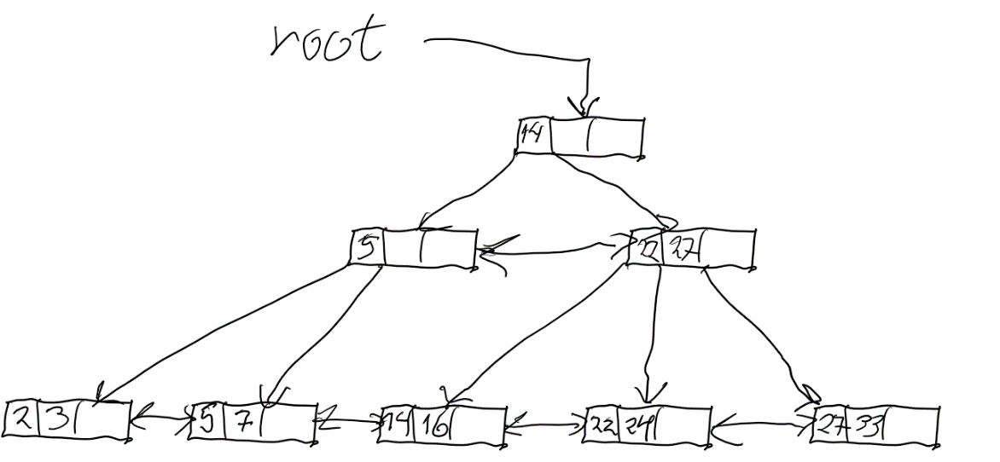

This alternative is used within MySQL's InnoDB storage engine. It is also the storage alternative used in Microsoft's SQL server when a primary key is defined for a table. There, it is called a clustered index or simply a clustered table.

Heap file and B+-tree. The table is stored in a heap file. There is a B+-tree index on the primary key. There may be a hash index on some fields of the records.

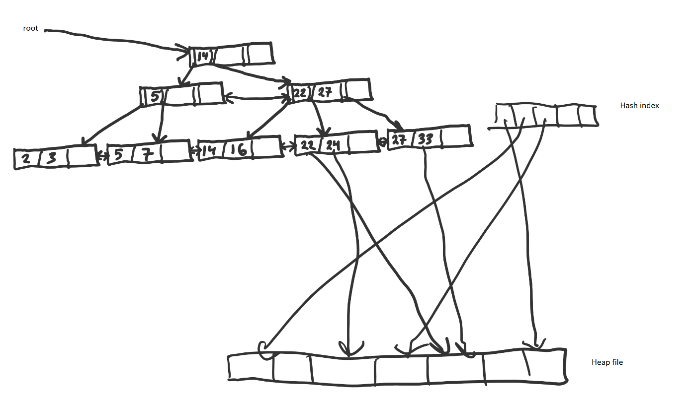

Heap file with a B+-tree index is used in MySQL's MyISAM storage engine. In MicroSoft’s SQL Server this is called a non-clustered index. The pointer from the index to the heap file is called a Record-pointer/RecordId or row locator in Microsoft SQL Server.

---

- Heap file. In MicroSoft's SQL Server you get a heap file when no primary key is defined for a table. A heap file is useful when you never do a direct access for a key or search for specific records, except for things like scan, join or aggregation.

- LSM trees (Log-Structured Merge trees). This is a modern access method which focuses on write speed over read performance. It keeps the latest written data in a main-memory storage area called MemStore. As new data is inserted, the current MemStore is copied into a disk-oriented structure SSTable. SSTables may be organized in multiple levels, where data is merged downwards in levels over time. This method is useful when you need good write speed and you mainly read the newest data. The LSM trees are regarded as having a superior write speed, due to low “write amplification” (how many disk writes an insert may cause) and due to better compression of data due to larger units, e.g. a SSTable may be 2 MB, while a B+-tree block may be e.g. 8 KiB. LSM trees are used in Google’s BigTable, Adobe Hbase, MongoDB’s WiredTiger and are present in SQL DBMSes, e.g. through Facebook’s MyRocks which is used as a storage engine in MySQL throughout Facebook. This is regarded as the data structure of “big data”.

- Column stores. Traditional SQL databases use row-oriented storage, i.e., each row in the table is stored as a record. Data warehousing requires a lot of aggregation of single attributes and takes advantage of a column-oriented storage of tables. This gives less data to retrieve and makes it much easier to compress the data. Several SQL databases have built in column- oriented storage in their servers.

- Clustered hash index. Hash index on the primary key. Clustered index storing the actual records/rows of the table, i.e. a clustered hash index. It is called a hash cluster in Oracle. Hash index

- AI-generated indexes/ Recursive model indexes. New research within using AI to create indexes has shown promising results, using machine learning on the data to be inserted to create a N step model, using a linear model to create an initial prediction of a Cumulative Distribution Function (CDF) of a sorted index, and using one of several cubic model for step 2, and so on. Usually, two steps are enough. The problem with this approach is that works on static data, and is currently hard to use in a world with dynamic data, e.g., like big data arriving continuously at high speed. There are some approaches that try to cater for this problem, like ALEX which has a different layout than other learned indexes at the leaf level, allowing for updates and insert without a complete rebuild of the model. Also string keys are problematic to index with AI.

---

## 10. B+-trees

This document is intended as a short description of B+-trees to be used within the course TDT4145 at NTNU. Its intention is to replace the text book on B+-trees. B+-trees are the most widely used access structures within databases. A B+-tree is a generalization of an ISAM structure where you have multiple levels. The advantages of B+-trees are that they are good for many situations, like sequential scans, range scans and they are good at direct access by search key as well. The main properties of B+-trees are that they organize the indexed keys in sorted order and that the tree is always balanced. Thus, they are good for inserts as well. The main disadvantage of B+-trees is that recent inserts tend to spread over the blocks of the tree, making large volumes of write load to the disk. Below we see an example of a B+-tree with two levels, where we only show the keys. At the leaf level (level 0) we see the actual keys which are indexed by the tree. At the level above (level 1) which in this example is the root level, we see keys which help us to navigate to the keys at the level below. E.g. the key 14 has one pointer on the left side. This leads to a block where the keys are less than 14. The pointer on the right side of 14 directs the search to a block where the keys are 14 or greater. The next key at the root block is 27, meaning that the pointer in-between 14 and 27 directs to a block where the keys are 14 or greater, but less than 27. Note that pointers here are BlockIds, and they point to the block, not individual records within the block. We may think of the leftmost pointer in the root (or at any level>0) as a special record with key minus infinity.

```text
root: 5 14 27

leaf level: 2 3 | 5 7 | 14 16 22 | 27 33
```

The keys at the leaf level of the tree may be records storing complete rows in a table (clustered index), or they may be indexed keys with a field pointing to a record in another (heap) file or tree. To illustrate some searches in this tree, we first search for key 3. We always start with the current root block. In this case 3 is less than the least key 5. We follow the link to the first block at the level below, the leaf level in this case. To search within a block, a binary search is usually used since the keys are sorted. In this case we find the key as the second key within the block. Note that a binary search first makes sense when the number of records is larger than the “toy” example used in this case. The second example is searching for the key 15. We start with the root block and find the pointer in between 14 and 27. When searching the leaf level block here, we do not find the key 15. Such a search may be used to return the position for inserting a new record with key 15. The next example searches for all keys greater or equal to 14. First, we do a binary search at the root block, and find the pointer to the right of key 14. This will point to the block with keys 14 and larger.

---

We scan the leaf level sideways starting with the block containing 14. This is one of the beauties with B+-trees, sideways traversals. Note that the pointers go in both directions, meaning that both forwards and backwards scans are possible. Thus, it is easy to evaluate queries including both “where attribute < 14” and “attribute > 14”. In addition, it is easy to deliver sorted keys when this is requested. Another strong point of B+-trees is that records may be inserted anywhere in the tree without any noticeable loss in efficiency. If there is space in a block when inserting a record, the record is simply inserted in that block. If it is not enough space, the existing records are divided in-between the existing block and a newly created block. This is called block split. Normally, half of the records are moved to the right in the newly created block in the split. What is stored inside B+-trees? This is dependent on if the tree is clustered or unclustered. In a clustered B+-tree the records at the leaf-level (level=0) are the same as the rows for the table being stored. That means that the primary key is the search key for the B+-tree. The records at level>0 will be (search key, BlockId). The search key in this case is the primary key. Each search-key will have a pointer (BlockId) to the BlockId containing the records equal or larger than the search key, but less than the next search key. In an unclustered B+-tree the records at the leaf level (level=0) will be (search key, References to record) or (search key [Set of references to records]). The last in case the search key appears in multiple rows of the table, e.g. ‘study program’ of a student table. The reference to the record may either be a RecordId in case the table is stored in a heap file. It may also be primary key to the record in case the row is stored in a clustered B+-tree or clustered hash file. On level>0 in the unclustered B+-tree the records are the same as in the clustered B+-tree, i.e., (search key , BlockId).

Insertions into B+-trees

We will show a "toy" example of insertions of keys into an empty B+-tree. An ordinary B+-tree would have many records/keys per block, e.g. 20 to 200. However, in our "toy" tree we have just a few. The following keys are to be inserted in the given order: 2, 5, 14, 22, 27, 33, 3, 7, 16 and 24. We assume blocks with space for 3 keys, and with 4 pointers in the blocks above level 0. After inserting the first three keys we get the following "tree":

```text
root: 2 5 14
```

The root is pointing to a single level 0 block. We try to insert key 22, but there is no space for this. Thus, we need to split the leaf level block. After splitting this block, we get the following tree:

---

```text
root: 14

leaf level: 2 5 | 14
```

At a block split we move half of the keys to the new (right) block, before we insert the new key. In this example it means that just one record is moved to the block to the right here (key 14). We always do the block split before inserting the new key, so that there is space for the new key. We never look at the key to be inserted when splitting the block. A new root block is allocated as well. In this root block we insert the split key, i.e. the leftmost key in the newly allocated block. The reason for this special algorithm is that split should both work for inserts of new data and for extensions of existing data (i.e. updates of VARCHAR/TEXT). In the latter case, there is no new record to insert. Additionally, this is also connected to recovery, where we want to let the split be redone before the record is redone and inserted. After inserting the two keys: 22 and 27, we get the following tree:

```text
root: 14

leaf level: 2 5 | 14 22 27
```

Now, the root points to a block at level 1. After inserting another two keys we get the following tree:

```text
root: 14 27

leaf level: 2 3 5 | 14 22 | 27 33
```

We got another block split at the leaf level. After inserting another two keys, we get the following tree:

---

```text
root: 5 14 27

leaf level: 2 3 | 5 7 | 14 16 22 | 27 33
```

We got yet another block split at the leaf level. Note that when splitting a block at the leaf level, we "copy" the split key to the level above. After inserting the last keys, we get a block split at level 1:

```text
root: 14

level 1: 5 | 22 27

leaf level: 2 3 | 5 7 | 14 16 | 22 24 | 27 33
```

Now, something interesting has happened. When splitting a block at a level above level 0, we "move" the split key to the level above. In this case it means that key 14 from level 1 has been "moved" to level 2. The reason for this is that level 1, 2 and above are merely providing directions to level 0, where the "real" indexed keys exist. Thus, we cannot move away a real indexed key from level 0 since it is a part of the user data in the database. We do not show deletions in B+-trees. Usually, this is done by compacting levels in the tree by a management thread and then deleting the empty blocks. However, some research papers have shown that delete-at-empty-block suffices, meaning that you do not need a separate management thread doing this, simply deleting a block when it becomes empty is enough. Composite keys When we have composite keys, i.e., search keys consisting of several attributes, the sorting in the B+-tree is according to lexicographic order. This means that the keys are first sorted on the first attribute of the key, and secondly on the second attribute, and so on. This means that it can be advantageous to make the order of the key attributes according to selectivity. The first attribute should be the key giving most selective distribution. An example could be the Employee table with attributes: Employee (ssn, dno, age, street, zip, salary, skill) An example query could be: SELECT * FROM Employee WHERE dno=4 and age>50;

---

In this case when using composite search key (dno,age), we will first search for dno=4, and afterwards scan the Employees to find the ones with age>50. An alternative is to use (age,dno) as search key. In this case we have to start the search at the first row having age=51 (if any), and then scan the B+-tree for all employees with dno=4. To know which is most selective, one needs statistics of the table. A guess here would be that department is most selective, depending on the number of departments existing. Fill degree of B+-trees The fill degree of B+-trees is regarded statistically to be 2/3, i.e. there will be unused space at the end of each B+-tree block. The reason for this property is that the keys should be sorted. If the keys are inserted in a strictly sorted order, the blocks may be filled more complete. However, this is only possible if you use generated keys in an increasing order. In regular B+-trees the fill degree is regarded as 2/3. This means that each block is filled approximately 2/3 in overall. To calculate how much you may fill a B+-tree block, we need some common rules. The traditional way is to let each block be filled 2/3, meaning that you will not exceed 2/3 in storage when filling the block. As an example using blocks of 4096 bytes (4KiB), and filling with records of 120 byte (recSize), we may use the formula, nRecs = floor((4096 * 2/3)/recSize) = 22. This means that 22 records will fill this block when we use 2/3 as our fill degree. When there is 10000 records in a table using this record size and blocks of 4KiB, you need ceiling(1000/22) = 455 blocks on level 0 to store the records. It is nice to have a common approach when solving problems with fill degree. Summary of B+-trees Some summarized concepts about B+-trees:

- The indexed records are stored at the leaf level (level=0). The blocks above the leaf level are merely used to navigate to the leaf level.

- The records/keys at one level are sorted.

- The block should at least be 50% filled. On average a block will be 2/3 or 67% filled when inserting keys randomly. Some text books operate with 69% fill degree (ln(2) = 0.69)

- The blocks have a size that fits the disk, typically, 4KiB, 8KiB, 16KiB or 32KiB.

- Blocks are disk-oriented and are traditionally read into memory in disk format. However, it is also possible to convert the disk format to e.g. Java objects when reading in a block, and opposite when writing the block.

- Search is performed from the root to the leaf level.

- Deletion in B+-trees are usually handled by compaction of blocks on each level. This may be done by a management thread running in parallel with user queries. Some researcher has suggested that delete-block-at-empty is sufficient, but this may leave a lot of blocks poorly utilized.

- In comparison to LSM trees, B+-trees are regarded to have superior read performance, but LSM trees have superior write performance.

---

## 11. LSM Trees

LSM trees were proposed in 1996 by O’Neil & O’Neil, but was popularized by Google through BigTable and LevelDB. The main advantage of LSM trees is their write performance. They are able to receive high loads of write / insert data. Thus, they are considered the data structure of the BigData age. The most well-known LSM tree is Facebook’s RocksDB, which is based on Google’s LevelDB and partly on Apache HBase. Facebook was originally using MySQL InnoDB a lot, but later replaced InnoDB by RocksDB for almost all usage through the MyRocks storage engine. RocksDB provides a key-value store where values are byte streams. Thus, to provide a high level storage you need to have a layer on top which provides records with fields/attributes, just like MyRocks. Below we have shown an overview figure taken from Facebook’s RocksDB documentation. The three basic constructs of RocksDB are memtable, SST files and logfile. The memtable is an in-memory data structure - new writes are inserted into the memtable and are optionally written to the logfile (aka. Write Ahead Log(WAL), treated in the Recovery section of this document). The logfile is a sequentially-written file on storage. When the memtable fills up, it is flushed (written) to a SST file on storage and the corresponding logfile can be safely deleted. The data in an SST file is sorted to facilitate easy lookup of keys. Inside the memtable and the SST files there are skiplists, which are used to search the sorted data. Skiplists are similar to B+-trees. Additionally, there is a Bloom filter which can answer if the key is potentially inside this SST file.

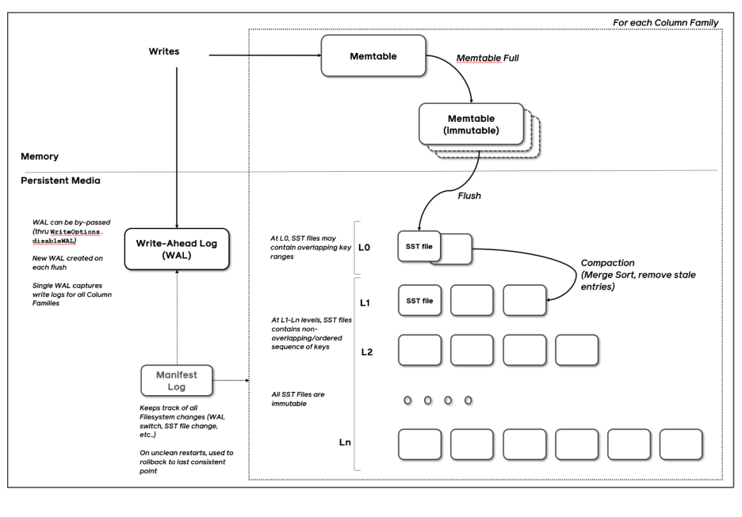

When the memtable is filled up, it is flushed to become a SST file. As data gets older it is merged down the levels of SST files. At the same time, the data is compacted by removing deleted entries. The main tool that RocksDB uses to improve write performance is the size of data to be written. The memfile is typically of the size 2MB, which is far more than a typical B+-tree block. Both SSDs and HDDs both take advantage of having big chunks of data written. For SSDs this done using parallel writes through many channels, while for HDDs this is done by writing this close on tracks of the rotating disk.

---

RocksDB has built functionality which makes it suited to be a storage engine. It supports group commit transactions by using a fsync (disk sync) call on the WAL, write-ahead logging segment. It also support iterators to do range scans throughout the different SST files. This topic is further treated in the TDT4225 course.

## 12. Queries and storage structures

The architecture of a typical DBMS for query execution is shown in the figure below. A query is received in SQL by a session manager which invokes the compiler which creates an algebraic version of the query. This is done by contacting the SQL dictionary to know the layout of the table and its attributes. If there are any indexes, constraints and so on. The query is sent to the optimizer which reads statistics about the table. E.g. the height of B+-trees, the smallest and largest key of an index, the number of blocks in a heap file, B+-tree, etc. Thus, it may calculate which is the fastest access way (or access path) of traversing a specific table for å given query. In addition to this, it will generate several execution plans for the query where the best one is chosen. This is usually considered “black art”, i.e. it is a complex process which uses a lot of tricks. E.g. it considers how join trees between multiple tables should be formed to minimize the number of data blocks to scan. The figure below shows an example of a logical query tree being translated into a concrete execution plan, where Select is translated into a Table Scan, and different join algorithms are used in the different parts of the tree.

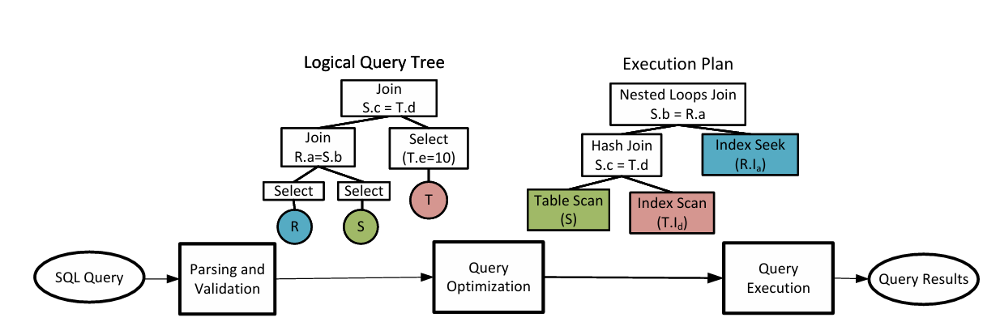

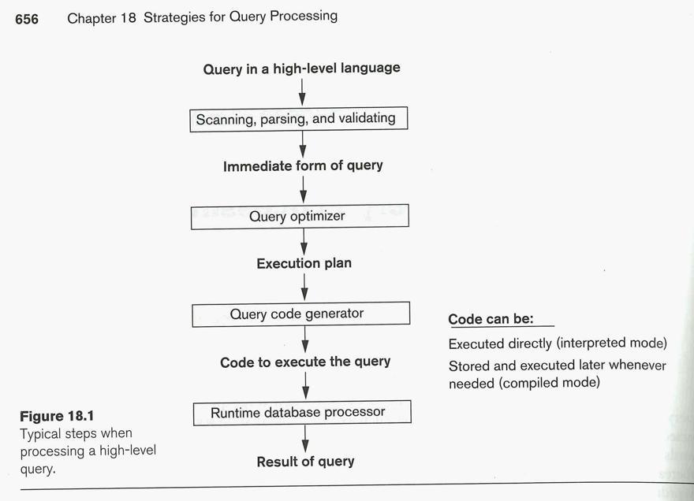

---

To illustrate the cost of executing a query we use some simple examples. More advanced things are treated in the course TDT4150 Advanced database systems. We will use the following storage alternatives for a table.

1. Heap file

2. Clustered B+-tree

3. Heap file and unclustered B+-tree.

4. Clustered hash index

Example To explain the concepts, we will use an example. Assume a table of employees: Employee (empno, name, age, depno, salary).

We assume there to be 100 000 employees in the table. Each employee record is 80 bytes. Each block is 4096 (4 KiB) bytes

1. Heap file:

We calculate the number of records per block = floor (4096/80) = 51 records. The heap file will contain ceiling (100000/51) = 1961 blocks of 4KiB (4096 bytes). Note that this is an example and the heap file is a useful starting point.

2. Clustered B+-tree

When inserting the same records into a clustered B+-tree there will be 2/3 filldegree. The leaf level (level=0) block of the B+-tree will contain floor (4096*2/(3*80)) = 34 records. Thus, there will be ceiling (100000/34) = 2942 blocks at the leaf level. How many levels will there be in the B+-tree? Usually, a B+-tree has 3 or 4 levels. In this case an index record in the B+-tree will be on the format (empno, BlockId). If we assume such a record to be of size 4 + 8 byte = 12 byte, we get 227 records in each block, i.e. floor ((4096*2/(3*12)). Level 1 of the clustered B+-tree will contain 2942 records because there is one record pointing to each block at the leaf level. Thus, there will be 13 blocks on level 1 because ceiling(2942/227) = 13. There will be 1 block on level 2 since this level contains just 13 records. The clustered B+-tree has 3 levels.

3. Heap file and unclustered B+-tree

The heap file will be the same as in the original with 1961 blocks. How big will the unclustered B+-tree be? In this case the records at the leaf level will be on the format (empno, RecordId). The RecordId may be assumed to be (BlockId, index within block). E.g. 4 + 12 bytes. If we say (empno, RecordId) together will be 16 bytes, the number of records within a block is 170 = floor((4096*2/3*16). Thus, there will be ceiling(100000/16)=589 blocks on level 0. Level 1 will contains the similar records as in the clustered tree (empno, BlockId) , thus each block will be 227 records (empno, BlockId). Thus, we need 3 blocks to contain all 589 records. And level 2 is one block containing 3 records. Thus, this B+-tree will also have 3 levels.

4. Clustered hash file

---

A hash file typically has 80 % fill degree. A block contains floor (4096*8/(10*80) = 40 records. Thus, a clustered hash file of the example table will contain ceiling(100000/40) = 2500 blocks.

Simple SELECT queries There are multiple types of queries. We consider some simple ones.

SELECT * FROM table; This is to select all records from the table.

1. (heap file) We need to scan all 1961 blocks.

2. We may scan the leaf level of the B+-tree, but we also need to traverse down to the leaf level. Thus, 2 + 2942 blocks (the leftmost block at leaf level needs to be read once).

3. Here, we may scan the heap file. 1961 blocks.

4. We need to read the whole hash file, 2500 blocks.

SELECT attributes FROM table WHERE key=constant; We assume the key to be the indexed attribute.

1. In average, we need to scan half of the heap file. Thus, 981blocks. We assume they key to be unique here. If they key is not unique, we need to scan the whole file.

2. We need to traverse down the B+-tree. Thus, 3 blocks. Binary search is used within each block.

3. We need to traverse down the B+-tree plus accessing the heap file using a RecordId. Thus, 3 + 1 blocks.

4. In a hash file the average blocks to be accessed is 1.2. This is due to some overflow blocks.

SELECT attribute FROM table WHERE key > constant;

1. The heap file needs to be scanned entirely. Thus, 1961 blocks.

2. Here, we need to traverse down the B+-tree, and scan forwards at the leaf level. If we assume that 20 % of the keys match, we traverse 2 blocks down and 0.2*2942 sideways. 591 blocks.

3. If we choose to use the B+-tree index, we need to traverse 2 block downwards and 0.2*589 = 118 blocks sideways. In addition, we need to follow all 0.2*100 000 = 20 000 pointers (RecordIds) to the data records in the heap file. Thus, in worst case, 20 000 + 2 + 118 = 20120 blocks. Then, it is better to scan the heap file, 1961 blocks.

4. We need to scan the hash file. 2500 blocks.

This was some simple examples. More advanced queries are treated in TDT4150 Advanced database systems.

---

## 13. JOIN queries

We will treat nested loop join. For join queries indexes are of little help, unless they are indexing the join key. In SQL databases usually multiple versions of join algorithms are present, like nested loop, hash joins and sort-merge joins. In this course we treat the simplest join algorithm, which is nested loop join. This is usually the fastest join algorithm, especially when the size of the tables to be joined is different. E.g. joining a small table with a big table. We show nested loop join by a simple example. If we add another table to our example Department(dno,dname,manager,location) we could consider a query like:

SELECT name, salary, location FROM Employee, Department WHERE Employee.depno=Department.dno AND dname=’Sales’; To illustrate this, we assume there to be 500 departments stored in 5 blocks in a heap file. We assume there to be 5 blocks in the buffer. Thus, in a nested loop implementation, we may use 3 buffer spaces for one table, 1 for the other table and 1 for holding a result block. Heap files. In a plain nested loop, we could read 3 blocks into the buffer from Department and then read 1000 blocks (one and one) from Employee. Then we read the last 2 blocks from Department and then scan the 1000 blocks of Employee again. In total we get 5 (Department) + 2*1000 (Employee) = 2005 blocks read. We do not say anything about the result, because we do not know the size of the result (i.e. how many Employees that work in the Sales department). If we switch the order of the tables, by reading the employee table into the 3 buffer slots, we get 1000 + (1000/3)*5 blocks. Thus, 1000 + 334*5 = 2670 blocks. It is considered as a general rule to have the smallest table in the outer loop of the nesting. If we consider the query in detail, we note that there probably will be few departments which are used in the join, possibly just one (dname=’Sales’). Thus, we may read this record from department first. This takes either 1, 2 or 5 blocks depending on the organization. This record / these records will certainly be contained within one block in buffer. Thus, we only need to scan the 1000 blocks in the Employee table. In total, e.g. 1001 blocks are read.

## 14. Merge sort

Sorting is important in databases. Many users search for ordered results. B+-trees order the data according to a search key, but some queries ask for ORDER BY attribute, where attribute is not necessarily the search key of any B+-tree, and it may be sorted based on a joined or aggregated result. When sorting large volumes of data, we typically use a method called merge sort. It is intended to be optimal when the data volume is larger than you may hold in RAM at any time. The idea here is to first partition the data (initial sort) by reading unsorted data into main memory buffers, and doing an

---

internal sort of this partition of the data. This data is written to disk to be stored in what we call a run or a “partial file”. In the sorting / partition (initial sort) phase we operate with the number of initial runs (n_R), the number of file blocks (B) and the number of buffer blocks (n_B). As an example we use n_B = 5, b = 1024, and then n_R = ceiling(b/n_B) = ceiling(1024/5) = 205. Thus, we have at start of the merging phase 205 sorted runs (files). So, the principle here is that the size of a run is limited by the data available in buffer at any time.

Reservoir/ Buffer runs

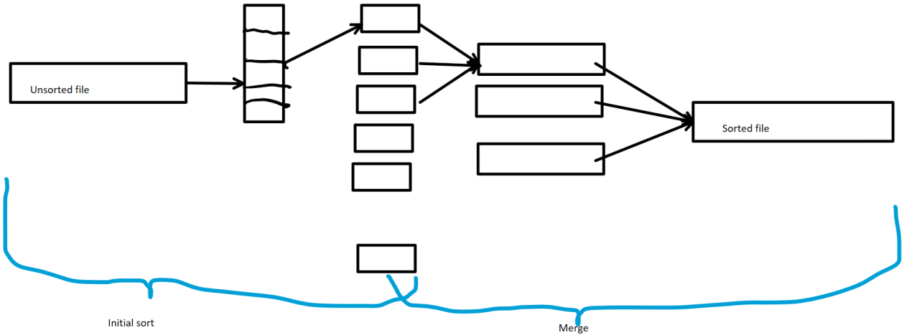

So, at the start of the merging, we have a number of runs (sorted files). The merging phase is somewhat more complicated. We operate with degree of merging, d_M, which is the number of runs that may be merged in each step. When we have 5 buffers, we may merge 4 runs and use 1 buffer for the sorted output. Thus, d_M is the smallest of (n_B - 1) and n_R. Then, we can calculate the number of passes of the merge. We use the formula ceiling(log_dM(n_R)), which calculates the height of the merge tree. In our case it would be ceiling(log_4(205)) = 4. Thus, we need to merge in 4 passes. Thus, we read the data and write the data in 4 passes, creating 8 times that we either read or write the data. So, the final I/O of the complete merge-sort is read-and-write-in-initial sort plus 4 times read and write in merge: 2*b + 8*b = 10240 blocks.

## 15. Introduction to Transactions and Concurrent Access of Data

Transactions are important in databases. They provide us with concurrency control when multiple users access the database concurrently. And they provide us with consistent access of data in case of failures and undo recovery. If you have a specific piece of work you need to do towards the database,

---

like transferring money from one account to another, or to order a travel where ordering all connections belonging together to form one logical operation, you need database transactions. When understanding concurrency in database, it is common to make some abstractions about database operations. We consider a database object, e.g. X, which is accessed by operations read and write. This is enough to understand concurrency between transactions. To understand recovery, we also need to know about commit and abort of transactions. The database object could be a data block or a record stored in the database. It is not very important when we discuss concurrency issues to know the granularity of database object, since concurrency issues may happen between database objects of any size. We have operations like r1(X) and w2(X), which means read of X by transaction 1, and write of X by transaction 2. We also have operations like c1 and a2, which means commit of transaction 1 and abort of transaction 2. As an example of concurrent operations we have two transactions, T1 and T2, which operate on the same bank accounts A and B. T1 transfers 100 dollars from B to A, while T2 increases the amount by an interest of 6%. Below, we have illustrated these two transactions.


Dependent on how these two transactions execute the operations when they intersect, we may get results that we do not expect. The following example gives us the correct result.

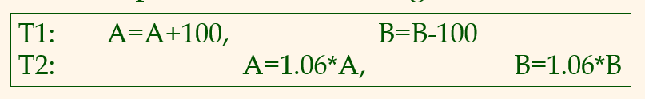

However, the following execution does not gives an intended result.

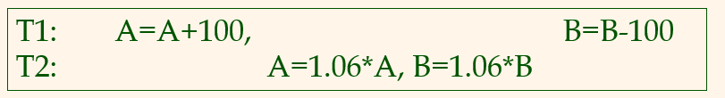

When inserting values here, you will see that the results are not as expected. The customers will earn by this and the bank will lose money. This will look as following when we do not see the details in the transactions of the computations:

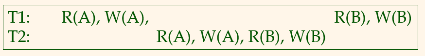

And written as follows when considering transaction schedules:

- r1(A); w1(A); r2(A); w2(A); r2(B); w2(B); r1(B); w1(B);

---

There are multiple classes of problems that may appear in concurrent access of data. For instance, when reading not yet committed changes, which is named dirty read. This may be dangerous, because the changes may be rolled back later.

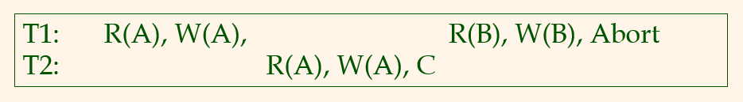

In the example we see that T2 reads A from T1’s changes and itself changes A and commits. Later T1 aborts the transaction. Thus, the changes made by T2 might be rolled back. Thus, this is a problem that should be avoided. Later, we will see that the isolation level, read committed, will solve this problem. The next problem we may see in concurrent access is what is called dirty write. One example is shown below:

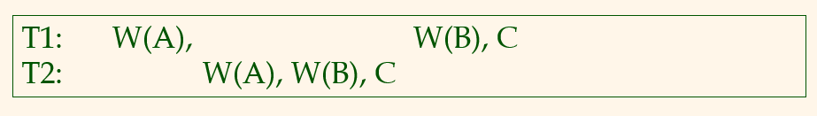

This could be two different transaction trying to update A and B to the same value. However, due to the succession of the operations, the values of A and B may be different, because in the end T1 has updated B and T2 has updated A. Another example showing the same, is the following: w1(buyer=‘Alice’); w2(buyer=‘Bob’); w2(invoice=‘Bob’); w1(invoice=‘Alice’); Two different transactions, T1 and T2, are registering the sale of the same item, and then both of them send the invoice in another set of writes. Thus, in the end Bob receives the item, while Alice receives the invoice for the item. The next problem is called unrepeatable read (or read skew). This is often discovered during nested loop, when data items are scanned multiple times. If the data set changes during each loop, you have a problem, and the result of the join would be strange. A simple illustration is shown in the figure below:

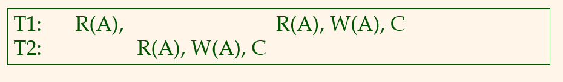

Here we see that T2’s read and write of A comes between two reads by T1 of A. The last example of trouble is called incorrect summary, and may be characterized as a summation where set of data values changes while doing the summary, or some other sort of aggregation. In the figure below this is illustrated:

---

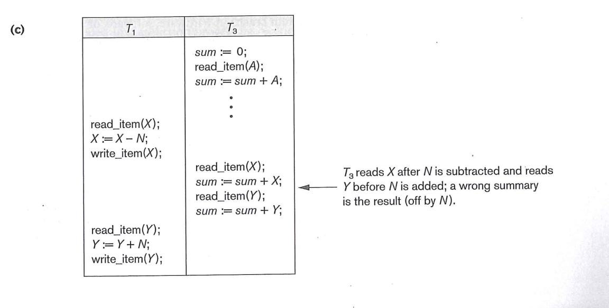

In the end the summary is wrong. Why do we need recovery? There are multiple types of errors that make the need for recovery. The first case is transaction rollback during normal operations (abortion). This may be due some unexpected circumstances. Missing data, i.e. the key that you are trying to get is not there, or simply the user decides that the transaction should be rolled back. At the same time the database system may decide that you need to roll back due to some deadlock or conflicts in the concurrency control subsystem The other way of recovery is called system crash recovery. This means that the database system was restarted due to some reason, like power outage, software errors or some operator error. The database does some kind recovery by “pulling itself up by its hair”, bootstrapping from a stored state on permanent storage. This usually means that the database system reads the log stored on disk and restore a consistent state of the database by re-applying log records (redo) and some ongoing (“in transit”) transactions will be rolled back (undo). Thus, any committed transaction will survive a crash, but non-committed transactions will be rolled back. The properties of transactions are usually described by the acronym ACID, where each letter stands for one property of transactions:

- A – atomic: Transactions run entirely or not at all. Commit or rollback (abort). Some people calls this Abortability.

- C – consistency: Transactions adhere to restrictions, like primary key, references, check, etc. Each transaction is a consistent change to the database.

- I – isolation: Transactions are isolated from each other with respect to concurrent operations. They should not notice other transactions when running.

- D – durability: Transactions are permanent when committed. They should not be lost after commit. This usually means to write something (i.e. the log) to disk.

A transaction is a grouping of operations that logically belongs together. It is often termed an elementary business operation. It may be a use-case in software engineering terms. Like ordering and

---

buying something. To draw a complete polyline. Inserting a complete set of points you have visited on a trip you have done. An insert operation that also needs to insert an indexing element. All of them need to be fulfilled, the transaction should not be partially done. A transaction ends with:

- COMMIT: Everything went ok and the transaction’s result exists in the database. Connection.commit();

- ROLLBACK (abort): The transaction rolls back (abort) and no changes from the transaction exists in the database. Connection.rollback();

- Autocommit: Each SQL-statement is a separate transaction. May be tuned off. Default, it is off in Python/SQLite3-API. It may set via isolation_level in the connection object.

SQL and Transaction Isolation Levels The SQL standard has defined SQL Isolation level, which may be set when interacting with the database. In Interactive SQL this is done through the command “SET TRANSACTION ISOLATION LEVEL”. The four different values belonging to the standard are “READ UNCOMMITTED”, “READ COMMITTED”, “REPEATABLE READ” and “SERIALIZABLE”. The standard is usually not followed by the different vendors, so you have to check with the documentation of your system.

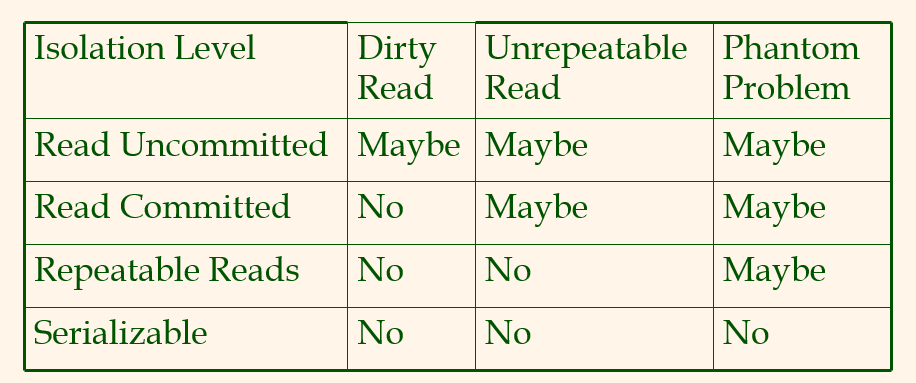

The interpretation of the different isolation levels are shown in the table above. The relate to the different concurrency problems that may appear when having concurrent access of data. Phantom problems relate to new records appearing while scanning tables. E.g. during a nested loop, new records appear in a later loop iteration. The table shows that increased isolation level (down the table) gives increased “correctness”, meaning you will get less problems with concurrency issues. At the same time you pay penalty by having less concurrency. When different transactions access the same data, and some of them update the data, they will in practice be serialized by serializable. The big problem appears when some transactions are scanning complete tables for read access, e.g. nested loop join, then others may have problem with writing or inserting some new items. Or the other way around, when some transactions are inserting data, others doing joins may have to wait. There has been a development in isolation levels and concurrency control in SQL databases. There is little agreement on the concepts and names used in these systems. Thus, we will try to describe the different concurrency mechanisms that are used in today’s SQL databases.

---

ACID is typical way of describing the concepts of transactions. The I of ACID is Isolation, which means that concurrently executing transactions are isolated from each other. The toughest isolation level used is serializable (name used in SQL standard), meaning that each transaction can pretend that it is the only transaction running on the entire database. The database ensures that when the transactions have committed, the result is the same as if they had run serially, thus, they have run after each other. The weakest usable level is READ COMMITTED. It has two properties:

1. When reading from the database, you will only see data that has been committed (no dirty reads).

2. When writing to the database, you will only overwrite data that has been committed (no dirty writes).

READ COMMITED is used as default in many databases, like Oracle, MS SQL Server and PostgresSQL. There are two ways used to support this.

1. Locking. The transaction sets write locks before writing a data item. Release of this lock is done at commit of the transaction. Before reading an item, the transaction sets a read lock on the item, but this read lock is released after the read is done.

2. Snapshot isolation. Most databases prevent dirty reads by keeping old values for writes until the transactions commit. Read transactions may read the old value. Only when the new value is committed do new transactions switch over to reading the new value. The idea is that each transaction reads from a consistent snapshot of the database — that is, the transaction sees all the data that was committed in the database at the start of the transaction. Even if the data is subsequently changed by another transaction, each transaction sees only the old data from that particular point in time. To keep single record locks would cost too much, since one writer may cause multiple readers to wait. This is also called multi-version concurrency control. Transactions use write locks, which are held until commit.

REPEATABLE READ is the next level of isolation. This is used to solve the problems of re-reading some items, such that they have not changed since the transaction read them previously. This isolation level is usually supported by the same mechanism as previously, i.e., snapshot isolation. Some databases calls this level SERIALIZABLE, other calls it REPEATABLE READ, and some use REPEATABLE READ to reference SERIALIZABLE. Thus, there is real confusion on these concepts. SERIALIZABLE means that transactions operate as they are running serially. However, they may run in parallel as long as their effect is like running serially. It is usually supported by using two phase locking (2PL). SERIALIZABLE isolation is usually regarded as the strongest isolation level. It guarantees that even though transactions may execute in parallel, the end result is the same as if they had executed one at a time, serially, without any concurrency. 2PL will be treated later in this document.

## 16. Transactions and Theory

Transactions may be viewed through theoretical properties with respect to recovery and concurrency. To do this we need to consider transactions through the concept of schedule. A Schedule (history) is a list of actions with operations:

---

read, write, abort, commit for a set of transactions. We have the following transactions examples:

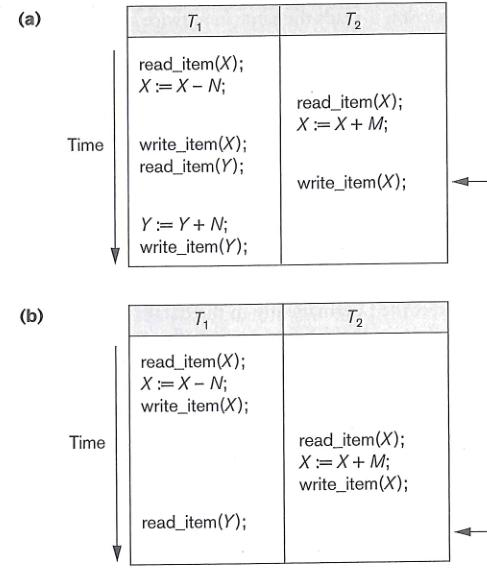

Those two transactions schedules may be written as:

```text
H_a: r1(X); r2(X); w1(X); r1(Y); w2(X); w1(Y);
H_b: r1(X); w1(X); r2(X); w2(X); r1(Y); a1;
```

when we assume that transaction 1 aborts. These are concurrent transactions which get their operations interleaved. What we see here is the database operations to read and write data. X and Y are data in the database. This may be data blocks or data records. To use this theoretical approach we need to define conflict. Two operations from a schedule are in conflict when:

1. They belong to different transactions.

2. They use the same data element

3. At least one of the operations is a write

H_a: r1(X) and w2(X) are in conflict. H_a: w1(X) and w2(X) are in conflict. H_a: r1(X) and r2(X) are not in conflict. Two operations are in conflict if change in sequence of operations changes the result on the database.

Transactions and recoverability

We need a way of understanding when transactions may be exposed to recovery based on dependencies between basic database operations. A schedule is considered recoverable when each transaction commits after every transactions that it has read from, have committed. An example of a recoverable schedule is the following:

```text
H1: w2(A); w1(B); w1(A); r2(B); c1; c2;
```

Transaction 2 has read from transaction 1 and r2(B) depends on the uncommitted w1(B). When the sequence of commits is c1 and c2, it is recoverable. In case the sequence of commits is c2 and c1, the schedule is not recoverable, because when c2 has committed, it is impossible to abort T1.

---

The next level is called Avoid Cascading Aborts (ACA). When transactions may only read values from committed transactions. H1 is not ACA, since r2(B) reads the result from the uncommitted w1(B). H2 is ACA:

```text
H2: w1(A); w1(B); w2(A); c1; r2(B); c2;
```

This is because T1 commits before B is read by transaction 2. Thus, transaction 1 will not abort in case transaction 2 aborts. The third level of recoverability is called strict. This means that a transaction may neither read or write over uncommitted values. An example of this is the following:

```text
H3: w1(A); r1(B); w2(B); c1; w2(A); c2;
```

The basic property achieved by this level is that we may do undo recovery by before images, meaning that undo may be done by storing the previous value in the log record for this operation. There is a set property between the sets of recoverable schedules:

```text
Strict ⊂ ACA ⊂ Recoverable ⊂ All schedules
```

This means that the set of strict schedules is a subset of the ACA schedules, and the set of ACA schedules is a subset of recoverable schedules.

Transactions and serializability

The concept we look at is the concurrency properties between operations in a schedule. We cover the concept of conflict serializable schedules, which is one of the numerous serializability definitions. A serial schedule is a schedule which do not interleave operations from different transaction. The transactions run in sequence. The transactions run after each other. A serializable schedule has the same effect on the database as a serial schedule.

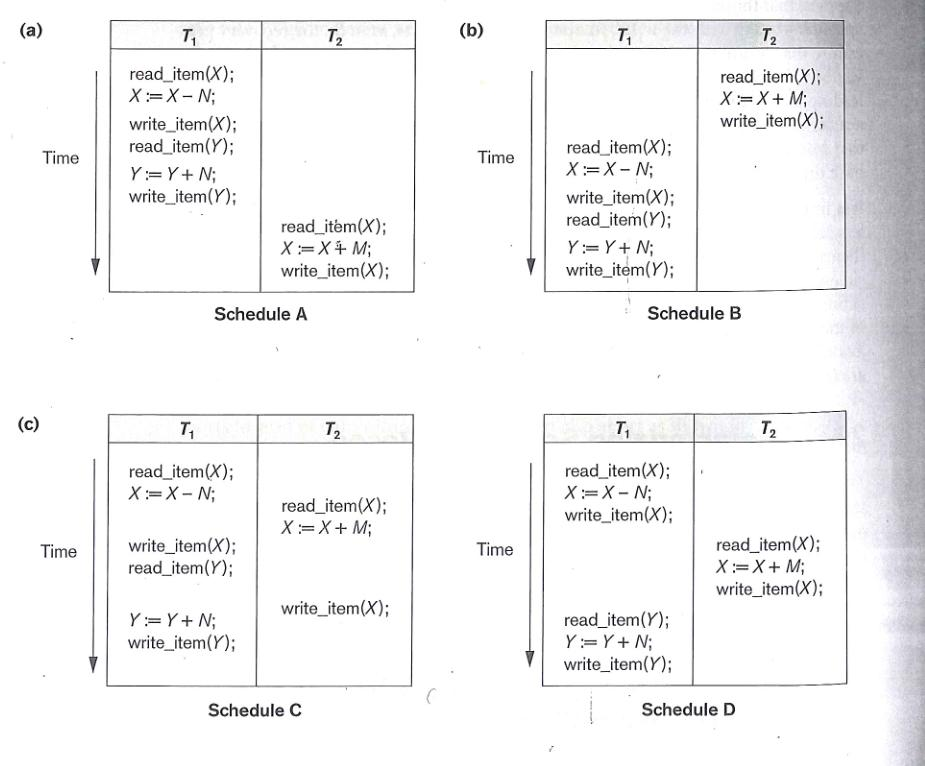

In the figure above we see four different schedules. Schedule A is T1; T2. Schedule A is both a serial and a serializable schedule. The same is schedule B. It is T2; T1. Schedule D is not a serial schedule, but it is a serializable schedule. It is has the same result as the schedule T1; T2. However, schedule C is neither serial or serializable. It is not equivalent to T1; T2 or T2; T1.

---

We want to have serializable and not demand serial schedules because we want concurrency. This is due to the wish to use parallel execution threads, since all modern computers support this concept. In addition we want to support use that needs to pause, due to reading data from disk or other external devices. So that other threads may come in and run.

Conflict serializability

We have conflict between two operations when they belong to different transactions and access the same data item and at least one of them is a write:

- r1(A) and w2(A)
- w1(A) and r2(A)
- w1(A) and w2(A)

Two schedules are conflict equivalent if they have the same sequence of operations which have conflicts. A schedule is conflict serializable if it is conflict equivalent to a serial schedule. Conflict serializability implies serializability, but the opposite does not hold. This means that conflict serializability is an important property since it is tightly connected to using locking to achieve serializability. This is a simple way of implementing serializability, but it is often considered a costly way of doing this, since read locks block possible writes to the same element. In the figure above with the schedules (a) to (d), we see that in schedule (c) there is a conflict between r2(X) and w1(X), and in the same time there is a conflict between w1(X) and w2(X), making the schedule non-serializable.

Precedence graph

There is a technique that may be used to check if a schedule is conflict serializable. We use a directed graph where the nodes are transactions in a schedule H. If there is an operation in T1 which is conflict with an operation in T2, and the operation in T1 happens before the operation in T2, there is a directed edge from T1 to T2. When constructing the precedence graph for a schedule H, we may tell that the schedule is conflict serializable when there is no cycles in the precedence graph. This is an important property to check if a schedule is conflict serializable, and it may be used to prevent cycles by using locks of data items. As examples of this, consider the following two schedules:

- H1: r2(A); r1(B); w2(A); r3(A); w1(B); w3(A); r2(B); w2(B);

- H2: r2(A); r1(B); w2(A); r2(B); r3(A); w1(B); w3(A); w2(B);

We have two examples of schedules there we may construct the precedence graph.

---

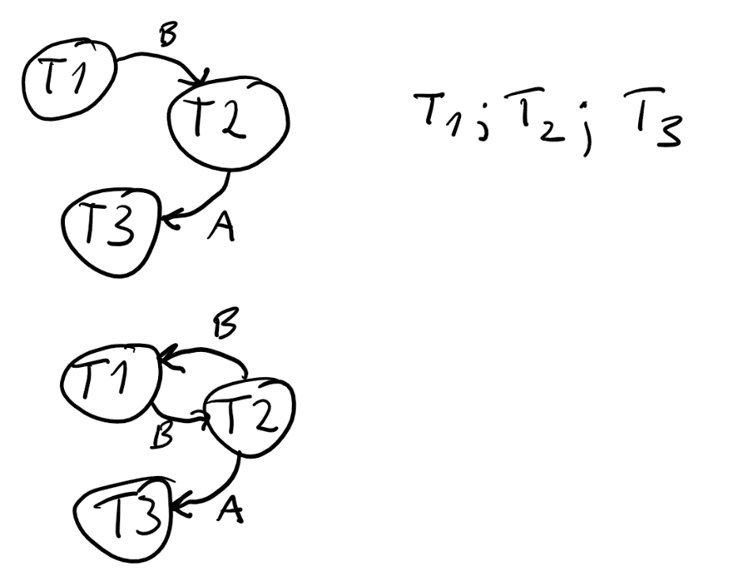

The first graph (H1) has no cycles, so the schedule is conflict serializable, and it is conflict equivalent to the schedule T1; T2; T3. The other graph (H2) has a cycle, and thus it is not conflict serializable.

## 17. Transactions and Concurrency Control

We may use locking of data elements to ensure conflict serializability. We use two different locking types. Read_lock (X), which may be a shared lock between different transactions having read lock on the same data item. We also have Write_lock (X), which is an exclusive lock, meaning that only one transaction may have this lock, and no other transactions may have a read lock on the same data element at the same time. It is also possible to do upgrades or downgrades of locks. A Read_lock may be converted to a Write_lock in case there are no other locks on the same data element. And a Write_lock may be downgraded to a Read_lock. The most common way to implement locking is to use a locking table which is held in primary memory, since usually there are few locks compared to the number of data items. We have different levels of locks: – Record locks – Block locks – Table locks – Range locks (avoid phantoms) – Predicate locks (avoid phantoms) Modern databases typically use record and range locks. As an example of setting locks, use the following sequence of basic database operations:

---

- w2(B); r2(A); r1(A); r1(B); r3(B);

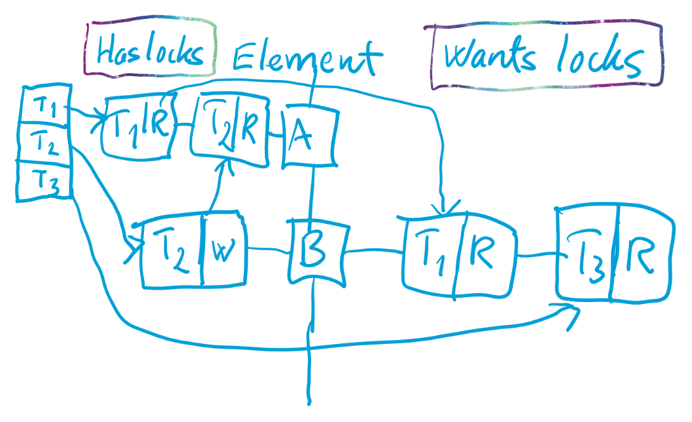

Each active transaction will have an element in a transaction table (Trans.tabell). From this one all locks may be reached by following a list (blue arrows). Each data element that is locked is kept in another data structure, where we usually just lock a signature instead of a complete key. A signature is a hashed version of the key, usually stored in an integer of fixed length (8 bytes). Some different keys may end with the same signature, but this is so unlikely that it has no effect on the structure. On one side of the element, there are the locks that are achieved (“Has locks”) and on the other side there are the locks that is yet to be achieved (“wants locks”). When using two-phase locking, locks will be removed when the transaction commits. 2PL To achieve serializability, two-phase locking (2PL) is a common solution to use. A transaction has two-phase locking if all locks are set before any lock is unset. Below we show an example of how this

---

works. Transaction 1 and 2 run concurrently and access the same data element X.

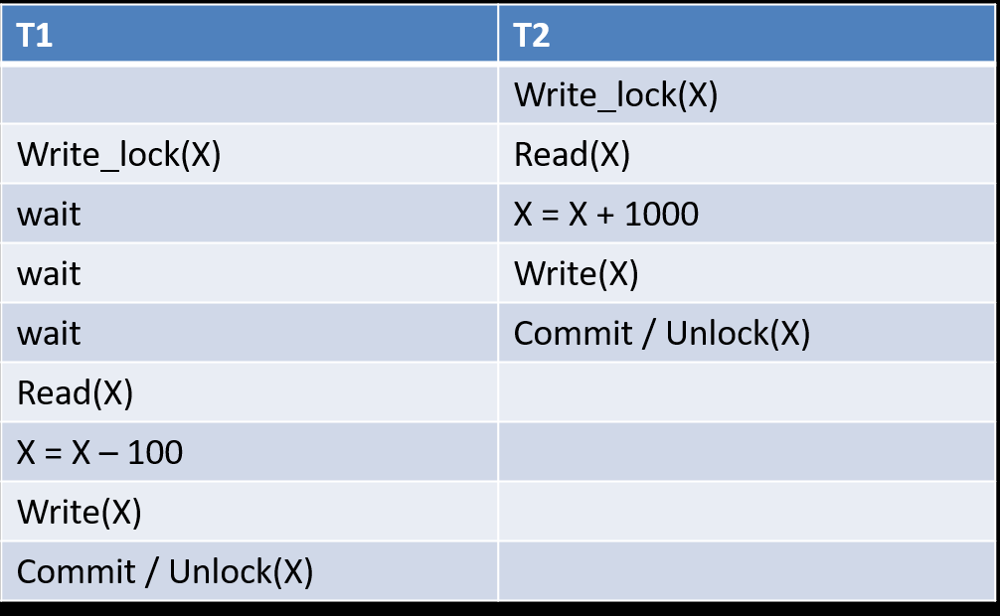

T2 gets an exclusive lock on X (write_lock(X)). When T1 tries to write_lock X, it has to wait. When T2 commits, it releases its locks. Then, T1 will be waked up and may continue its execution. Another possibility is that T1 gets a rollback, e.g. on a timeout. This is also OK, as T1 may later be restarted. In the figure we have shown what happens when it gets executed immediately after T2 releases its locks. The nice property of two-phase locking is that it implies conflict serializability. This is an important property for transaction to achieve correct execution, i.e. in the sense that it has semantics like a serial execution.

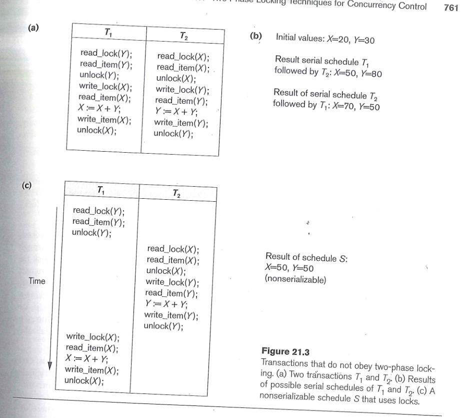

To illustrate that 2PL has meaning, we show an example. In the figure above we see two transactions T1 and T2. Depending on the interleaving of operations, the result of the executions are different.

---

When we have T1; T2, the values of X and Y become 50 and 80. When we have T2; T1 the values are 70 and 50. In the c-alternative where the operations are interleaved, the result is that X becomes 50 and Y becomes 50. This schedule is non-serializable schedule and it does not obey 2PL. If the schedule in c used 2PL, a deadlock would probably appear, since T2 would wait on T1’s readlock on Y, while T1 would wait on T2’s readlock on X. There are some different models for 2PL:

- Basic 2PL: «Symmetric mountain»

- Conservative 2PL: Locks everything you need in advance.

- Strict 2PL: Unlock of write locks after commit/abort. Read locks are released prior to this.

- Rigorous 2PL: Unlock of all locks after commit.

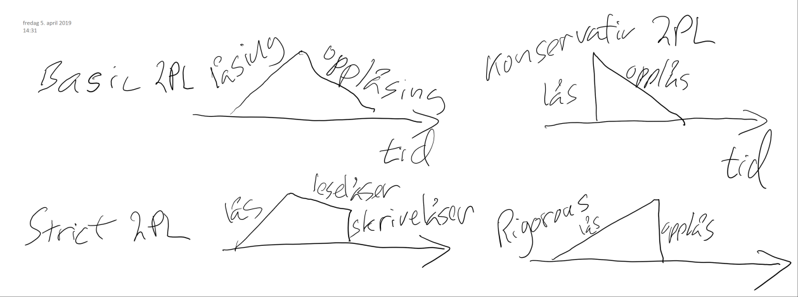

The figure above tries to illustrate the four different versions (in Norwegian). The X-scale is the time. The two most used models are Rigorous and Strict 2PL. It is very simple to release all locks after commit. The nice property of conservative 2PL is that it avoids deadlocks, but it requires that all locks are set before executing. This allows for less concurrency. And it may be hard to estimate which locks are needed before executing your program. It may be dependent on the execution. Deadlocks One problem with locking is that deadlocks may appear. Two or more transactions mutually wait on each other’ s locks. T1 T2

Read_lock(X) Read_lock(Y)

Write_lock(Y) Write_lock(X)

If T1 sets readlock on X, and T2 then set readlock on Y, we will get a deadlock. T1 waits on T2’s readlock on Y, while T2 waits on T1’s readlock on X. There is no way of resolving this, except to abort on the transaction. There are three different waits of solving the problem of deadlocks:

1. Avoid deadlocks

---

2. Discover and resolve deadlocks

3. Use timeouts and abort transactions.

To avoid deadlocks we may use conservative 2PL, where all locks are achieved beforehand. Another general solution is to order all resources, such that all locks are achieved in the same order. Both of these approaches are hard or impossible to achieve in databases. Thus, approach 2 is most commonly in use of commercial databases. By using the lock information in the locking graph, we may discover deadlocks by regularly checking for cycles in this graph. In case we find a cycle, one of the transactions involved in the cycle may be aborted. If this resolves the deadlock, everything is fine. When the database is distributed, this become more complex, because you may have deadlocks globally. Thus, locking graphs (often called wait-for-graphs) must be distributed between all computer nodes of the system. This is outside the scope of this course. The third solution is to use timeouts. This is a very simple solution. Since if a transaction executes too long, we assume it is in a deadlock, and it will be aborted. The hard thing with this solution is that it may be hard to estimate what the timeout values should be. Some transactions do a lot of work and need more time to execute than the simple transactions. Lock setting during execution To illustrate how locks work, we will run some examples of lock setting (2PL rigorous) when the database receives a series of operations to be executed. The first example we use is the following:

- H1: r1(A); w2(A); w2(B); w3(B); w1(B); C1; C2; C3;

This is a sequence of operations to be executed by the scheduler of the database system. Each operation will first try to set a lock on the data item, then it will execute the operation. Each transaction runs in sequence. However, different transactions may be interleaved and be executed in another sequence than what is given to the scheduler. This is due to some transactions have to wait for other transaction’s locks.

---

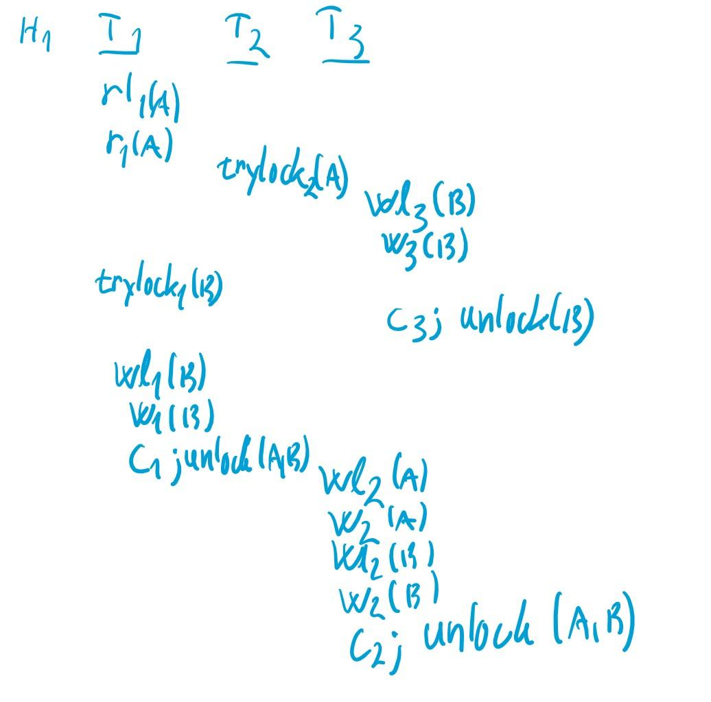

When a transaction 1 tries to set a lock and it has to wait, we write trylock1(B). This transaction will be resumed when the transaction that holds the lock on B, releases its locks. This happens when transaction 3 commits. We have another example with a different outcome:

- H2: r1(A); w2(B); w2(A); w3(B); w1(B); C1; C2; C3;

---

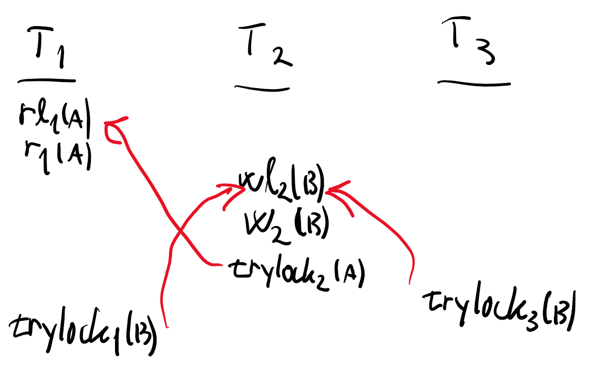

In this case we will have a deadlock between transaction 1 and transaction 2. T1 waits on T2’s B-lock, while T2 waits on T1’s A-lock. Additionally, T3 waits on T2’s B-lock. So, no transaction may continue, and the only solution here is to abort one of the transactions, e.g. T2.

Multi-version concurrency control (or SNAPSHOT ISOLATION).

Traditionally, multi-version concurrency control (MVCC) is based on what is called timestamp versioning. However, modern databases use multi-version CC through what is called SNAPSHOT ISOLATION. This is created to allow reads to happen while some other transaction is holding a write lock. This is done by letting the read use an old version of the data item being locked. As soon as the new write is committed, it will be allowed to be used by any new transaction. However, old transactions will use the old version of the data item. As an example of this consider a bank example:

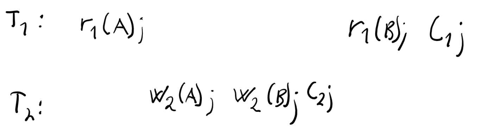

In this case Transaction 1 reads the balance from two accounts, A and B. At the same time Transaction 2 transfers 100 dollars from account A to account B. If T1 reads the current value of account A and B in both cases, it will make an inconsistent read, in the sense that it has 100 dollars more in sum than what exists. In this case, using SNAPSHOT ISOLATION, the operation r1(B) will read the old version of B, prior to the update w2(B). Thus, the reads of T1 will be consistent. Any transaction starting later than C2, will read the new version of B.

---

## 18. Recovery in Databases

Recovery in databases has two different forms. Firstly, it is used when rolling back transactions in case of transaction failures or user actions. This may happen due to missing records or locking causing deadlocks. Secondly, it is used when the database management software crashes in some way. This happens due to software errors in the database software itself, or due to management errors done by the database administrators. Sometimes it happens when there is a power outage or hardware failure. The recovery manager is responsible for both atomicity and durability for transactions. Transactions are either committed or they are aborted, they are never left half-done. This is to ensure that users have a reliable way of doing their work. Transactions are considered to enter a consistent database, and to leave the database consistent when they are committed. Thus, consistency in databases is usually meant to be a user concept, where the data is left consistent in the eyes of the user. Durability is ensured to make the user confident that their data is never lost when using the database. In this document we will mainly treat the ARIES recovery algorithm created by C. Mohan and IBM Almaden research center in the years approx. 1985-1992. This is regarded as the most standard way of doing recovery and it is fairly structured and easy to understand. It is used in many of today’s SQL databases. ARIES has three main concept it brings along with it:

1. Write-ahead logging (WAL): Log records must be written to stable storage (disk) prior to data blocks (pages used in ARIES terminology). It also forces-log-at-commit, meaning that the log records of a transaction are written to stable storage at commit time.

2. Repeating history during redo. At recovery time log records are redone until the point of the last registered log records. Then, transactions which were not committed at the crash point, are undone.

3. Logging undo. When undoing a log record, a compensating log record is created and this is redone. This is important to create record level locks, and to prevent a log record to be undone multiple times in case of repeated crashes.

Winners and losers At crash recovery we divide the transactions into two groups: Winners and losers. Winners are those transactions that managed to commit before the crash, meaning that their log records were written to stable storage prior to the crash, including the commit log record. Losers are those transactions that did not get their commits written to stable storage before the crash. Thus, we can not know what the rest of transaction was supposed to be. Thus, we have no other way of making a consistent database than to abort the loser transactions.

---

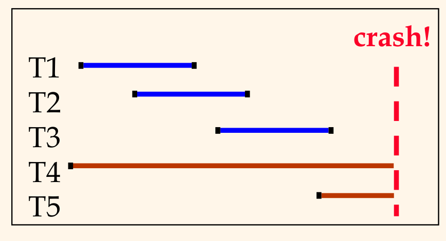

In the figure above, we have shown the transactions which are winners (T1, T2 and T3), and two transactions which are losers (T4 and T5). The figure illustrates the life line of the transactions, where blue bars indicate the lives of transactions which committed, meaning that the commit decision was logged in stable storage.

Force and steal

Recovery algorithms are tightly connected to transactions and buffer algorithms. A classification of different recovery algorithms may be done based on two different properties of how blocks in the buffer are handled:

Force: Must a data block be forced to stable storage at commit time. The alternative here is no-force, which usually means that the redo log is forced to disk. The data block may be written some time in the future. The question is – when must a block be written to stable storage?

Steal: Is it possible to steal a slot in the buffer from an active transaction, even if the block is “dirty”, meaning that it is modified, but not yet written to stable storage. If you do not support steal, an active transaction must hold all its modified blocks in the buffer until commit time. The question is – when may a block be written to stable storage?

It is possible to construct a two-times-two matrix showing the different classes of recovery algorithms:

| | No-steal | Steal |
|---|---|---|
| Force | Shadowing | Undo-logging |
| No-force | Redo-logging | Undo/redo-logging (ARIES) |

In this document we will focus on ARIES, which is an algorithm having both undo and redo logging, which shows that it is a No-force/steal-algorithm. Another noteworthy approach is shadowing, which is a recovery approach not using logging at all. It is based on copying data blocks when changing them, and do a massive commit by switching to the new data at commit time. This is regarded as an old-style type of recovery. Modern SQL databases use both undo and redo logging. The log The log is used to register changes done to the database. This means that read operations are usually not logged. The log is a sequential data structure, where new log records are created at the end (or tail) of the log. Every log record is identified by a LSN – log sequence number. This is an ever increasing number which is unique to each log record (and change to the database). There is a tightly connected number, called PageLSN, which are attached to each data block of the database. The

---

PageLSN is the LSN of the latest log record being applied to the block. The log records are created for the following operations: Update: This may be an insert, delete or update operation. After being applied to the block, the block’s PageLSN is updated with the log record’s LSN. Commit: When a transaction commits, a commit log record is created and it is force-written to the log device, creating a Durability property of the transaction. Thus, a transaction may be redone to the database as soon as the transaction has been committed. Abort: When a transaction is aborted, an abort log record containing the transaction ID is created. Undo the transaction is initiated after the abort. CLR (compensating log record): This is great invention, meaning that undos are logged with a compensating log record. Thus, undo does not set the state of the database backwards, by resetting old PageLSNs or similar, it simply creates an operation with the opposite intention than the one being undone. The figure below shows some of the main logging concepts (Norwegian text in the figure). There is a log buffer which contains sequential log records which all are written to the log device. The latest log record to be written to the log device is denoted by FlushedLSN. Inside a data block there is a special field called PageLSN, which tells the LSN of the latest applied log record to the block. The data blocks are written to a data device, which usually is another disk than the log device.

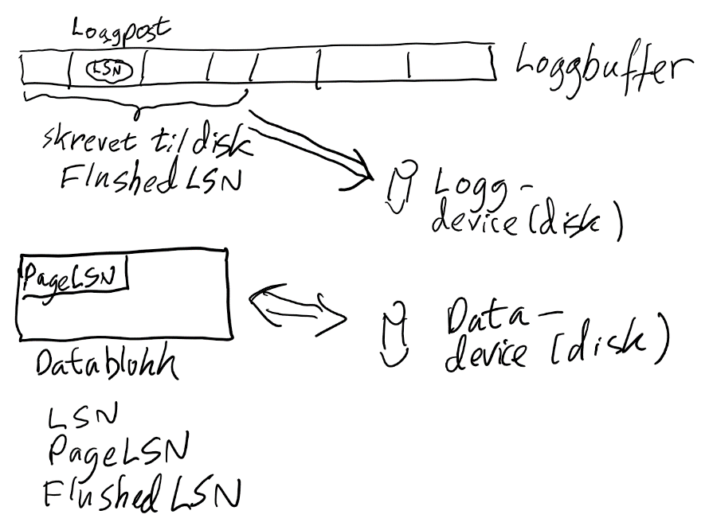

A log record has the following, generic structure:

```text
(LSN, TransID, PrevLSN, OpType, PageID, Offset, BeforeImage, AfteImage)
```

The PrevLSN is used to link log records for the same transaction backwards, meaning that the PrevLSN field points to the previous log record of the same transaction. OpType may be thinks like insert, update and delete. PageID is the Id of the effected block. (Page in ARIES terminology). Offset is an identification of where inside the block the record is located. This may also be a key to search for the record inside the block. BeforeImage is the value of the changed bytes before the update, and AfterImage is the value of the bytes after the update. This may be a complete copy of the record in question, or it may the changed field of record, all depending on how advanced the operations are

---

implemented in the DBMS. Some operations do not need the BeforeImage (e.g. insert) and some do not need the AfterImage (e.g. delete). The log buffer itself is usually a circular buffer, where log records not longer needed to be used may be removed from the buffer. There is a separate field of the log buffer usually called FlushedLSN, which is the newest log record being safely written to the log device. This is used in case of steal, meaning that we need to check that undo log is written for a dirty data block in the buffer, so that the WAL rule is kept. The only problem with the circular log buffer is long-lived transactions, where log records survive a long period of time. These log records may be handled by a technique called ephemeral logging. Ephemeral logging is a technique for managing a log of database activity on disk. It does not require periodic checkpoints and does not abort lengthy transactions as frequently as traditional logging for the same amount of disk space. Therefore, it is well suited for highly concurrent databases and applications which have a wide distribution of transaction lifetimes. This is done by keeping generations of log records in separate spaces. It manages the log as a chain of queues to which new records are continuously added. It performs continuous garbage collection and log compression. Compensating log records (CLR) A compensating log record is created when undoing an update operation performed during transaction rollback (abort) or during crash recovery when undoing loser transactions. The CLR lets undo be a roll forward operation, which allows a higher degree of concurrency for the data. Since you roll forward, other operations performed to the same block, may be done concurrently. So the PageLSN will be updated to the CLRs LSN during the undo. The undo process may use the PrevLSN of the non-CLR as the next log record to compensate for in the rollback of this transaction (non-CLR is used for the log record being compensated for). The CLR may be redone, in case of repeated crash, but it will never be undone. Data structures used in recovery There are two different data structures which are in active use in ARIES during recovery from crash. These data structures are also checkpointed in the log on a regular basis. The transaction table is used to register the state of active transactions (active, committed or aborted). In the latter two cases the transaction will be removed after the transaction has entered into this state. Additionally, the transaction will have a LastLSN field, which points the latest log record produced the transaction. The Dirty Page Table (DPT) is a data structure being special to ARIES. It is used to reduce the necessary redo work during crash recovery. It contains one entry for each dirty block (page) in the buffer and the LSN of the first log record which made it dirty. This means that this log record is the oldest log record that may potentially have to be redone during recovery to this block (page). Write-Ahead Logging (WAL) Write-ahead logging often means two different concepts.

1. Undo log. You must write the log before the data block, e.g. when writing a dirty data block to disk, you first need to ensure that the log necessary to undo any operation to the block is also written to disk firstly.

2. Force-log-at-commit. This means that the redo log must be written to disk at the commit time, so that the durability property of the transaction is maintained. Forcing the log to

---

disk is considered much more light-weighted than writing the data to disk, since the log is small data structure with a sequential property, both in the buffer and on the disk. Checkpointing During normal operation it is created checkpoints in the log on a regular basis. The intended outcome of the checkpoint is to reduce the amount work to be done during crash recovery. In ARIES a begin_checkpoint log record is created and stored in the log. Then, the transaction table and the DPT are scanned and copied into an end_checkpoint log record. In addition to this a special record, often called the log anchor, is created to know where in the log the latest begin_checkpoint log record is located. At recovery time this point is found and the transaction table and DPT may be read from the checkpoint, and in addition to the log found between the begin_checkpoint and the end_checkpoint. This technique is usually called a fuzzy checkpoint, meaning that concurrent transactions may exist while the checkpoint is created. Older checkpointing techniques stopped the database activity while creating the checkpoint, creating a transaction- or action-consistent checkpoint. Another common checkpointing techniques is penultimate checkpointing, where data writing is coupled with log writing, ensuring that all data referenced in the log is written to disk until the penultimate checkpoint, i.e. the next newest checkpoint. But in ARIES, the checkpoint registers which transactions were active at the checkpoint time, and which log records had made the blocks dirty. Thus, we may limit the redo work of recovery, and we may limit the need for reading old log to reestablish the transaction table. What is special about ARIES is the decoupling of data writing from log writing. The data writer goes in the background decoupled from the commit and log activity, except for ensuring WAL. This means that it has to check that the (undo) log is written for the blocks that is written, e.g. check that FlushedLSN is larger than PageLSN. So at recovery, the only information about data writing we can find is in the DPT. Pages not found in the DPT or pages found in the DPT where the RecoveryLSN is higher than the log records LSN, is written to disk in the state of the LSN in the log record. Recovery from system crash After a crash recovery is done in three phases:

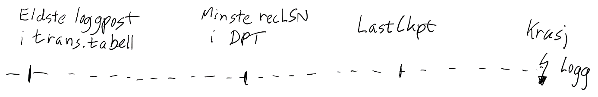

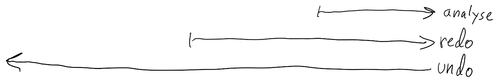

1. Analysis. The purpose of the analysis is to find the which transactions are winners and which are losers. Additionally, the DPT is reconstructed to reflect the state of DPT at the point of the crash. The analysis starts at the newest end checkpoint log record (“LastCKpt”) and

---

scanning the log forwards. This log record is found at recovery by checking the log anchor which is a data field at a fixed position in the recovery structures. From this end log record it loads the transaction table and the dirty page table (DPT). Then, the analysis process scans the log to the end of the log. For each log record it inserts its TransID and lastLSN in the transaction table, and it inserts a new RecoveryLSN and PageID, if the PageId is not already existing in the DPT. If the PageID is already existing, it means that the oldest log record for this page possibly needing redo, is already existing in the DPT.

2. Redo. The Redo phase starts at the oldest RecoveryLSN in the DPT (“Minste recLSN i DPT” in the figure). Every log record forward in the log is checked for redo. The log record does not need REDO if:

   a. The referenced Block (PageID) is not in DPT.

   b. The PageId is in DPT, but the PageId’s recLSN is greater than the log record’s LSN.

   c. The block’s pageLSN is greater or equal to the log record’s LSN. In this case the block must be read from disk. In the previous two cases you do not need to check the block, only the DPT’s data is checked.

   d. If none of the previous three tests are hit, the log record needs REDO. Thus, you need to write the After Image into the block, and then update the PageLSN in the block to the log record’s LSN.

3. Undo. After redo, undo is started. This goes backwards in the log until the oldest “alive” log record is found. For each log record needed to be undone, a compensating log record is created and redone. This compensates for the log record that needs to be undone. When all “alive” records are traversed backwards, recovery is completed. During undo the transaction table may be used to find the log record to be undone. And from each log record there is a PrevLSN that may be used.

Example of recovery analysis Assume the use of ARIES recovery and let A, B, and C be data elements. After a crash the following log was found. There is one log record in each row of the table:

| LSN | Last_lsn | Transaction | OpType | Page_id | Other_info |
|---:|---:|:---|:---|:---|:---|
| 101 | 0 | T1 | Update | C | … |
| 102 | 0 | T2 | Update | B | … |
| 103 | 101 | T1 | Commit | | … |
| 104 | | | Begin_ckpt | | |
| 105 | | | End_ckpt | | |
| 106 | 0 | T3 | Update | A | … |
| 107 | 102 | T2 | Update | C | … |
| 108 | 107 | T2 | Commit | | … |

Assume T1, T2 and T3 to be the transactions that exist and that the transaction table in log record 105 is this:

| Transaction | Last_lsn | Status |
|:---|---:|:---|
| T1 | 103 | Commit |
| T2 | 102 | In progress |

---

The Dirty Page Table that exists in log record 105 is this one:

| Page_id | Rec_lsn |
|:---|---:|
| C | 101 |
| B | 102 |

What is the contents of the dirty page table and transaction table after the analysis? We scan the log forwards and updates the two tables. Then, the transaction table becomes the following:

| Transaction | Last_lsn | Status |
|:---|---:|:---|
| T1 | 103 | Commit |
| T2 | 108 | Commit |
| T3 | 106 | In progress |

The transaction table get a new element T3, which gets status “In progress”. The last_lsn of T2 is updated to the last log record of T2, i.e. LSN=108. T3 will be aborted in the undo phase of the recovery. We get the following DPT:

| Page_id | Rec_lsn |
|:---|---:|
| C | 101 |
| B | 102 |
| A | 106 |

Here, a new element A is added. It is important that we do not update the Rec_LSN of C, since we know that LSN=101 is the first log record that made C dirty.

Examples of REDO tests Assume A, B, C are data pages which are exposed to recovery from the log recovery example above. Which log records will be redone during recovery when the DPT (Dirty Page Table) has the following state at start of REDO: (C, recLSN=101), (B, recLSN=102), (A, recLSN=106) and the data elements have the following states at start of recovery: (A, pageLSN=106), (B, pageLSN=102), (C, pageLSN=101)

For each log record describe whether REDO happens or not and why/why not.

| Log record | REDO? | Reason |
|---:|:---|:---|
| 101 | No | PageLSN == Logrecord.LSN |
| 102 | No | PageLSN == Logrecord.LSN |
| 106 | No | PageLSN == Logrecord.LSN |
| 107 | Yes | PageLSN < Logrecord.LSN |

---

In other examples than shown here, log records would avoid REDO because the PageID does not exist in the DPT or the log record’s LSN is less than the PageId’s recLSN.

Other recovery techniques Until now we have described the Undo/Redo technique that is used by ARIES. There are other techniques for recovery as well. Most of them are more simple approaches than ARIES,

- Undo/no-redo: Like ARIES, but just undo logging. This means that all changed data must be written to disk as a part of commit processing.

- No-undo/redo: Like ARIES, but just redo logging. This means that the transaction must keep all its changes in data buffer until commit.

- Shadowing: Does not use logging, but makes copies of data at updates. Commit transactions by doing copy of pointers to the new data. We need a catalog of pointers to data. An example of this is the Copy-On-Write B+-trees (COW). There is a (root) pointer to the top of the tree. At updates, copies of blocks are made all the way up to the top of the tree, and at commit, the new root block will be pointed to by the root pointer.

This makes a distinction between update-in-place and shadowing.
