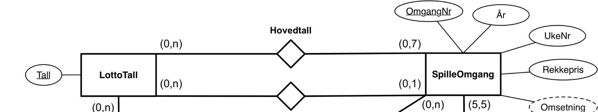
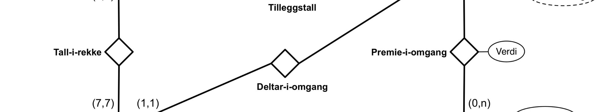
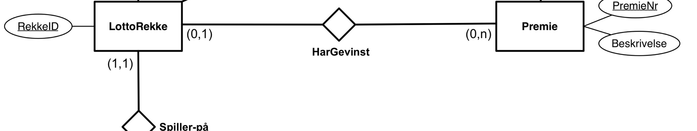
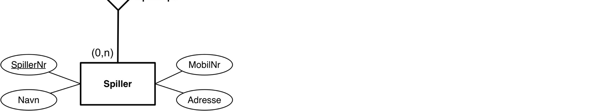
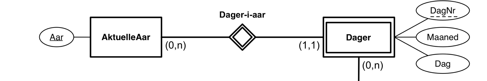
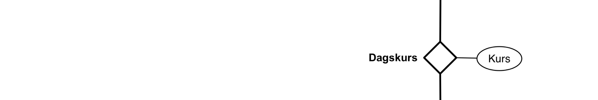
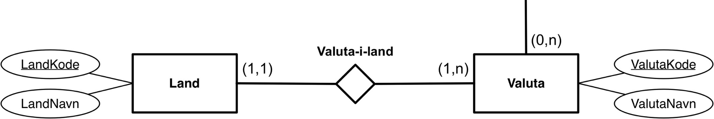
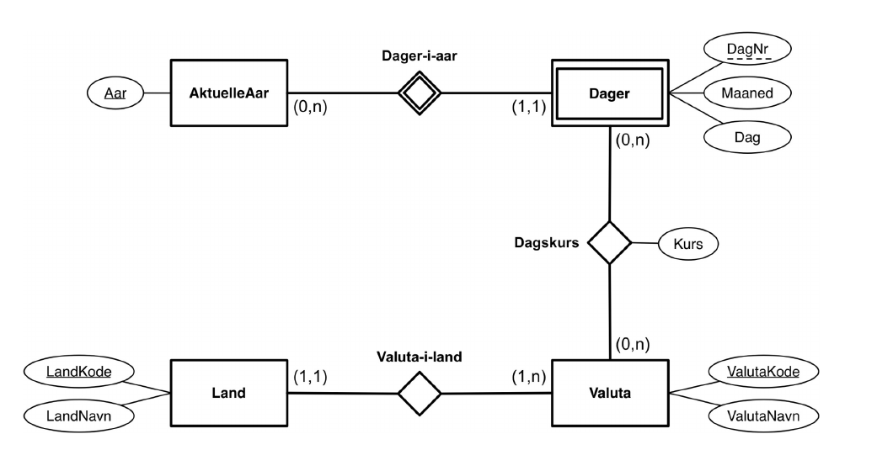

# TDT4145 - kont 2018: Løsningsskisse

**Løsningsskisse til eksamen i TDT4155 Datamodellering og databasesystemer**  
**18. august 2018**

## Oppgave 1 - Datamodeller (12 %)

ER-diagram for Lotto-miniverdenen:

**Entitetsklasser:**
- LottoTall (Tall [PK])
- SpilleOmgang (OmgangNr [PK], År, UkeNr, Rekkepris, Omsetning [avledet])
- LottoRekke (RekkeID [PK])
- Spiller (SpillerNr [PK], Navn, MobilNr, Adresse)
- Premie (PremieNr [PK], Beskrivelse)

**Relasjonsklasser:**
- Hovedtall: LottoTall (0,n) — (0,7) SpilleOmgang
- Tilleggstall: LottoTall (0,n) — (0,1) SpilleOmgang
- Tall-i-rekke: LottoTall (0,n) — (7,7) LottoRekke
- Deltar-i-omgang: LottoRekke (1,1) — (0,n) SpilleOmgang
- Premie-i-omgang: SpilleOmgang (5,5) — (0,n) Premie [Verdi]
- HarGevinst: LottoRekke (0,1) — (0,n) Premie
- Spiller-på: LottoRekke (1,1) — (0,n) Spiller









Vi har forutsatt at spilte lottorekker har en unik identifikator, RekkeID. Omsetning er modellert som et avledet attributt siden verdien kan beregnes ut fra rekkepris og antall rekker spilt i omgangen.

## Oppgave 2 - Datamodeller og relasjonsdatabaser (8 %)

```text
Photo(PhotoID, Title, Description, PhotographerID, CDID)
  PhotographerID er fremmednøkkel mot Photographer-tabellen, kan være NULL
  CDID er fremmednøkkel mot CaptureDevice-tabellen, kan være NULL

Photographer(PhotographerID, Forename, Surname, Nationality)

CaptureDevice(CDID, Type)
  Type viser om det er et fotoapparat eller en telefon

Genre(Title, Description)

Camera(CameraID, Brand, Model, CameraType, CDID)
  CDID er fremmednøkkel mot CaptureDevice-tabellen, kan være NULL

Phone(PhoneID, Model, CDID)
  CDID er fremmednøkkel mot CaptureDevice-tabellen, kan være NULL

Uses(PhotographerID, CDID)
  PhotographerID er fremmednøkkel mot Photographer-tabellen, kan ikke være NULL
  CDID er fremmednøkkel mot CaptureDevice-tabellen, kan ikke være NULL

DescribedBy(PhotoID, GenreTitle)
  PhotoID er fremmednøkkel mot Photo-tabellen, kan ikke være NULL
  GenreTitle er fremmednøkkel mot Genre-tabellen, kan ikke være NULL

Hashtags(PhotoID, Hashtag)
  PhotoID er fremmednøkkel mot Photo-tabellen, kan ikke være NULL
```

Vi har forutsatt at flere fotografier kan dele samme hashtag, ellers kunne Hashtag vært nøkkel alene i Hastags-tabellen.

## Oppgave 3 - Relasjonsdatabaser, ER-modeller, relasjonsalgebra og SQL (20 %)

### a) ER-diagram

ER-diagram med følgende struktur:

**Entitetsklasser:**
- AktuelleAar (Aar [PK])
- Dager (DagNr [PK], Maaned, Dag)
- Land (LandKode [PK], LandNavn)
- Valuta (ValutaKode [PK], ValutaNavn)

**Relasjonsklasser:**
- Dager-i-aar: AktuelleAar (0,n) — (1,1) Dager
- Dagskurs: Dager (0,n) — (0,n) Valuta [Kurs]
- Valuta-i-land: Land (1,1) — (1,n) Valuta



For å komme frem til denne modellen har vi gjort følgende nødvendige forutsetninger:

- Alle land må ha en valuta.
- Et land kan bare ha en valuta.
- En valuta må være brukt i minst ett land.
- En valuta kan være brukt i flere land - Euro er et godt eksempel på en slik valuta.

Det skal ikke trekkes for andre forutsetninger så lenge disse fremstår rimelige.

### b) SQL

```sql
SELECT LandKode, LandNavn
FROM Land NATURAL JOIN ValutaILand NATURAL JOIN Valuta
WHERE ValutaNavn = 'Euro'
ORDER BY LandNavn ASC
```

### c) SQL

```sql
SELECT ValutaKode, MIN(Kurs), MAX(Kurs), AVG(Kurs)
FROM Dagskurs
WHERE Aar = 2017
GROUP BY ValutaKode
```

### d) Relasjonsalgebra

Relasjonsalgebra-spørringen finner kursen for danske kroner på datoen 11. februar for alle år som det finnes data for, sortert på år. Da har vi forutsatt at Danmark har bare en valuta. Eventuelt vil svaret være at spørringen finner kursen på alle danske valutaer på de samme dagene.

### e) SQL

```sql
SELECT DISTINCT Aar, Maaned
FROM Dager AS D
WHERE NOT EXISTS (SELECT *
                  FROM Dagskurs NATURAL JOIN Dager
                  WHERE Valutakode = 'SEK'
                    AND Kurs <= 100
                    AND Maaned = D.Maaned
                    AND Aar = D.Aar)
```

## Oppgave 4 - Normaliseringsteori (20 %)

### a)

Alle rader med samme A-verdi må ha samme B-verdi (`A -> B`). Det betyr at X ikke kan ha verdien 1 og at Y må ha verdien 1. Alle rader med samme D-verdi må ha samme A-verdi (`D -> A`). Det betyr at Z ikke kan være 2, 4 eller 5. Z kan bare være 6 dersom X er 3. Siden det ikke finnes flere rader med samme B-verdi og samme C-verdi, vil `BC -> D` alltid være oppfylt.

### b)

En kandidatnøkkel er en minimal supernøkkel for en tabell. At den er en supernøkkel betyr at den er en unik identifikator for tabellen - det vil aldri finnes flere rader med samme verdier for alle attributtene i kandidatnøkkelen. At den er minimal betyr at ingen ekte delmengde at attributtene i kandidatnøkkelen vil være en supernøkkel.

Siden C ikke er med på noen venstreside i F, vet vi at C må være med i alle supernøkler. Men C er ikke supernøkkel siden `C+ = C`.

```text
AC+ = ABCD = R
BC+ = ABCD = R
DC+ = ABCD = R
```

Vi har derfor tre kandidatnøkler: AC, BC og CD.

### c)

Vi har Boyce-Codd normalform (BCNF) dersom det for alle funksjonelle avhengigheter, `X -> Y`, er slik at X er en supernøkkel. Verken A eller D er supernøkler så vi har ikke BCNF.

Vi har tredje normalform (3NF) dersom det for alle funksjonelle avhengigheter, `X -> Y`, er slik at X er en supernøkkel for tabellen eller Y er et nøkkelattributt for tabellen.

Et attributt er et nøkkelattributt dersom det er med i en eller flere kandidatnøkler.

```text
A -> B:   A er ikke supernøkkel, men B er nøkkelattributt
BC -> D:  BC er supernøkkel og D er nøkkelattributt
D -> A:   D er ikke supernøkkel, men A er nøkkelattrributt
```

R oppfyller kravene til 3. normalform som dermed er den høyeste normalformen som tabellen oppfyller.

### d)

Gitt en mengde funksjonelle avhengigheter er tillukningen (`X+`) til en mengde attributter (X) alle attributter som er funksjonelt avhengig av attributtene i X.

Algoritme:

```text
Innputt: En mengde funksjonelle avhengigheter, F, og en mengde attributter, X.

X+ := X;
repeat
   oldX+ := X+;
   for (each functional dependency Y -> Z in F) do
       if Y subset-of X+ then X+ := X+ union Z;
until (X+ = oldX+);
```

## Oppgave 5 - Extendible hashing (5 %)

Vi hasher nøklene ved hjelp av `K MOD 8`.

```text
27 % 8 = 3 = 011
18 % 8 = 2 = 010
9 % 8 = 1 = 001
7 % 8 = 7 = 111
16 % 8 = 0 = 000
13 % 8 = 5 = 101
15 % 8 = 7 = 111
```

Til slutt får vi en struktur som under.

Direktorystruktur (global depth = 3) med åtte direktorypekere som peker mot fire bøtter med ulike lokale depth-verdier:

- Direktorypeker 000 -> Bøtte B0 (lokal depth 2): inneholder 16
- Direktorypeker 100 -> Bøtte B0 (samme bøtte som 000)
- Direktorypeker 001 -> Bøtte B1 (lokal depth 2): inneholder 9, 13
- Direktorypeker 101 -> Bøtte B1 (samme bøtte som 001)
- Direktorypeker 010 -> Bøtte B2 (lokal depth 2): inneholder 18
- Direktorypeker 110 -> Bøtte B2 (samme bøtte som 010)
- Direktorypeker 011 -> Bøtte B3 (lokal depth 3): inneholder 27
- Direktorypeker 111 -> Bøtte B4 (lokal depth 3): inneholder 7, 15

```text
          3          2
  000                    16
  001
                     2

  010                    9      13

  011                2
  100                    18

  101                3
  110                    27
  111
                     3
                         7      15
```

## Oppgave 6 - Lagring, indeksering og queries (10 %)

### a)

Level 0: Ved å anta 2/3 fyllingsgrad, får vi 45 poster per blokk. Da får vi 22 223 blokker på nivå 0.

Level 1: Vi antar poster på level > 0 som 8 (passId) + 8 byte (BlockId) = 16 byte. Da har vi plass til 341 poster per blokk (2/3 fyllingsgrad). Da har vi 66 blokker på nivå 1. Helt greit med BlockId på 4 byte også. Da blir det litt færre blokker her.

Level 2: 1 blokk da vi får plass til alle 66 postene der.

### b)

Her må vi gå gjennom hele treet, dvs. 2 blokker nedover og 22 223 bortover, til sammen 22 225 blokker. Det vi spør etter (regno) er ikke indeksert og vi må lete gjennom alle blokker etter matchende poster.

### c)

Vi bør lage en indeks på regNo, f.eks. et B+-tre med poster på formen `(regno,[list of PassId])`. Det er også helt greit å bruke en hashet struktur her. Indekspostene må man regne med blir oppdatert, dvs. nye passIds blir satt inn for regNr'et for kjøretøy som passerer.

## Oppgave 7 - Join (5 %)

Passeringer er lagret i 15 000 blokker. Kjøretøy er lagret i 300 blokker.

32 plasser i bufferet:

- 30 til Kjøretøy
- 1 til Passeringer
- 1 til resultat

Dvs. vi får `10 * (30 + 15 000) = 150 300` blokker lest ved en nested-loop join.

## Oppgave 8 - Transaksjoner (10 %)

### a)

Konsistens vil si at en transaksjon overholder alle konsistenskrav, slik som referanseintegritet, primærnøkkelintegritet, assertions, check osv. I tillegg er en transaksjon en konsistent endring i seg selv, dvs. programmereren/brukeren har bestemt at det er endringer som hører sammen som en konsistent endring av databasen.

### b)

```text
T1                      T2                   T3
rl1(A)
r1(A)
rl1(B)
r1(B)
                        Try wl2(A)
                        wait
                                             Try wl3(B)
                                             wait
wl1(B)
w1(B)
c1; unlock(A,B)
                        wl2(A)
                        w2(A)
                        wl2(B)
                        w2(B)
                        c2; unlock(A,B)
                                             wl3(B)
                                             w3(B)
                                             c3; unlock(B)
```

## Oppgave 9 - Transaksjoner: Recovery - ARIES (10 %)

### a)

Sjekkpunktloggposter (end_checkpoint) i ARIES inneholder transaksjonstabellen og dirty page table (DPT). Transaksjonstabellen brukes for å slippe å scanne hele loggen ved recovery for å finne de «levende» transaksjonene. DPT brukes for å redusere hvilke loggposter som man trenger å sjekke REDO for, ved å se om Pagen/Blokka trenger redo uten å se på selve datablokka. Start_checkpoint brukes for å markere når man begynner å lage sjekkpunktinformasjonen, slik at ved analysen skal man starte ved start_checkpoint når man skal scanne loggen forover.

### b)

Datablokker (pages) skrives i ARIES ved en prosess/daemon som går i bakgrunnen. Ved commit av transaksjonen må loggen skrives (NO-FORCE), men ved STEAL av bufferplasser må man skrive ut den skitne datablokka.
