# TDT4145 - vår 2018: Løsningsforslag

**Versjon 20. juni 2018**

## Oppgave 1 - Datamodellering (19 %)

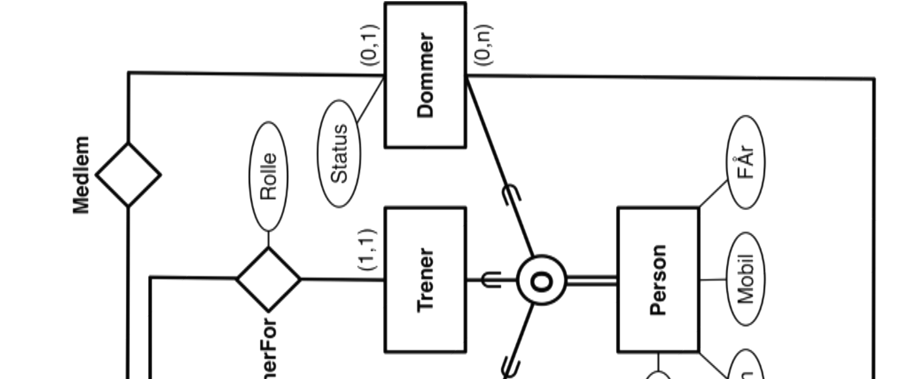
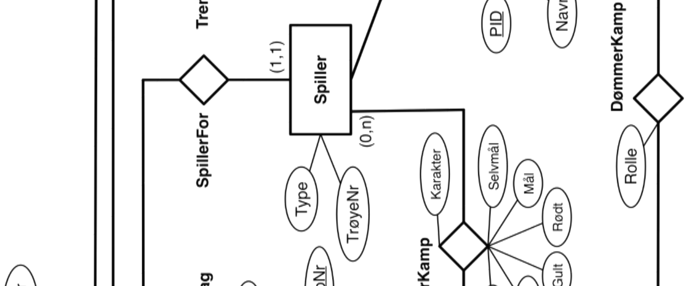
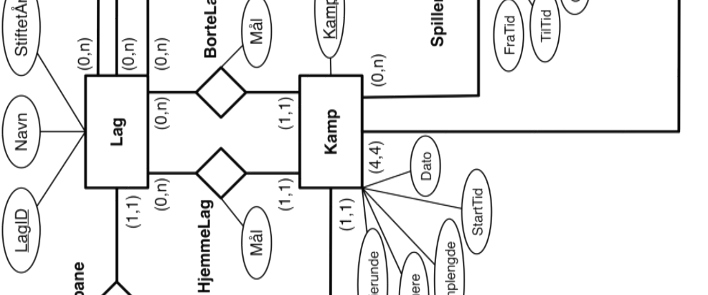
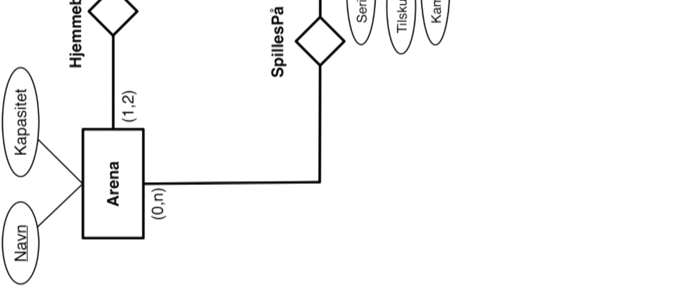

Modellen over danner utgangspunkt for vurdering av besvarelsene. Det er helt greit å spesifisere attributtene inne i entitetsklasse-boksene. Det er en vurderingssak hvor mye detaljer man skal ta med i datamodellen og hvor mye som heller bør overlates til applikasjonsprogrammene. I vurderingen av besvarelsene skal det legges mest vekt på overordnet struktur - at det er hensiktsmessige valg av entitetsklasser og hensiktsmessige relasjonsklasser mellom disse.

Uheldig eller direkte feil bruk av virkemidlene i ER-modellering skal vektlegges, særlig hvis problemer er gjennomgående. Så lenge eventuelle forutsetninger anses å være rimelige skal disse tas med i betraktning når den foreslåtte modellen vurderes. Dersom fremstillingen av modellen gjør det vanskelig å vurdere kvaliteten, kan det trekkes for dette.

## Oppgave 2 - Relasjonsdatabaser, ER, SQL og relasjonsalgebra (20 %)

### a)

ER-diagram for relasjonsskjemaet er vist under. Ut fra det oppgitte relasjonsskjemaet må man gjøre ekstra forutsetninger for eventuelt å sette mer begrensende restriksjoner på relasjonsklassene. Det er helt i orden å tegne attributtene inne i entitetsklassene.

I vurderingen skal det legges vekt på at løsningen inneholder hensiktsmessige entitetsklasser og relasjonsklasser mellom disse, restriksjoner på relasjonsklassene, nøkler og attributter, og korrekt bruk av de anvendte elementer i ER-notasjon.

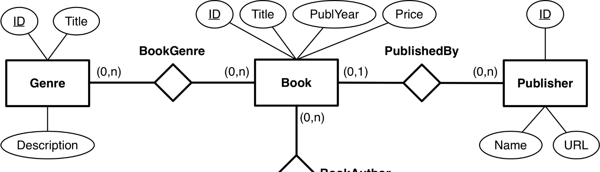

### b)

```sql
SELECT ID, GenreTitle
FROM Genre
WHERE Description LIKE '%fantasy%';
```

### c)

```sql
SELECT Publisher.ID, PublisherName, COUNT(Book.PublisherID)
FROM Publisher LEFT OUTER JOIN Book
     ON (Publisher.ID = Book.PublisherID)
GROUP BY Publisher.ID, PublisherName;
```

Det er strengt tatt ikke nødvendig å ha med PublisherName etter `GROUP BY`. Det skal trekkes ett poeng for besvarelser som ikke tar med forlag uten bøker (ikke sammenstiller tabellene med outer-join), med mindre problemstillingen er diskutert i besvarelsen, og det er gjort en eksplisitt forutsetning om at man velger ikke å ta med forlag uten bøker.

### d)

```sql
INSERT INTO Author(ID, Firstname, Surname, Nationality, URL)
VALUES (100, 'Kim', 'Leine', 'Danish', NULL);
```

eller

```sql
INSERT INTO Forfatter(ID, Firstname, Surname, Nationality)
VALUES (100, 'Kim', 'Leine', 'Danish');
```

Hvis man legger inn verdier for alle attributtene er det ikke nødvendig å spesifisere kolonnenavn.

### e)

Relasjonsalgebra:

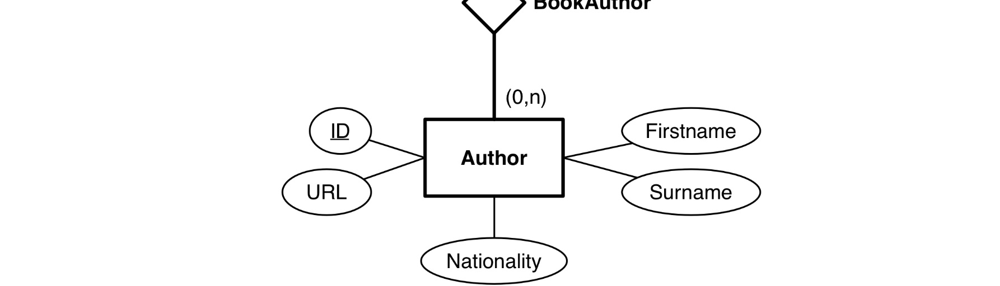

Legg merke til at `(NOT(Firstname = 'Linn' AND Surname = 'Ullmann'))` er ekvivalent med `(Firstname <> 'Linn' OR Surname <> 'Ullmann')`. Betingelsen `(Firstname <> 'Linn' AND Surname <> 'Ullmann')` er ikke et korrekt alternativ - den vil utelate alle som heter Linn (uansett etternavn) og alle som heter Ullmann (uansett fornavn).

Oppgaven kan løses med naturlig join i den avsluttende foreningen, i tilfelle vil det ikke være nødvendig med alias-er for de to instansene av BookAuthor.

## Oppgave 3 - Normaliseringsteori (16 %)

### a)

Den funksjonelle avhengigheten `Wind -> Attempt` spesifiserer at alle rader med samme verdi for Wind må ha samme verdi for Attempt. Det er oppfylt i den oppgitte tabellforekomsten og `Wind -> Attempt` kan derfor tenkes å være en restriksjon for tabellen. Dersom `Wind -> Attempt` skulle gjelde for lengdehopp-konkurranser, ville det være slik at alle hopp med samme medvind (Wind) måtte være fra samme omgang (Attempt). Det er helt urimelig å forutsette dette.

### b)

Under er vist et eksempel på en tabellforekomst der verken `CD -> A` eller `B -> D` er oppfylt. Alle svar på oppgaven må inneholde minst to rader som har samme verdier for C og D, der ikke alle disse radene har samme verdi for A. De må også inneholde minst to rader med samme verdi for B, der ikke alle disse radene har samme verdi for D.

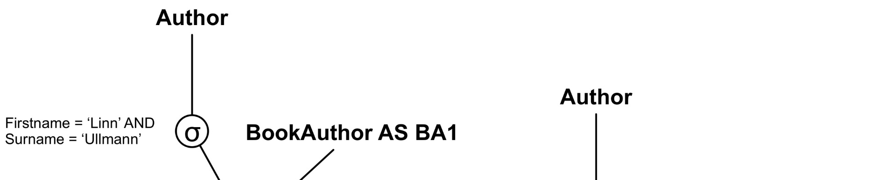

### c)

Å vise at `WY -> Z` og `X -> Y` nødvendigvis må medføre `WX -> Z` kan gjøres på flere ulike måter.

- Det enkleste er kanskje å beregne tillukningen til WX når `WY -> Z` og `X -> Y` gjelder: `WX+ = WXYZ`, som viser at `WX -> Z` må gjelde.
- En annen løsning er å vise til at dette er den sjette utledningsregelen, pseudotransitivitet, for funksjonelle avhengigheter.
- En tredje løsning vil være å ta utgangspunkt i Armstrongs «aksiomer» for funksjonelle avhengigheter og bruke disse for å komme frem til resultatet:
  - Gitt: `WY -> Z` og `X -> Y`
  - Augmentation-regelen: `X -> Y` medfører `WX -> WY`
  - Transitivitet-regelen: `WX -> WY` og `WY -> Z` medfører `WX -> Z`

Det kan også tenkes andre løsninger. I vurderingen skal det ikke gis uttelling for svar som i realiteten er rene omformuleringer av oppgaven.

### d)

Når vi har R(A, B, C, D) er det flere mengder med funksjonelle avhengigheter som kan tenkes å gjelde. For at BC skal være nøkkel må en av disse fem mengdene inngå: `F1 = {BC -> AD}`, `F2 = {B -> A; C -> D}`, `F3 = {B -> D; C -> A}`, `F4 = {B -> AD}` eller `F5 = {C -> AD}`. Av disse er det bare F2 som fører til at R kan dekomponeres tapsløst i de tre oppgitte tabellene.

Det er nok å vise at man ikke oppnår tapsløs dekomponering i ett mulig tilfelle, men det må argumenteres for hvorfor det er slik. En fullgod argumentasjon bør bruke tabell-metoden for å sjekke tapsløs dekomponering. Startpunktet for algoritmen før vi begynner å bruke funksjonelle avhengigheter, er vist under:

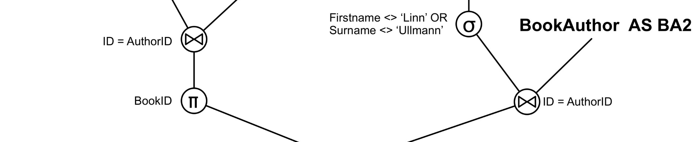

For F2 vil vi kunne få en rad (rad 2) med bare a-er som viser at dekomponeringen er tapsløs. For F1, F3, F4 og F5 kan vi ikke komme fram til en rad med bare a-er, og dette viser at dekomponeringen ikke er tapsløs i disse tilfellene.

Løsninger som benytter «snitt-metoden» (ser på om felles attributter er supernøkkel) er ikke 100 % tilfredsstillende siden dette er en tilstrekkelig, men ikke nødvendig betingelse for tapsløs dekomponering. I vurderingen skal vi likevel gi full uttelling til slike løsninger hvis argumentasjonen i besvarelsen er god.

Det vi ønsker å få frem i denne oppgaven er (a) en refleksjon om hva BC som nøkkel innebærer for mengden funksjonelle avhengigheter, (b) en refleksjon omkring kriteriene for om en dekomponering er tapsløs og (c) en konklusjon på spørsmålet om vi alltid vil ha en tapsløs dekomponering.

## Oppgave 4 - Datamodellering (5 %)

Under er vist et ER-diagram der vi har markert de fem feilene vi hadde som utgangspunkt da vi lagde oppgaven.


1. CourseID er nøkkel (identifikator) for Course, det er ikke markert.
2. Det kan finnes emner (Course) uten registrerte studenter så her skulle det vært (0,n).
3. ExercisePackage oppfyller ikke kravene for å være en svak entitetsklasse og skulle derfor vært tegnet som en ordinær entitetsklasse (enkel strek).
4. En student kan ha flere eksamener i samme emne. Det er ikke mulig slik det er modellert i diagrammet.
5. Sammenhengene mellom Course, ExercisePackage og Student er ikke en tertiær relasjonsklasse mellom alle tre entitetsklassene, men burde vært modellert som to binære relasjonsklasser. En relasjonsklasse mellom Course og ExcercisePackage og en relasjonsklasse mellom Student og ExercisePackage.

Hva som oppfattes som feil kan påvirkes av hvordan man forstår beskrivelsen av miniverdenen, de forutsetningene man gjør og hvordan man teller «feil». Så lenge besvarelsen tar utgangspunkt i rimelige antagelser og forutsetninger skal det ikke nødvendigvis trekkes om studenten har kommet fram til en litt annen løsning, det må vurderes i hvert enkelt tilfelle.

## Oppgave 5 - Innsetting i B+-trær (10 %)

Sett inn følgende nøkler i et B+-tre i den gitte rekkefølgen: 4, 28, 3, 17, 18, 5, 27, 13, 16, 15. Anta at det er plass til tre nøkler i hver blokk, og at det er plass til tre nøkler og fire pekere i hver blokk med nivå > 0. Vis tilstanden til B+-treet hver gang du skal til å splitte en blokk. Vis også tilstanden til B+-treet til slutt.

Løsning:

Her har vi løst oppgaven slik det står i pensumnotatet. Dvs. splittenøkkelen er minste verdi i høyreblokka i splitten. Samtidig har vi brukt regelen om at vi først splitter den fulle blokka helt slavisk, uten å se på nøkkelen som skal inn, så kan vi sette i den nye nøkkelen.

Noen studenter vil kanskje bruke metoden fra Elmasri og Navathe, hvor splittenøkkelen er den største verdien i venstreblokka i splitten. Det bør bli tre nivå i treet, ellers har studenten gjort noe feil. Det er viktig å få med at det er pekere mellom blokkene, spesielt på løvnivå.

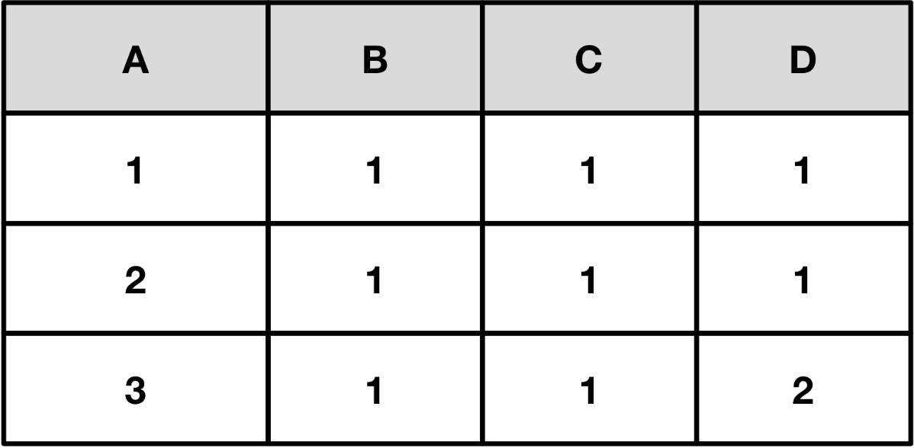
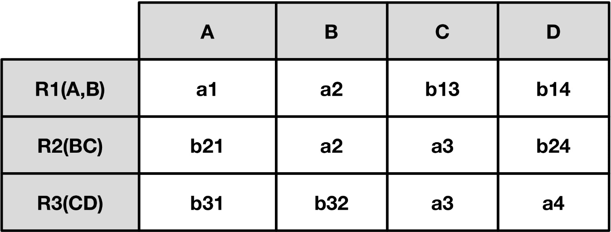
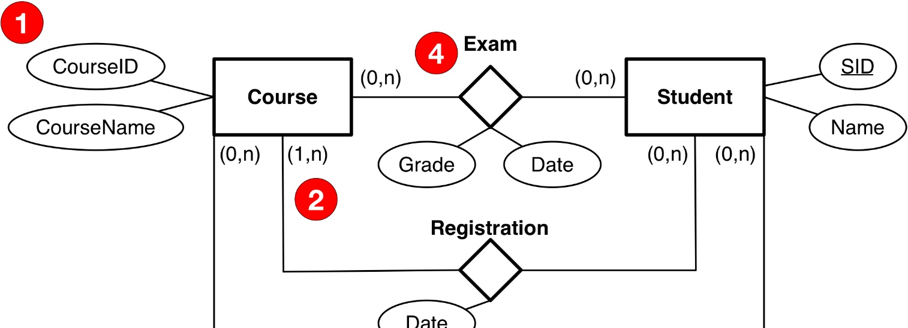
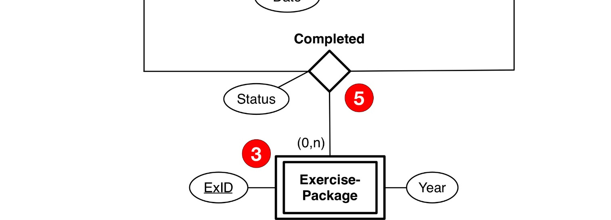

## Oppgave 6 - Lagring, indekser og queries (10 %)

Anta følgende tabell er lagret i et Clustered B+-tre med den sammensatte nøkkelen `(exno, studno)` som søkenøkkel:

```text
Exercise(exno, studno, datedelivered, approval_status)
```

Det er 1000 blokker på løvnivå (nivå=0) i B+-treet og det er tre nivå med blokker i treet.

### a)

```sql
SELECT datedelivered, approval_status
FROM Exercise
WHERE exno=2 AND studno=123456;
```

Her får vi direkteaksess ned B+-treet. Dvs. 3 blokker aksesseres.

### b)

```sql
SELECT *
FROM Exercise
WHERE studno=123456 AND approval_status="Disapproved";
```

Her er ikke B+-treet til noe særlig hjelp. Studentens øvinger er spredd utover løvnivået i treet. Dvs. vi må gå ned treet og scanne løvnivået. `2 + 1000 = 1002` blokker.

### c)

```sql
SELECT exno, studno, approval_status
FROM Exercise
ORDER BY exno ASC, studno ASC;
```

Her kan vi bruker sorteringsrekkefølgen i B+-treet direkte, leksiografisk sortering, dvs. `2 + 1000 = 1002` blokker.

### d)

```sql
SELECT exno, count(*)
FROM Exercise
WHERE approval_status="Approved"
GROUP BY exno;
```

Her kan vi også bruke det sorterte B+-treet og telle opp antall studenter med godkjent øving for hver exno. `2 + 1000 = 1002` blokker.

## Oppgave 7 - Historier og recoveryegeneskaper (5 %)

Avgjør recoveryegenskapene (ikke gjenopprettbar, gjenopprettbar, ACA og strikt) ved de følgende historiene:

```text
S1: r2(Z);w2(X);w2(Y);c2;w1(X);r1(X);c1;r3(X);r3(Z);r3(Y);c3;
```

Denne er seriell, og derfor strikt.

```text
S2: r1(X);r2(X);w2(X);w2(Y);c2;w1(X);r3(Z);w1(Y);c1;r3(Y);r3(X);c3;
```

Her er det ingen dirty read, heller ingen "dirty write". Følgelig er den strikt.

```text
S3: r2(X); w2(X); r1(X); r2(Y); w1(Y); c1; r2(Z); w2(Z); c2;
```

`r1(X)` gjør en dirty read av X og committer før T2. Unrecoverable. Ikke gjenopprettbar. r1 skriver ikke X, men vi kan tenke oss at den har lest X og skrevet noe i Y som er avhengig av Xs verdi.

## Oppgave 8 - Historie og setting av låser (5 %)

```text
T1                                          T2
----------------------------------------------------------------
                                            rl2(X)
                                            r2(X)
                                            wl2(X)
                                            w2(X)
Try rl1(X) must wait
                                            rl2(Y)
                                            r2(Y)
                                            rl2(Z)
                                            r2(Z)
                                            wl2(Z)
                                            w2(Z)
                                            c2; unlock(X,Y,Z);
rl1(X)
r1(X)
wl1(Y)
w1(Y)
c1; unlock(X,Y);
```

## Oppgave 9 - Recovery (10 %)

### a)

Det er to blokker / pages som oppdateres i loggen, A og B. Vi får da DPT etter analysen med følgende verdier:

```text
(A, 238)
(B, 239)
```

Transaksjonstabellen blir etter analysen følgende verdier:

```text
T1, 241, Active
T2, 240, Commit(ted)
T3, 242, Active
```

### b)

Det er to aktive transaksjoner som blir rullet tilbake: T1 og T3. Vi får laget en del kompenserende loggposter (CLRs). Her bør det være med det meste for å få full uttelling.

Følgende loggposter blir laget:

```text
(243, 242, T3, CLR undo av 242, PageId B)
(244, 243, T3, Abort)
(245, 241, T1, CLR undo av 241, PageId A)
(246, 245, T1, CLR undo av 238, PageId A)
(247, 246, T1, Abort)
```

Vi har påpekt hvilken non-CLR hver CLR kompenserer for. Dette feltet er ikke nevnt i læreboka og det skal ikke trekkes for om det mangler. Men det er interessant at undo går bakover i historien.
