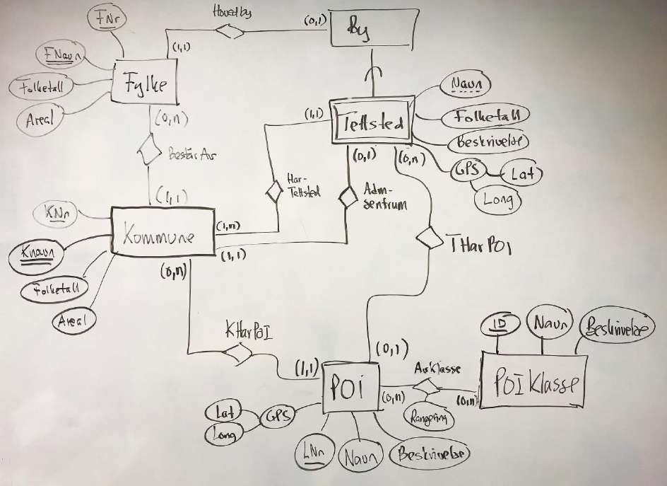
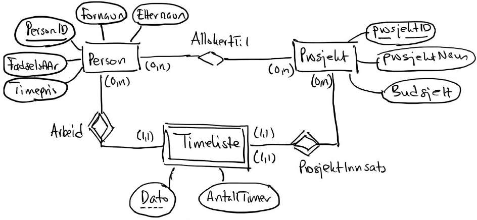
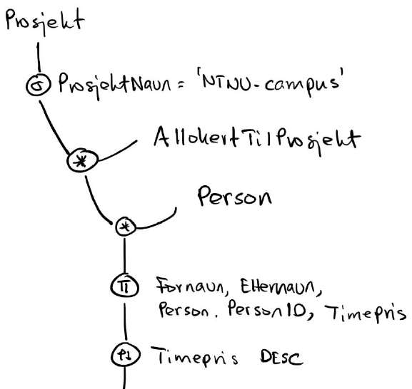
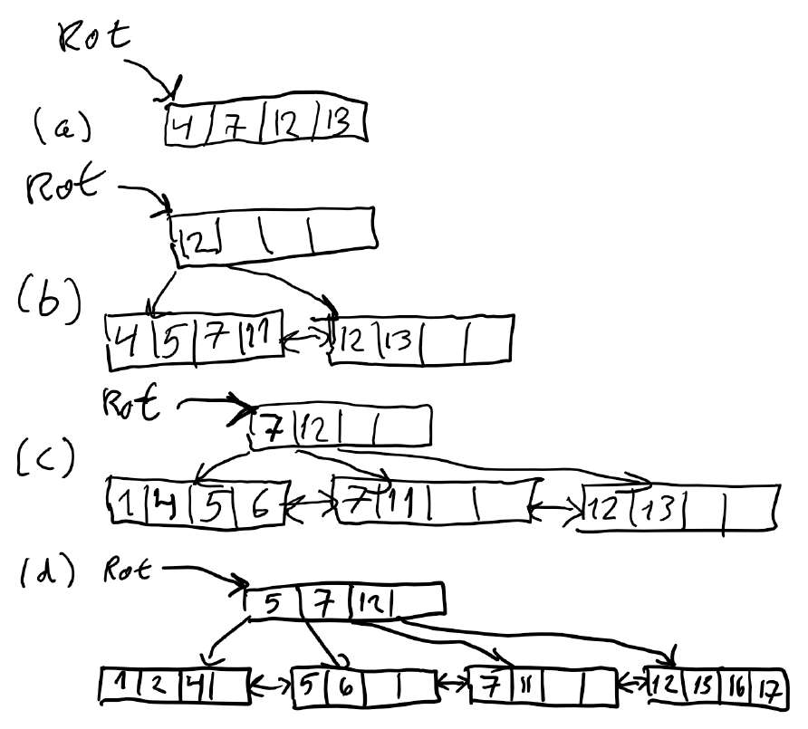
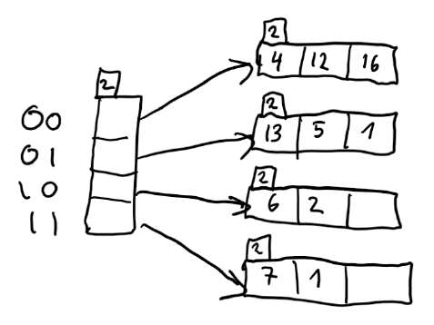
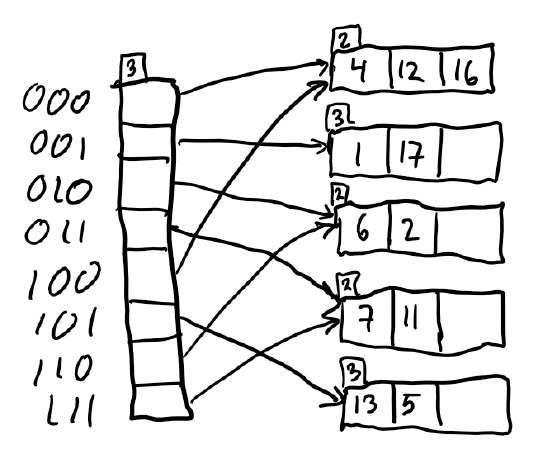

# TDT4145 - kont 2019: Sensorveiledning

**Sensorveiledning for TDT4145 kont 2019, eksamen 6. august**

## Læringsutbyttebeskrivelser for TDT4145

Kunnskaper:

1. Databasesystemer: generelle egenskaper og systemstruktur.
2. Datamodellering med vekt på entity-relationship-modeller.
3. Relasjonsdatabasemodellen for databasesystemer, databaseskjema og dataintegritet.
4. Spørrespråk: Relasjonsalgebra og SQL.
5. Designteori for relasjonsdatabaser.
6. Systemdesign og programmering mot databasesystemer.
7. Datalagring, filorganisering og indeksstrukturer.
8. Utføring av databasespørringer.
9. Transaksjoner, samtidighet og robusthet mot feil.

Ferdigheter:

1. Datamodellering med entity-relationship-modellen.
2. Realisering av relasjonsdatabaser.
3. Databaseorientert programmering: SQL, relasjonsalgebra og database-programmering i Java.
4. Vurdering og forbedring av relasjonsdatabaseskjema med utgangspunkt i normaliseringsteori.
5. Analyse og optimalisering av ytelsen til databasesystemer.

Generell kompetanse:

1. Kjennskap til anvendelser av databasesystemer og forståelse for nytte og begrensninger ved slike systemer.
2. Modellering av og analytisk tilnærming til datatekniske problemer.

## Oppgave 1

- **Miniverden** - Den delen av virkeligheten som er relevant for datamodellen/databasen.
- **Relasjonsklasse** - En mengde likeartede relasjoner mellom entiteter fra bestemte entitetsklasser.
- **Databasetilstand** - Dataene i databasen ved et bestemt tidspunkt.
- **Skjema** - En beskrivelse av databasen. Det uttrykker intensjonen: Hvilke entiteter (objekter) og attributter for disse som kan lagres i databasen, hvilke relasjoner (sammenhenger) mellom entiteter som kan forekomme og hvilke restriksjoner (regler) som gjelder.
- **Funksjonell avhengighet** - En funksjonell avhengighet `A -> B` er en restriksjon på sammenhengen mellom A-verdier og B-verdier. To tupler med samme verdi av A må nødvendigvis må ha samme verdi av B.
- **Referanseintegritet** - En fremmednøkkel må enten referere til (ha verdien til) en primærnøkkel som finnes i den refererte tabellen, eller være lik null.
- **Restriksjon (eng: constraint)** - En regel som dataene i databasen må tilfredsstille.
- **Union-kompatibilitet** - To mengder av attributter er union-kompatible dersom de har like mange attributter, og hvert par av korresponderende attributter har samme domene.

## Oppgave 2

**Entiteter:**
- Fylke (FNr [PK], FNavn, Folketall, Areal)
- Kommune (KNr [PK], KNavn, Folketall, Areal)
- By (Navn, Folketall, Beskrivelse, GPS (Lat, Long)) — svak entitet (mht. Tettsted)
- Tettsted (Navn, Folketall, Beskrivelse, GPS (Lat, Long))
- POI (LNr [delnøkkel], Navn, Beskrivelse, GPS (Lat, Long)) — svak entitet (mht. Kommune)
- POIKlasse (ID [PK], Navn, Beskrivelse)

**Relasjoner:**
- BestårAv: Fylke (1,n) — (1,1) Kommune
- HarTettsted: Kommune (1,n) — (1,1) Tettsted (svakt eierforhold)
- Hovedby: Fylke (0,1) — (0,1) By
- AdmSentrum: Kommune (1,1) — (0,1) Tettsted
- THarPOI: Tettsted (0,n) — (0,n) POI
- KHarPOI: Kommune (1,1) — (0,n) POI (svakt eierforhold)
- AvKlasse: POI (0,n) — (0,n) POIKlasse [Rangering]
- (By er en spesialisering/relatert til Tettsted)



## Oppgave 3

**Entiteter:**
- Person (PersonID [PK], Fornavn, Etternavn, FødselsÅr, Timepris)
- Prosjekt (ProsjektID [PK], ProsjektNavn, Budsjett)
- Timeliste (Dato, AntallTimer) — svak entitet (mht. både Person og Prosjekt)

**Relasjoner:**
- AllokertTil: Person (0,n) — (0,n) Prosjekt
- Arbeid: Person (0,n) — (1,1) Timeliste (svakt eierforhold)
- ProsjektInnsats: Prosjekt (0,n) — (1,1) Timeliste (svakt eierforhold)



Forutsetninger:

- En person kan være allokert til flere prosjekt, men trenger ikke å være allokert til noe prosjekt.
- Et prosjekt kan ha flere personer allokert, men trenger ikke å ha noen person allokert til seg.
- En person trenger ikke å ha levert noen timeliste, men kan ha levert mange.
- Et prosjekt kan ha mange timelister, men trenger ikke å ha noen.

## Oppgave 4

```
τ_{Timepris DESC}
  └─ π_{Fornavn, Etternavn, Person.PersonID, Timepris}
      └─ Person
          ⋈ (AllokertTilProsjekt
              ⋈ σ_{ProsjektNavn = 'NTNU-campus'} Prosjekt)
```



## Oppgave 5

```sql
SELECT SUM(AntallTimer)
FROM Prosjekt NATURAL JOIN Timeliste
WHERE ProsjektNavn = 'NTNU-campus'
```

Spørringen kan også løses med EQUI-join.

## Oppgave 6

```sql
SELECT Prosjekt.ProsjektID, ProsjektNavn, COUNT(DISTINCT PersonID), SUM(AntallTimer)
FROM Prosjekt LEFT OUTER JOIN Timeliste ON Prosjekt.ProsjektID = Timeliste.ProsjektID
GROUP BY Prosjekt.ProsjektID, ProsjektNavn
```

Det er ikke strengt nødvendig å ha med ProsjektNavn i `GROUP BY`-delen av spørringen. Må bruke outer join for å få med prosjekt uten timelister.

## Oppgave 7

```sql
UPDATE Person
SET Timepris = Timepris * 1.1
WHERE Etternavn = "Bowim"
```



## Oppgave 8

Den eneste nøkkelen er AC. Da vil alle delmengder av R som inneholder AC være supernøkler: AC, ACB, ACD, ABCD.

## Oppgave 9

En tabell er på tredje normalform (3NF) hvis det for alle ikke-trivielle funksjonelle avhengigheter `X -> A` som gjelder for tabellen, er slik at (a) X er en supernøkkel i tabellen eller (b) A er et nøkkelattributt (eng: prime attribute) i tabellen.

## Oppgave 10

En dekomponering av en tabell, R, i to deltabeller, R1 og R2, har tapsløst-join-egenskapen dersom det for alle gyldige tabellforekomster av R vil være slik at r(R) er lik sammenstillingen av r(R1) og r(R2) med join eller kartesisk produkt.

Når vi ikke har tapsløst-join-egenskapen kan dekomponeringen i seg selv føre til at det oppstå datasammenhenger som vi ikke har i den opprinnelige tabellen. Det betyr at de to deltabellene har et annet informasjonsinnhold enn tabellen som dekomponeres.

Et eksempel kan være at R(A,B,C) dekomponeres i R1(A,B) og R2(C). For `r(R) = {(1,1,1), (2,2,2)}` vil vi få `r(R1) = {(1,1), (2,2)}` og `r(R2) = {1,2}`. Når vi forener R1 og R2 med kartesisk produkt vil vi få `r(R1) X r(R2) = {(1,1,1), (1,1,2), (2,2,1), (2,2,2)}` som inneholder to tupler i tillegg til de to tuplene vi startet med.

## Oppgave 11

I sjeldne tilfeller kan vi måtte velge mellom BCNF og bevaring av funksjonelle avhengigheter. Da vil det ofte være best å nøye seg med tredje normalform.

Generelt vil normalisering fjerne redundans og gjøre at vi unngå innsettings-, oppdaterings- og slettingsanomalier. Kostnaden vil være at data spres over flere tabeller - det kan bli mer uoversiktlig og spørringene blir mer kompliserte når flere tabeller må sammenstilles. Av og til vil man derfor prioritere spørreytelse fremfor høyere normalform og heller håndtere de ulempene dette medfører. Dersom frekvensen av innsettinger og oppdateringer er lav vil disse problemene ikke oppstå så ofte.

## Oppgave 12

Sette inn nøkler i B+-tre. Splitter på midten når vi har 4 poster.

```text
(a) Etter de første innsettingene (rot er fortsatt et blad):
    Rot: [4, 7, 12, 13]

(b) Etter neste innsetting (5) splittes bladet på midten;
    løftes opp 12 til ny rot:
    Rot: [12]
         ├── [4, 5, 7, 11] → [12, 13]

(c) Etter flere innsettinger (1, 6) splittes venstre blad og 7 løftes opp:
    Rot: [7, 12]
         ├── [1, 4, 5, 6] → [7, 11] → [12, 13]

(d) Etter siste innsettinger (2, 15, 16, 17) splittes blader videre;
    5 løftes opp:
    Rot: [5, 7, 12]
         ├── [1, 2, 4] → [5, 6] → [7, 11] → [12, 13, 16, 17]
```



## Oppgave 13

Sette inn nøkler i Extendible hashing. Her må det velges en stor nok base for hashfunksjonen. I og med at det største tallet er 16, kan mod 16 være et bra valg. Da har vi nok bits.

```text
Mellomtilstand (global depth = 2):

Directory                  Buckets (local depth i hjørnet)
00 ──────────────────────► [2] 4, 12, 16
01 ──────────────────────► [2] 13, 5, 1
10 ──────────────────────► [2] 6, 2
11 ──────────────────────► [2] 7, 11

Endelig tilstand (global depth = 3, etter at en bøtte måtte splittes):

Directory                  Buckets
000 ─────────────────────► [2] 4, 12, 16
001 ─────────────────────► [3] 1, 17
010 ─────────────────────► [2] 6, 2
011 ─────────────────────► [2] 7, 11
100 ─────────────────────► [2] 4, 12, 16   (peker til samme bøtte som 000)
101 ─────────────────────► [3] 13, 5
110 ─────────────────────► [2] 6, 2        (peker til samme bøtte som 010)
111 ─────────────────────► [2] 7, 11       (peker til samme bøtte som 011)
```



## Oppgave 14

Recovery:

1. For å håndtere feil i transaksjoner, dvs. vi kan rulle tilbake transaksjoner når noe går galt, dvs. bruker bestemmer seg for det, eller systemet bestemmer at denne transaksjonen skal rulles tilbake.
2. For å håndtere krasj i databasesystem. Da vil tapertransaksjoner rulles tilbake (UNDO) og vinnertransaksjoner rulles forover (REDO).

## Oppgave 15

- **A - atomicity:** Transaksjoner kjører som en helhet.
- **C - consistency:** Transaksjoner er konsistente, dvs. de holder konsistenskrav og operasjonene utføres sammen, slik at endringene er konsistente med det brukeren ønsker seg.
- **I - isolation:** Transaksjonene skal ikke merke at det er andre transaksjoner der.
- **D - durability:** Transaksjoner er permanente (dvs. mistes ikke) når de er committet.

## Oppgave 16

- H1: Recoverable
- H2: Strict
- H3: ACA

## Oppgave 17

ARIES vedlikeholder DPT hele tiden. Den vet hvilke blokker som er «dirty», dvs. de er endret, men ikke skrevet til disk ennå. Når en blokk er skrevet til disk, fjernes dens innslag i DPT. Dermed vet vi hvilke blokker som var «dirty» når sjekkpunktloggposten ble skrevet. Da vet vi også LSN til den eldste loggposten som gjorde en slik blokk «dirty». Alle eldre loggposter er reflektert på disk. Derfor må REDO starte på den første loggposten som muligens ikke er reflektert på disk.

## Poenggrenser brukt

Terskelverdier:

- A: 89
- B: 77
- C: 65
- D: 53
- E: 39
- F: 0
