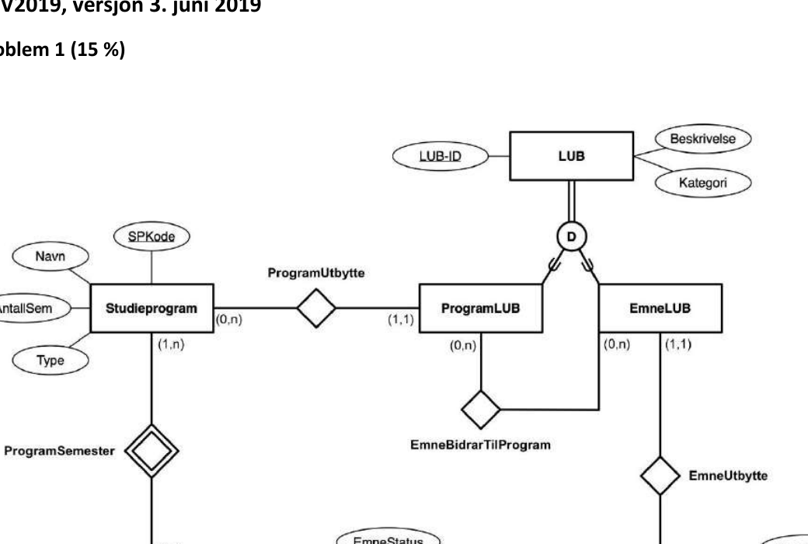
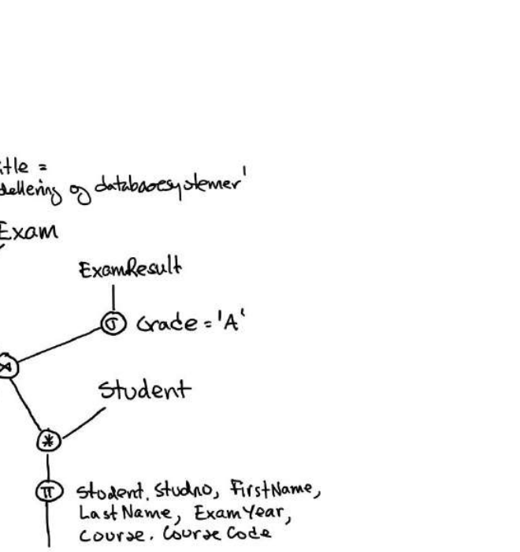
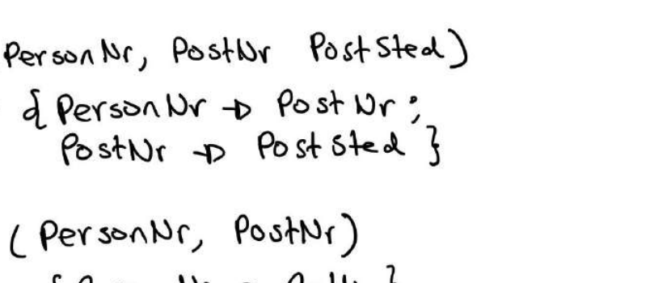
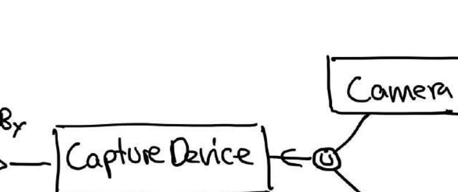
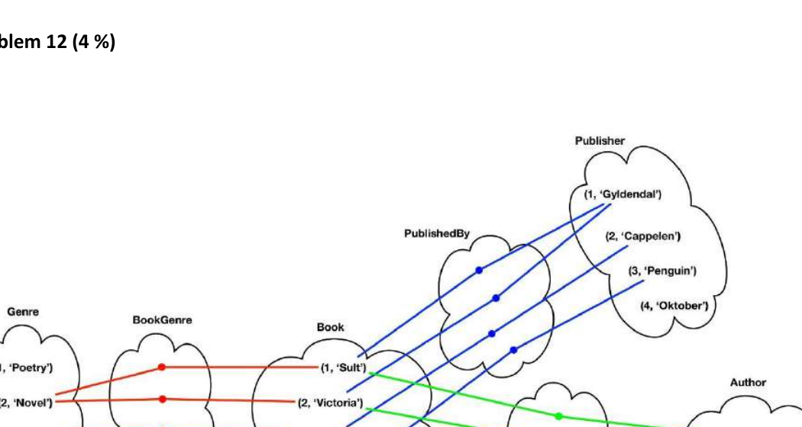

# TDT4145 - vår 2019: Sensorveiledning

**Sensorveiledning for TDT4145 vår 2019, eksamen 24. mai**

## Læringsutbyttebeskrivelser for TDT4145

Kunnskaper:

1. Databasesystemer: generelle egenskaper og systemstruktur.
2. Datamodellering med vekt på entity-relationship-modeller.
3. Relasjonsdatabasemodellen for databasesystemer, databaseskjema og dataintegritet.
4. Spørrespråk: Relasjonsalgebra og SQL.
5. Designteori for relasjonsdatabaser.
6. Systemdesign og programmering mot databasesystemer.
7. Datalagring, filorganisering og indeksstrukturer.
8. Utføring av databasespørringer.
9. Transaksjoner, samtidighet og robusthet mot feil.

Ferdigheter:

1. Datamodellering med entity-relationship-modellen.
2. Realisering av relasjonsdatabaser.
3. Databaseorientert programmering: SQL, relasjonsalgebra og database-programmering i Java.
4. Vurdering og forbedring av relasjonsdatabaseskjema med utgangspunkt i normaliseringsteori.
5. Analyse og optimalisering av ytelsen til databasesystemer.

Generell kompetanse:

1. Kjennskap til anvendelser av databasesystemer og forståelse for nytte og begrensninger ved slike systemer.
2. Modellering av og analytisk tilnærming til datatekniske problemer.

## Problem 1 (15 %)

**Entiteter:**
- Studieprogram (SPKode [PK], Navn, AntallSem, Type)
- Semester (svak entitet; SemNr [delnøkkel], Kode)
- Emne (EmneKode [PK], EmneNavn, Omfang, SemKode)
- LUB (LUB-ID [PK], Beskrivelse, Kategori) — superklasse med disjunkt spesialisering (D)
- ProgramLUB (subklasse av LUB)
- EmneLUB (subklasse av LUB)

**Relasjoner:**
- ProgramSemester: Studieprogram (1,n) — (1,1) Semester (Semester er svakt mht. Studieprogram)
- SemesterEmne: Semester (0,n) — (0,n) Emne [EmneStatus]
- ProgramUtbytte: Studieprogram (0,n) — (1,1) ProgramLUB
- EmneUtbytte: Emne (0,n) — (1,1) EmneLUB
- EmneBidrarTilProgram: ProgramLUB (0,n) — (0,n) EmneLUB



Det vil som alltid være andre løsninger som kan gi god mening, for eksempel å ha en entitetsklasse for LUB-kategorier.

I vurderingen skal det legges mest vekt på at virkemidlene brukes riktig og konsistent og at den foreslåtte modellen har en hensiktsmessig struktur.

## Problem 2 (4 %)

```
π_{Student.StudNo, FirstName, LastName, ExamYear, Course.CourseCode}
  └─ σ_{CourseTitle = 'Datamodellering og databasesystemer'}
      └─ Course
          ⋈ (Exam ⋈_{ID = ExamID} (σ_{Grade='A'} ExamResult ⋈ Student))
```



De to nodene med naturlig join kan selvsagt erstattes med equi-join-noder, ellers er det jo mange varianter som kan være like riktige.

## Problem 3 (4 %)

```sql
select ExamYear, count(StudentNo) as AntallEksamensResultat
from Exam left outer join ExamResults on (ID = ExamID)
where CourseCode = 'TDT4145'
group by ExamYear
order by ExamYear DESC
```

Her er det nødvendig å bruke «left outer join» siden det kan ha vært arrangert eksamener som ikke har noen eksamensresultat. Det anses like riktig å skrive «left join», å telle over et annet hensiktsmessig attributt og ikke å lage et alias som «AntallEksamensResultat». Bruk av `count(*)` vil kunne gi en liten tellefeil i noen tilfeller.

Etter tilbakemeldinger fra studentene velger vi å godkjenne løsninger med bruk av «inner join» uten å trekke for at det ikke ble brukt «outer join».

## Problem 4 (4 %)

```sql
select CourseCode, CourseTitle
from Course inner join Exam
     on (Course.CourseCode = Exam.CourseCode)
where not exists (select *
                  from ExamResults
                  where Exam.ID = ExamID
                    and Grade = 'A')
```

I den ytre spørringen kunne vi like gjerne brukt «natural join». Om det brukes alias er det selvsagt greit.

## Problem 5 (4 %)

```sql
create table ExamResults (
   ExamID int,
   StudentNo int,
   Grade char(1),
   constraint pk primary key (ExamId, StudentNo),
   constraint fk1 foreign key ExamID references Exam(ID)
      on delete cascade
      on update cascade,
   constraint fk2 foreign key StudentNo references Student(StudentNo)
      on delete cascade
      on update cascade)
```

Så lenge det er gjort fornuftige valg av datatyper og ev. andre ting, skal vi godta andre løsninger som like gode.

## Problem 6 (8 %)

Vårt forslag er å beholde bare superklassen Result i de to spesialiseringene:

```text
Event(EventID, EventName)

Athlete(AthleteID, FirstName, LastName, BirthYear, Gender, Nationality)

Result(ResultID, Date, EventID, AthleteID, Weight, Wind, Distance,
       Time, Height, Type)
```

`EventID` er fremmednøkkel mot Event-tabellen, kan ikke være NULL. `AthleteID` er fremmednøkkel mot Athlete-tabellen, kan ikke være NULL.

`Type` kan ha verdiene `Throw`, `VerticalJump`, `HorizontalJump` eller `Run`, kan ikke være NULL.

Fordelen med denne løsningen er at alle resultater samles i en Result-tabell. Ulempene er at attributter i Result-tabellen nødvendigvis vil måtte ha NULL-verdier.

Alternativene vil være ulike varianter der man lager tabeller for subklasser. Da vil det være liten grunn til å ha tabeller for superklassene (Result og JumpingResult). Den beste løsningen vil være å ha tabeller for ThrowingResult, VerticalJumpingResult, HorizontalJumpingResult og RunningResult. Dette vil spre resultatene over fire tabeller, men man vil unngå attributter med NULL-verdi.

Ved sensur vektlegges at det foreslås en «riktig» løsning og ikke minst diskusjonen av fordeler og ulemper.

## Problem 7 (2 %)

En tabell (relasjon) er en mengde med rader (tupler) og det kan ikke være to like rader (tupler) i en tabell. Dette kalles også entitetsintegritet. Hvis det ikke finnes nøkler med færre attributter, vil kombinasjon av alle attributter være unik og fungere som en nøkkel for tabellen (relasjonen).

## Problem 8 (2 %)

En supernøkkel er en unik identifikator for en tabell - det kan ikke finnes to eller flere rader med samme verdier for attributtene i en supernøkkel.

En nøkkel er en minimal supernøkkel. Det betyr at ingen ekte delmengde av attributtene i en nøkkel kan være en supernøkkel.

Kommentar: Nøkkel og kandidatnøkkel er det samme.

## Problem 9 (5 %)

```text
R(PersonNr, PostNr, PostSted)
F = { PersonNr -> PostNr,
      PostNr   -> PostSted }

Dekomponering:
R1(PersonNr, PostNr)
F1 = { PersonNr -> PostNr }

R2(PersonNr, PostSted)
F2 = { PersonNr -> PostSted }
```



Når en tabell dekomponeres i to deltabeller vil de funksjonelle avhengighetene som gjelder for hver deltabell være en delmengde av de funksjonelle avhengighetene som gjelder i den originale tabellen. Dersom det finnes en eller flere funksjonelle avhengigheter som gjelder i den opprinnelige tabellen og ikke kan utledes fra de funksjonelle avhengighetene som gjelder i deltabellene, har vi ikke bevaring av funksjonelle avhengigheter.

I eksemplet over ser vi at `PostNr -> PostSted` ikke kan utledes fra unionen av F1 og F2. Det betyr at `PostNr -> PostSted` blir en inter-tabell-restriksjon som blir kostbar å sjekke fordi det vil involvere data i to tabeller. Det er langt å foretrekke at funksjonelle avhengigheter kan sjekkes i en tabell, uten behov for join.

## Problem 10 (5 %)

Når vi beholder en tabell på første normalform (1NF) og ikke normaliserer denne frem til Boyce-Codd normalform (BCNF), kan vi ha redundant lagring av informasjon og uhensiktsmessige nøkler, slik at det er fare for inkonsistens og innsettings-, oppdaterings- og slettings-anomalier.

Kilden til disse ulempene skyldes:

- Ikke-nøkkelattributter som er delvis funksjonelt avhengig av nøkler (elimineres av andre normalform).
- Funksjonelle avhengigheter blant ikke-nøkkel-attributter (elimineres av tredje normalform).
- Funksjonelle avhengigheter blant nøkkel-attributter (elimineres av Boyce-Codd normalform).

## Problem 11 (3 %)

Vi bruker kategori når vi har behov for å ha en entitetsklasse som kan inneholde entiteter fra to eller flere ulike entitetsklasser.

I figuren under har vi vist et eksempel på en kategori, CaptureDevice, som kan være enten Camera eller Phone. Et alternativ kunne være å modellere Camera og Phone som subklasser av CaptureDevice, men det ville tvinge alle Phone til å være CaptureDevice, noe som ikke ville være ønskelig.

**Entiteter:**
- Photo
- Camera
- Phone
- CaptureDevice (kategori — union av Camera og Phone)

**Relasjoner:**
- TakenBy: Photo — CaptureDevice
- CaptureDevice er kategori (U-symbol) med Camera og Phone som superklasser



## Problem 12 (4 %)

Figuren viser fire "skyer" (tabeller) med tupler og koblinger mellom dem som illustrerer hvordan ER-relasjoner mappes til relasjonsdatabase:

**Genre-tabell:**
| ID | Navn |
| --- | --- |
| 1 | Poetry |
| 2 | Novel |
| 3 | Nonfiction |

**Book-tabell:**
| ID | Tittel |
| --- | --- |
| 1 | Sult |
| 2 | Victoria |
| 3 | Factfulness |
| 4 | Thinking, Fast and Slow |

**Publisher-tabell:**
| ID | Navn |
| --- | --- |
| 1 | Gyldendal |
| 2 | Cappelen |
| 3 | Penguin |
| 4 | Oktober |

**Author-tabell:**
| ID | Navn |
| --- | --- |
| 1 | Knut Hamsun |
| 2 | Hans Rosling |
| 3 | Daniel Kahneman |

**Koblinger (fra figur):**
- BookGenre (rød): kobler bøker til sjangre
- PublishedBy (blå): kobler bøker til forlag
- BookAuthor (grønn): kobler bøker til forfattere



Det har kommet frem at et løsningsforslag til øving tegner dette på en uheldig måte for relasjoner, for eksempel med en kant fra Knut Hamsun til en node i BookAuthor som så har to kanter til Book («Sult» og «Victoria»). Vi skal derfor ikke trekke for slike løsninger.

## Problem 13 (5 %)

Den lokale dybden her kan være fra og med 2 til og med 5. Man starter alltid med local depth == global depth. Dette fordi det gir en helhetlig struktur hvor databaseadministrator har tatt høyde for hvor stor tabellen blir.

Etter «angrep» fra sinte studenter godkjenner vi også svaret 1 til og med 5. Studentene mener vi kan starte med to blokker og 4 elementer i directory og at de har funnet informasjon i Wikipedia som underbygger dette. Hvorfor ikke 0 også da, dvs. kun en blokk og fire pekere til den?

Hvis en blokk får veldig få poster (ved en dårlig hashfunksjon), så blir den usplittet og beholder verdien 2. Men som regel vil den lokale dybden være enten 4 eller 5. For å få full score (5 poeng), må du ha 2-5, men hvis du har 4 og 5, får du 3 poeng. Denne oppgaven er helt ny, men en student som selv har gjort øvingene og satt inn poster i en extendible hashing-struktur, vil kunne vite det riktige svaret.

## Problem 14 (2,5 %)

Her spørres det etter alle poster og om hele posten, og da er det aller best å scanne seg gjennom heapfila. Dvs. 1000 blokker.

## Problem 15 (2,5 %)

Her spørres det om alle data for en spesifikk post. Derfor slår vi opp via hash-indeksen. Og så leser vi ei blokk fra heapfila. Så svaret blir da gjennomsnittlig `1,2 + 1 = 2,2`. Men hvis noen sier f.eks. 2 er det også greit, i og med at queriet har listet opp et spesifikt pno. For i praksis vil det være 2 eller 3 aksesser, men gjennomsnittlig 2,2.

## Problem 16 (2,5 %)

Her bør vi aksessere via B+-treet på lastname. Da får vi 3 blokker på vei ned B+-treet, og så får vi 1 aksess i heapfila per ‘Hansen’. Så kanskje 3 aksesser hvis ingen heter Hansen, 4 aksesser hvis 1 heter Hansen, og 5 aksesser hvis 2 heter Hansen, osv.

## Problem 17 (2,5 %)

Dette er det tradisjonelle «index-only»-queriet det er spurt om i annenhver eksamen. Vi kan svare på spørsmålet ved kun å scanne B+-treet, dvs. 2 blokker ned og 500 blokker bortover, dvs. 502 til sammen, (evt. 3 ned og 499 bortover, med samme svar 502 er like greit).

## Problem 18 (5 %)

Her har studentene lært at for å kunne holde slike UNIQUE-contraints, må vi opprette en indeks på de. Dvs. en indeks på studno og en indeks på epost. Da vil postene i de to forskjellige indeksene være på formatet `(studno, RecordID)` og `(epost, RecordId)`. Det er viktig å sjekke at de foreslår at dette er i tillegg til allerede eksisterende primærnøkkel. Å bytte ut primærnøkkelen her var ikke meningen med oppgaven. Men litt score (2 poeng) hvis de foreslår å bytte ut primærnøkkelen med studno og epost.

Her kan vi gjerne bruke hashing, da vi ikke trenger sortering. B+-trær oppfører seg bedre enn statisk hashing på dynamiske datamengder, så det er også greit. Men antall studenter får en tro er ganske konstant, så hashing er bra her, men B+-trær gir full score også.

## Problem 19 (5 %)

```text
r1(X); r2(X); w1(X); r3(Z); r2(Z); w2(Y); c1; c2; w3(Z); c3;
```

Setter låser slik (tiden går nedover i figuren):

| T1 | T2 | T3 |
| --- | --- | --- |
| `rl1(X);` | | |
| `r1(X);` | | |
| | `rl2(X);` | |
| | `r2(X);` | |
| `trylock1(X);` | | |
| | | `rl3(Z);` |
| | | `r3(Z);` |
| | `rl2(Z);` | |
| | `r2(Z);` | |
| | `wl2(Y);` | |
| | `w2(Y);` | |
| | `c2; unlock(X,Y,Z);` | |
| | | `wl3(Z);` |
| | | `w3(Z);` |
| | | `c3; unlock(Z);` |
| `wl1(X);` | | |
| `w1(X);` | | |
| `c1; unlock(X);` | | |

Det er også mulig at T1 fortsetter etter at T2 låser opp sine X, Y, Z-låser og før T3 fullfører. Dette er avhengig av implementasjonen (scheduler). Dvs. at de to siste «bolkene» (T3s og T1s siste operasjoner) bytter plass.

## Problem 20 (5 %)

```text
r1(X); r2(Y); r3(Z); w1(Y); w2(Z); w3(X); c1; c2; c3;
```

Setter låser som følger:

| T1 | T2 | T3 |
| --- | --- | --- |
| `rl1(X);` | | |
| `r1(X);` | | |
| | `rl2(Y);` | |
| | `r2(Y);` | |
| | | `rl3(Z);` |
| | | `r3(Z);` |
| `trylock(Y);` | | |
| | `trylock(Z);` | |
| | | `trylock(X);` |

Vi har en vranglås mellom T1, T2 og T3. Her vil «deadlock detection» kjøres og vi får abortert en av transaksjonene. Og så kjøres det videre, og etter hvert blir den aborterte transaksjonen kjørt på nytt.

Men dette trenger ikke studenten vise, kun si at «her har vi en vranglås» for å full score.

## Problem 21 (5 %)

Transaksjonstabellen blir slik etter analysen:

| Transaksjon | LastLSN | Tilstand |
| --- | ---: | --- |
| T1 | 12 | Commit |
| T2 | 17 | Commit |
| T3 | 15 | Active |

Dirty Page Table (DPT) blir slik:

| PageID | RecLSN |
| --- | ---: |
| A | 10 |
| B | 11 |
| C | 16 |

## Problem 22 (5 %)

Her er det essensielt at studenten forstår at analysen fra forrige oppgave brukes som utgangspunkt. Hvis de ikke gjør det, kan de ikke få mer enn 3 poeng. Da har de ikke forstått recoveryprosessen i ARIES (1. analyse, 2. redo, 3. undo).

REDO foregår alltid i stigende LSN-rekkefølge, slik at de blir gjort slik de opprinnelig ble gjort. Hvis en besvarelse svarer per blokk, har de ikke forstått REDO, følgelig får de kun 1 poeng hvis de ellers har riktig RecLSN- og PageLSN-logikk.

Begrunnelsen bør være de tre gitt under i høyre kolonne. Men hvis de bare bruker `PageLSN < LSN`, er det nokså greit (dvs. 4 poeng). Hvis studenten referer til «comittet» som betingelse for REDO eller ikke, så gis det 0 poeng.

Man starter alltid REDO på eldste RecLSN i DPT, dvs. LSN=10 i dette tilfellet.

| LSN | REDO | Begrunnelse |
| ---: | --- | --- |
| 10 | REDO | PageId finnes i DPT, LSN == RecLSN, PageLSN < LSN |
| 11 | Ikke REDO | PageId finnes i DPT, LSN == RecLSN, PageLSN > LSN |
| 15 | Ikke REDO | PageId finnes i DPT, LSN > RecLSN, PageLSN == LSN |
| 16 | REDO | PageId finnes i DPT, LSN == RecLSN, PageLSN < LSN |

## Poenggrenser brukt

Terskelverdier:

- A: 89
- B: 77
- C: 65
- D: 53
- E: 41
- F: 0

Dette er tentative poenggrenser. De kan bli justert ved avslutting av sensur.
