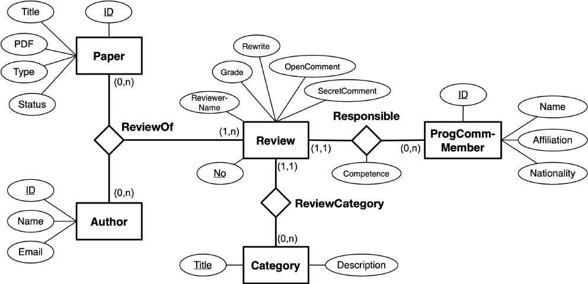
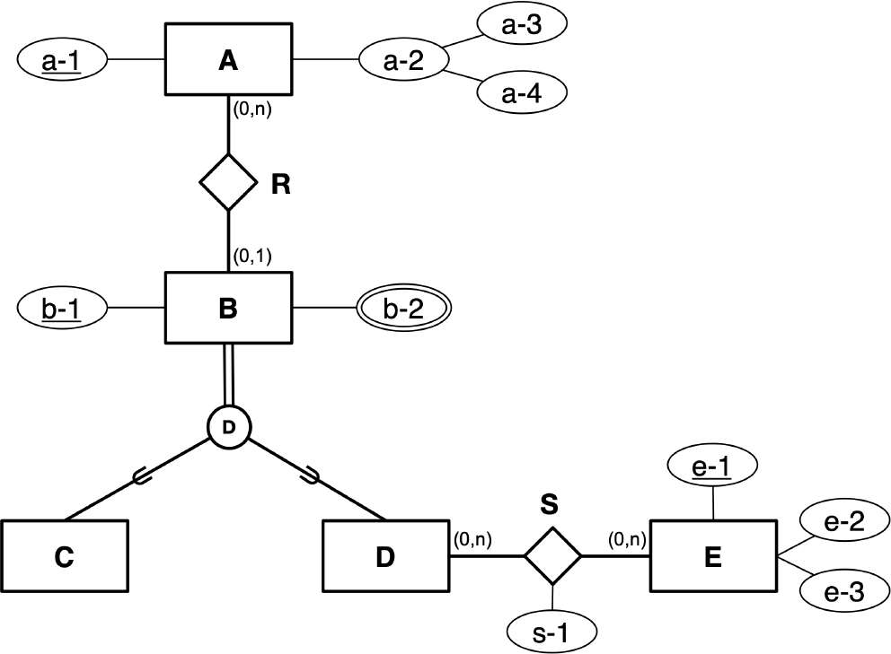
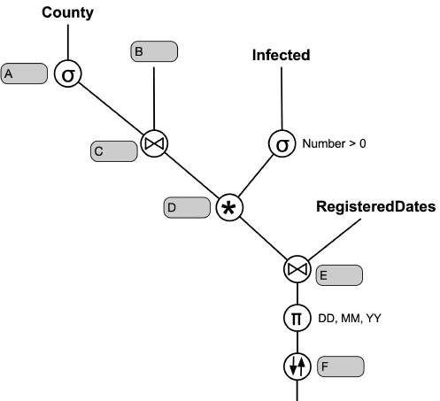
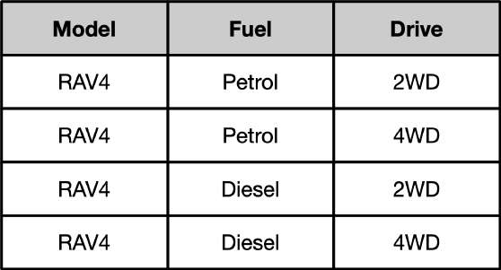
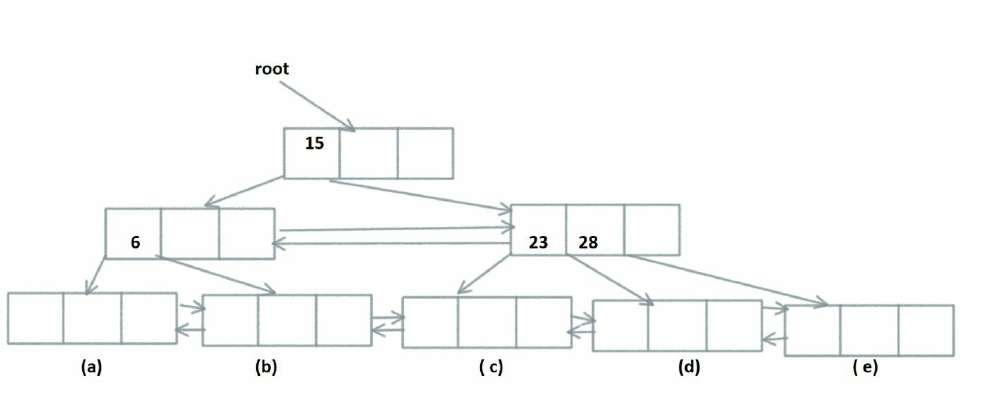

# TDT4145 - vår 2020: Sensurveiledning

**Sensurveiledning for TDT4145 vår 2020, eksamen 11. mai**

## Læringsutbyttebeskrivelser for TDT4145

### Kunnskaper

1. Databasesystemer: generelle egenskaper og systemstruktur.
2. Datamodellering med vekt på entity-relationship-modeller.
3. Relasjonsdatabasemodellen for databasesystemer, databaseskjema og dataintegritet.
4. Spørrespråk: Relasjonsalgebra og SQL.
5. Designteori for relasjonsdatabaser.
6. Systemdesign og programmering mot databasesystemer.
7. Datalagring, filorganisering og indeksstrukturer.
8. Utføring av databasespørringer.
9. Transaksjoner, samtidighet og robusthet mot feil.

### Ferdigheter

1. Datamodellering med entity-relationship-modellen.
2. Realisering av relasjonsdatabaser.
3. Databaseorientert programmering: SQL, relasjonsalgebra og database-programmering i Java.
4. Vurdering og forbedring av relasjonsdatabaseskjema med utgangspunkt i normaliseringsteori.
5. Analyse og optimalisering av ytelsen til databasesystemer.

### Generell kompetanse

1. Kjennskap til anvendelser av databasesystemer og forståelse for nytte og begrensninger ved slike systemer.
2. Modellering av og analytisk tilnærming til datatekniske problemer.

## Poenggrenser brukt

Terskelverdier:

- Bestått: 41
- Ikke bestått: 0

Dette er en tentativ poenggrense. Den kan bli justert ved avslutting av sensur.

## Problem 1 (15 %)

### Situasjonsbeskrivelse

VLDB er en internasjonal konferanse om databasesystemer som skal arrangeres i Trondheim i desember. For å administrere vurderingen av de vitenskapelige arbeidene (heretter kalt «paper») som sendes inn til konferansen, ønsker man å ta i bruk et egnet databasesystem.

I god tid før konferansen sender man ut Call for Papers der fagmiljøet inviteres til å sende inn paper av ulike typer, f.eks. «ordinært paper», «kort paper» og «plakat» (eng: poster). Hvert mottatt paper får en unik identifikator, og man må kunne lagre tittel, forfatter(e), e-postadresse til hver av forfatterne, PDF-fil og type paper. For å vurdere kvaliteten til de ulike paper-ene, setter man sammen en programkomité med kvalifiserte forskere innen det aktuelle fagområdet. Medlemmene i programkomiteen registreres med et unikt nummer, navn, tilknytning (universitet, forskningsorganisasjon, etc.) og e-postadresse. Hvert paper blir tilordnet tre medlemmer av programkomiteen som hver sørger for en uavhengig vurdering (review) av paper-et. Et medlem av programkomiteen er ansvarlig for de paper-ene han eller hun får tildelt, men trenger ikke å gjøre selve vurderingen selv. Dersom en annen person står for selve gjennomgangen og vurderingen av et paper, må man kunne registrere navnet på denne personen.

Hvert paper blir vurdert innen kategoriene “originality”, ”significance”, ”technical quality”, ”relevance”, ”presentation” og ”overall rating”. For hver kategori finnes det en tekst som beskriver kategorien og definerer hva som skal vektlegges i vurderingen. Innen hver kategori får paper-et en karakter fra 1 («Strong reject») til 7 («Strong accept») fra hver av de tre reviewerne. I tillegg kan hver reviewer skrive en kommentar til forfatterne og en (hemmelig) kommentar til programkomiteen. For å kunne vurdere ulike oppfatninger opp mot hverandre, må hver reviewer oppgi sin kompetanse (høy/middels/lav) innen det emnet som paper-et handler om. For hvert paper skal hver reviewer antyde hvor mye (ingen/litt/middels/mye) omskriving som er nødvendig før paper-et eventuelt kan aksepteres. Når alle paper er vurdert og bedømt, samles programkomiteen til et møte der de velger ut de paper-ene som skal presenteres på konferansen. Disse paper-ene får status som ”accepted”, mens øvrige innsendte paper får status som ”rejected”. Melding om programkomiteen sin beslutning, samt kopi av review-resultatene, sendes forfatterne pr e-post.

### Datamodell

I figuren under er vist et forslag til datamodell for VLDB.



### Oppgave

Forslaget på datamodell har en del feil eller uheldige løsninger som gjør at modellen ikke er i overensstemmelse med situasjonsbeskrivelsen. Det er minst to slike problemer og ikke flere enn 7.

Det er din oppgave å finne disse problemene i den foreslåtte modellen. For hvert problem skal du forklare hva som er feil/uheldig og du skal beskrive hvordan problemet bør rettes opp.

Gjør kort rede for eventuelle forutsetninger som du finner det nødvendig å gjøre.

### Løsning

Vi tenker i utgangspunktet at det er fem feil i den foreslåtte modellen:

1. Sammenhengene mellom Paper, Author og Review bør ikke modelleres som en trinær relasjonsklasse. Den bør erstattes av to binære relasjonsklasser:
   - En «Author-of-Paper» relasjonsklasse mellom Author og Paper, helst med (1,n) restriksjon på begge sider.
   - En «Paper-Review» relasjonsklasse mellom Paper og Review, helst med (0,3) restriksjon på Paper-siden og (1,1) restriksjon på Review-siden.
2. For relasjonsklassen ReviewCategory har satt en restriksjon som gjør at et review er knyttet til en bestemt Category. Det er ikke riktig, her skulle restriksjonen vært (0,n).
3. Grade er modellert som er attributt på review, men innenfor et review skal det gis en karakter for hver (vurderings-)kategori. Attributtet må derfor flyttes til ReviewCategory-relasjonsklassen.
4. Kompetansen skal spesifiseres for den som faktisk gjør review og ikke for det ansvarlige programkomite-medlemmet. Competence-attributtet skal derfor flyttes fra Responsible-relasjonsklasen til Review-entitetsklassen.
5. Nasjonalitet for programkomite-medlemmer er ikke nevnt noe sted, dette attributtet skal derfor tas bort.

Det kan tenkes at studenten påpeker andre feil eller uheldige forhold. I vurderingen tas disse og begrunnelsen for dem med i vurderingen, og det skal tas hensyn til at noen feil er mer graverende enn andre.

## Problem 2 (10 %)

Ta utgangspunkt i følgende EER-modell.



Vis hvordan denne modellen kan oversettes til en tilsvarende relasjonsdatabasemodell. Du skal oppgi tabeller, attributter, primærnøkler og fremmednøkler. Diskuter alternative løsninger og forklar hvorfor du mener ditt forslag er det beste alternativet.

### Løsning

Det er ikke er noen tvil om at vi skal ha tabellene:

- `A(a-1, a-3, a-4)`
- `E(e-1, e-2, e-3)`

**A) En løsning der vi bare beholder superklassen:**

- `B(b-1, a-1, type)`
  - `a-1` er fremmednøkkel mot A-tabellen, kan ta NULL-verdi
  - `type` kan ta verdiene «C» eller «D»
- `B2-attributt(b-1, b-2)`
  - `b-1` er fremmednøkkel mot B-tabellen.
  - Siden vi ikke vet om ulike B-entiteter kan dele verdier for `b-2` blir nøkkelen: `(b-1, b-2)`.
- `S(b-1, e-1, s-1)`
  - `b-1` er fremmednøkkel mot B-tabellen. Kan ikke ha NULL-verdi, det er dekket av at attributtet inngår i primærnøkkelen.
  - `e-1` er fremmednøkkel mot E-tabellen. Kan ikke ha NULL-verdi, det er dekket av at attributtet inngår i primærnøkkelen.

**B) En løsning der vi bare beholder sub-klassene:**

- `C(b-1, a-1)`
  - `a-1` er fremmednøkkel mot A-tabellen, kan ta NULL-verdi
- `D(b-1, a-1)`
  - `a-1` er fremmednøkkel mot A-tabellen, kan ta NULL-verdi
- `B2-attributt-i-C(b-1, b-2)`
  - `b-1` er fremmednøkkel mot C-tabellen. Kan ikke ha NULL-verdi, det er dekket av at attributtet inngår i primærnøkkelen.
  - Siden vi ikke vet om ulike C-entiteter kan dele verdier for `b-2` blir nøkkelen: `(b-1, b-2)`.
- `B2-attributt-i-D(b-1, b-2)`
  - `b-1` er fremmednøkkel mot D-tabellen. Kan ikke ha NULL-verdi, det er dekket av at attributtet inngår i primærnøkkelen.
  - Siden vi ikke vet om ulike D-entiteter kan dele verdier for `b-2` blir nøkkelen: `(b-1, b-2)`.
- `S(b-1, e-1, s-1)`
  - `b-1` er fremmednøkkel mot D-tabellen. Kan ikke ha NULL-verdi, det er dekket av at attributtet inngår i primærnøkkelen.
  - `e-1` er fremmednøkkel mot E-tabellen. Kan ikke ha NULL-verdi, det er dekket av at attributtet inngår i primærnøkkelen.

**C) En løsning der vi beholder både superklassen og sub-klassene:**

- `B(b-1, a-1, type)`
  - `a-1` er fremmednøkkel mot A-tabellen, kan ta NULL-verdi
  - `type` kan ta verdiene «C» eller «D»
- `B2-attributt(b-1, b-2)`
  - `b-1` er fremmednøkkel mot B-tabellen. Kan ikke ha NULL-verdi, det er dekket av at attributtet inngår i primærnøkkelen.
  - Siden vi ikke vet om ulike B-entiteter kan dele verdier for `b-2` blir nøkkelen: `(b-1, b-2)`.
- `C(b-1)`
  - `b-1` er fremmednøkkel mot B-tabellen. Kan ikke ha NULL-verdi, det er dekket av at attributtet inngår i primærnøkkelen.
- `D(b-1)`
  - `b-1` er fremmednøkkel mot B-tabellen. Kan ikke ha NULL-verdi, det er dekket av at attributtet inngår i primærnøkkelen.
- `S(b-1, e-1, s-1)`
  - `b-1` er fremmednøkkel mot D-tabellen. Kan ikke ha NULL-verdi, det er dekket av at attributtet inngår i primærnøkkelen.
  - `e-1` er fremmednøkkel mot E-tabellen. Kan ikke ha NULL-verdi, det er dekket av at attributtet inngår i primærnøkkelen.

Det er ikke forventet at alle alternativene spesifiseres i full detaljeringsgrad slik det er gjort her.

Det som skal vektlegges ved vurderingen er kvaliteten av den foreslåtte oversettingen, at det vises forståelse for hva alternativene er og at det gjøres en fornuftig diskusjon av fordeler og ulemper ved de ulike valgene.

Det er nærliggende å tenke at alternativ A, der vi beholder bare superklassen, samlet sett er den beste løsningen fordi:

- Det gir det minste antallet tabeller, to færre enn de andre alternativene.
- Det samler «all informasjon» om B-entiteter i en tabell, sammenlignet med alternativ B og C som sprer dette over flere tabeller.
- Det samler R-relasjonene i en tabell som er en fordel sammenlignet med alternativ B som splitter disse mellom to tabeller.
- Det samler B2-attributt-informasjonen i en tabell, sammenlignet med alternativ B som splitter dette over to tabeller.
- Den eneste egentlige ulempen ved å droppe sub-klassene er at S-relasjonene må lenkes mot tabellen for superklassen og ikke mot en egen tabell for sub-klassen D. Man vil altså måtte passe på at `type=«D»` for alle rader i B-tabellen som det refereres til fra S-tabellen.

## Problem 3-6 (4 x 5 %)

Ta utgangspunkt i følgende skjema for en relasjonsdatabase som holder oversikt over Korona-pandemiens utvikling i Norge. Primærnøkler er understreket.

```text
RegisteredDates(DateSeqNo, DD, MM, YY, WeekNo)
County(CountyNo, Name, Population)
Municipality(MunNo, Name, Population, CountyNo)
     - CountyNo er fremmednøkkel mot County, kan ikke være NULL
Tested(MunNo, DateSeqNo, Number)
     - Hvis det ikke er testet noen settes Number til 0.
     - MunNo er fremmednøkkel mot Municipality, kan ikke være NULL
     - DateSeqNo er fremmednøkkel mot RegisteredDates, kan ikke
       være NULL
Infected(MunNo, DateSeqNo, Number)
     - Hvis det ikke er registert ny smitte settes Number til 0.
     - MunNo er fremmednøkkel mot Municipality, kan ikke være NULL
     - DateSeqNo er fremmednøkkel mot RegisteredDates, kan ikke
       være NULL
Hospitalized(MunNo, DateSeqNo, Number)
     - Hvis det ikke er noen innlagt på sykehus settes Number til
       0.
     - MunNo er fremmednøkkel mot Municipality, kan ikke være NULL
     - DateSeqNo er fremmednøkkel mot RegisteredDates, kan ikke
       være NULL
```

### Problem 3

I figuren under har vi vist en relasjonsalgebra-spørring som skal finne datoer, representert med dag, måned og år, da det er registrert smitte i Trøndelag (county). Resultatet skal være sortert på år, måned og dag slik at de siste datoene kommer først.



Din oppgave er å finne ut hva som skal stå i de seks boksene merket med A-F.

### Løsning

A: `Name = «Trøndelag»`  
B: `Municipality`  
C: `County.CountyNo = Municipality.CountyNo`  
D:  
E: `Infected.DateSeqNo = RegisteredDates.DateSeqNo`  
F: `YY DESC, MM DESC, DD DESC`

### Problem 4

Skriv en SQL-spørring som finner ut hvor mange kommuner det er i de ulike fylkene i Norge. Resultatet skal inneholde fylkesnavn og antall kommuner, sortert etter synkende antall kommuner.

### Løsning

```sql
select County.Name, count(MunNo) AS AntallKommuner
from County inner join Municipality
     on County.CountyNo = Municipality.CountyNo
group by County.Name
order by AntallKommuner DESC
```

Legg merke til at det ikke kan joines med naturlig join i dette tilfellet.

### Problem 5

Skriv en SQL-spørring som finner alle datoer som er registrert i RegisteredDates, der det er registrert 0 innlagte på sykehus i Trondheim kommune. I resultatet skal du bare ta med DateSeqNo.

### Løsning

```sql
select DateSeqNo
from Municipality inner join Hospitalized
     on Municipality.MunNo = Hospitalized.MunNo
where Name = «Trondheim»
  and Number = 0
```

Legg merke til at det kan joines med naturlig join i dette tilfellet.

### Problem 6

Skriv SQL-setningene som skal til for å registrere data for Trondheim kommune 6. april 2020. Du kan gå ut fra at Trondheim er registrert i Municipality-tabellen med kommunenummer 1601 (MunNo). Datoen 6. april 2020 må registreres med DateSecNo=41, DD=6, MM=4, YY=2020 og WeekNo=15. På den aktuelle datoen ble det i Trondheim testet 64 personer, det var 3 positive tester og 12 personer var innlagt på sykehus.

### Løsning

```sql
insert into RegisteredDates values (41,6,4,2020,15);
insert into Tested values (1601,41,64);
insert into Infected values (1601,41,3);
insert into Hospitalized values (1601,41,12);
```

Det er selvsagt bare en fordel om man tar med kolonnenavn som for eksempel i:

```sql
insert into Hospitalized (MunNo, DateSeqNo, Number)
values (1601,41,12)
```

## Problem 7 (6 % - 2+2+2)

### Oppgave a

Lag et originalt eksempel på en tabell som er på andre normalform (2NF), men ikke på tredje normalform (3NF). Forklar hvorfor det er slik.

I denne oppgaven skal du ikke kopiere et eksempel fra en annen kilde, det vil gi null uttelling.

### Løsning

Her gjelder det å lage et eksempel der vi ikke har noen delvise avhengigheter av en nøkkel og der det er minst en funksjonell avhengighet blant ikke-nøkkel-attributtene.

Et enkelt eksempel kan være: `R(A, B, C)` der `F={A->B; B->C}`. Her er A den eneste nøkkelen. Siden nøkkelen ikke er sammensatt har vi 2NF. `A->B` oppfyller 3NF siden A er en (super-)nøkkel. `B->C` bryter derimot kravet til 3NF siden B ikke er en supernøkkel og C ikke er et nøkkelattributt.

I forelesningsnotatene er det brukt et eksempel: `Person(PID, PostNr, PostSted)` der `PostNr->PostSted`. Å gjengi dette bør ikke gi uttelling, ellers vil det være vanskelig å avgjøre om et eksempel er kopiert.

### Oppgave b

Grei ut om problemene som kan oppstå på grunn av at tabellen du foreslår i deloppgave a ikke er på tredje normalform.

### Løsning

På grunn av `B->C`, der B ikke er en supernøkkel, vil vi kunne ha redundant lagring av sammenhengen mellom B og C (altså i flere rader). Dette åpner for at en databasetilstand kan bli inkonsistent ved at en B-verdi kan være assosiert med ulike C-verdier (i forskjellige rader). I tillegg vil vi ha innsettings-, oppdaterings- og slettings-anomalier. Disse bør konkretiseres i besvarelsen.

### Oppgave c

Vis hvordan tabellen du foreslår i deloppgave a kan splittes opp slik at vi oppnår tredje normalform. Forklar hvorfor forslaget ditt er en god løsning.

### Løsning

Splitter R i `R1(A, B)` med `F1={A->B}` og `R2(B, C)` med `F2={B->C}`. Dette er en god løsning fordi begge del-tabellene er på 3NF, siden A og B er supernøkler i hhv. R1 og R2. I tillegg oppfyller dekomponeringen de øvrige kravene til en god oppsplitting av en tabell:

- Vi har attributtbevaring siden alle attributtene i R er med i minst en av deltabellene.
- Vi bevarer funksjonelle avhengigheter siden alle avhengigheter i F er med i enten F1 eller F2.
- Dekomponeringen har tapsløst-join-egenskapen siden deltabellenes felles attributt (B) er supernøkkel i R2.

## Problem 8 (3 %)

Ta utgangspunkt i en tabell `R(A, B, C, D, E)`. Attributtene (A-E) er alle definert over en datatype med heltallene fra og med 1 til og med 10.

Hva er det maksimale antall rader som kan finnes i en tabellforekomst av R? Hvilken primærnøkkel vil R ha i dette tilfellet? Du må begrunne svarene.

### Løsning

Hvert av attributtene kan ha 10 ulike verdier. Det er ingen restriksjoner som begrenser sammenhengen mellom verdier for ulike attributtene. En tabell er en mengde rader og kan derfor ikke ha flere like rader (med samme verdier for alle attributter). Det maksimale antall rader i tabellen er dermed: `10^5 = 100 000`.

Siden det ikke er noen (ikke-trivielle) funksjonelle avhengigheter vil nøkkelen være `ABCDE`.

## Problem 9 (2 %)

Ta utgangspunkt i en tabell `R(A, B, C, D, E)`. Attributtene (A-E) er alle definert over en datatype med heltallene fra og med 1 til og med 10.

Anta at den funksjonelle avhengigheten `C->BD` gjelder for R. Hva er primærnøkkelen i dette tilfellet? Hvor mange rader kan det maksimalt være i en tabellforekomst av R? Du må begrunne svarene.

### Løsning

Her er primærnøkkelen `ACE` siden `ACE+ = R` og ingen ekte delmengde av ACE har denne egenskapen. Dette er den eneste kandidatnøkkelen da det ikke finnes (ikke-trivielle) funksjonelle avhengigheter der A, C eller E er avhengig av andre attributter.

På grunn av restriksjonen `C->BD` må alle rader som har samme verdi for C også ha samme verdier for B og D. Det er 10 ulike verdier for C som fritt kan kombineres med 10 ulike verdier for henholdsvis A og E. Det maksimale antall rader blir derfor `10^3 = 1000`. En annen mulighet er å resonnere ut fra nøkkelen, ACE, som kan ha `10^3 =1000` ulike verdier.

## Problem 10 (4 %)

Ta utgangspunkt i tabellen `Bil(modell, drivstoff, fremdrift)`. Et eksempel på en tabellforekomst er vist under.



Tabellen er på Boyce-Codd normalform siden det ikke er noen ikke-trivielle funksjonelle avhengigheter som gjelder for tabellen. Hvilke forutsetninger om miniverdenen må vi gjøre for at tabellen Bil skal være på fjerde normalform (4NF)? Du må begrunne svaret.

### Løsning

En tabell er på 4NF når det for alle ikke-trivielle fler-verdi-avhengigheter, `X->>Y`, er slik at X er en supernøkkel for tabellen.

Siden vi ikke har noen funksjonelle avhengigheter består den eneste supernøkkelen av alle attributtene i tabellen.

Det er tre muligheter for ikke-trivielle MVD-er som alltid vil komme i par:

- `Modell ->> Fuel` og `Modell ->> Drive`
- `Fuel ->> Modell` og `Fuel ->> Drive`
- `Drive -> Modell` og `Drive ->> Fuel`

Skal vi ha fjerde normalform kan ikke noen av disse gjelde, det vil ha følgende konsekvenser:

- `Modell ->> Fuel` og `Modell ->> Drive`: Disse MVD-ene gjelder hvis man for en modell må tilby alle drivstoff-typer som modellen tilbyr, for alle fremdrifts-typer som modellen tilbyr. Dette kan altså ikke være en generell regel Som et eksempel må det være mulig at RAV4 leveres kun med 4WD for «hybrid» drivstoff.
- `Fuel ->> Modell` og `Fuel ->> Drive`: Disse MVD-ene gjelder hvis alle modeller som bruker en drivstoff-type må tilbys med alle fremdriftstyper som kombineres med denne drivstoff-typen. Dette kan altså ikke være en generell regel. Som et eksempel må det være mulig at X5 med diesel som drivstoff, leveres kun med 4WD fremdrift.
- `Drive -> Modell` og `Drive ->> Fuel`: Disse MVD-ene gjelder hvis alle modeller med en fremdriftstype tilbys med alle drivstoff-alternativ som kombineres med denne fremdrifts-typen. Dette kan altså ikke være en generell regel. Som et eksempel må det være mulig at X5 med 4WD bare finnes i dieselutgave.

## Problem 11 (5 %)

Vi har en extendible hashingstruktur hvor vi starter med 4 blokker (binært: 00, 01, 10, 11), hvor hver blokk har plass til to nøkler.

Når vi hasher inn de følgende nøklene: 7, 2, 14, 13, 11, 6, 1, 27.

Hvilken blokk er den første som må splittes? Hva er lokal dybde for de to blokkene (den gamle og den nye) etter splitten?

Husk å svare på begge spørsmålene.

### Løsning

Vi hasher først nøklene med MOD 4. Vi trenger kun vite hvilken blokk som først blir splittet og da trenger vi ikke MOD 8 for å svare på spørsmålet.

```text
7 MOD 4 = 3 = 11 (binært)
2 MOD 4 = 2 = 10 (binært)
14 MOD 4 = 2 = 10 (binært)
13 MOD 4 = 1 = 01 (binært)
11 MOD 4 = 3 = 11 (binært)
6 MOD 4 = 2 = 10 (binært)
1 MOD 4 = 1 = 01 (binært)
27 MOD 4 = 3 = 11 (binært)
```

Den første blokka som splittes er 10 (desimalt 2). Etter splitten blir lokal dybde på den gamle og nye blokka 3. Det samme blir global dybde, men det er det ikke spurt om.

## Problem 12 (8 %)

Vi skal sette inn nøkler i et B+-tre med plass til tre nøkler i hver blokk. Treet under skal inneholde nøkler på løvnivå (level=0). De er satt inn i den rekkefølgen de står i under. For hver blokk på løvnivå, dvs. (a)-( e), skriv hvilke nøkler som skal inn der. Du skal ikke tegne, bare skriv det som tekst: f.eks. (a): nøkkel 1, nøkkel 2, ... (b): (nøkkel), ...

Følgende nøkler er satt inn:

```text
3, 6, 15, 23, 28, 34, 4, 8, 17 og 25.
```



### Løsning

Her er B+-treet nesten ferdigutfylt:

```text
a: (3, 4, _)
b: (6, 8, _)
c: (15, 17, _)
d: (23, 25 ,_)
e: (28, 34, _)
```

## Problem 13 (10 %)

Vi har en tabell `Student (studnr, pnr, fornavn, etternavn, studieprogram, epost)`.

Tabellen lagres i en heapfil med 2000 blokker. Det er 20 studentposter i hver blokk.

For å tvinge gjennom at studnr er primærnøkkel, brukes et B+-tre med studnr som søkenøkkel og RecordId som peker til posten i heapfila. B+-treet har 3 nivåer og 1000 blokker på løvnivå.

Vi har også et annet B+-tre med søkenøkkel etternavn. Dette B+-treet har også 3 nivåer, men 1500 blokker på løvnivå.

Hvor mange blokker aksesseres ved de følgende queryene. Husk å begrunne hvert svar.

```sql
a) SELECT * FROM Student WHERE studnr = 123456;
b) SELECT * FROM Student WHERE fornavn=’Jon’;
c) SELECT * FROM Student WHERE etternavn=’Hansen’;
d) SELECT DISTINCT etternavn FROM Student ORDER BY etternavn;
```

Husk å svare på alle 4 delspørsmålene.

### Løsning

- a) 3 (ned B+-tre) + 1 (heap) = 4
- b) 2000 (scan heap)
- c) 3 (ned B+-tre) + N * “Hansen” (heap). Noen kan argumentere for at det er så mange ‘Hansen’ at de trenger to blokker i B+-treet på løvnivå.
- d) 2 (ned B+-tre) + 1500 (sidevegs i B+-tre) = 1502.

## Problem 14 (2 %)

Hvilket isolasjonsnivå for transaksjoner må vi bruke hvis vi ønsker å unngå at en annen transaksjon setter inn poster mellom de postene som en transaksjon ønsker å scanne og lese? Begrunn svaret ditt.

### Løsning

`ISOLATION LEVEL=SERIALIZABLE` tillater ikke såkalte «fantomer»., dvs. poster som dukker opp «innemellom» de du skanner.

## Problem 15 (5 %)

Vi har en historie som vi prøver å få utført ved at transaksjonene setter lese- og skrivelåser. Vi innfører tofaselåsing (2PL) av typen rigorous for denne historien.

```text
r1(X);r2(X);w1(X);c1;r2(Y);r3(Z);w3(Z);c3;w2(Y);c2;
```

I hvilken rekkefølge committer de tre transaksjonene T1, T2 og T3 når vi forutsetter rigorous 2PL? Du skal ikke tegne historien, bare skriv rekkefølgen av transaksjonenes commit.

### Løsning

```text
c3; c2; c1;
```

Forklaring:

```text
T1            T2             T3

rl1(X);
r1(X);
              rl2(X);
              r2(X);
waiting;
              rl2(Y);
              r2(Y);
                             rl3(Z);
                             r3(Z);
                             wl3(Z);
                             w3(Z);
                             c3; (unlock(Z))
              wl2(Y);
              w2(Y);
              c2; (unlock(X,Y))
wl1(X);
w1(X);
c1; (unlock(X))
```

## Problem 16 (5 %)

Vi har følgende logg som er funnet under recovery etter et krasj (vi bruker ARIES):

```text
(104, T3, 103, Commit)
(105, StartCkpt)
(106, EndCkpt)
(107, T4, NIL, Update, Page A, befImage, aftImage)
(108, T4, 107, Update, Page B, befImage, aftImage)
(109, T5, NIL, Update, Page C, befImage, aftImage)
(110, T5, 109, Update, Page A, befImage, aftImage)
(111, T4, 108, Commit)
```

Anta at DPT og Transaksjonstabellen er tomme i sjekkpunktloggposten med LSN 106 (EndCkpt). Loggpostene for update har formatet `(LSN, Transaction, PrevLSN, Operation, Page, befImage, aftImage)`. Hvis det er den første loggede operasjonen for en transaksjon, vil PrevLSN være NIL. For Commit og Abort er formatet `(LSN, Transaction, PrevLSN, Operation)`.

Skriv opp innholdet av Dirty Page Table (DPT) og Transaksjonstabellen etter at analysen har kjørt seg ferdig. Du skal ikke tegne disse, bare skriv de som tekst.

### Løsning

Vi starter i sjekkpunktloggposten og leser DPT og TransTabell. De er begge tomme. Scanner så loggen forover i analysen og oppdaterer med den første nye update-loggpostens LSN per blokk (page). Samtidig blir TransTabellen oppdatert med nye transaksjoner, sist registrerte loggpost og commits.

**DPT**

```text
(Page, RecLSN)
(A, 107)
(B, 108)
(C, 109)
```

**TransTabell**

```text
(TransId, LastLSN, Status)
(T4, 111,Commit)
(T5, 110,Active)
```

## Problem 17 (5 %)

Anta ARIES-recovery er gjort for loggen i oppgave 16.

Skriv opp PageLSN for datablokkene A, B, C etter redo-recovery.

Skriv også opp PageLSN for datablokkene A, B, C etter undo-recovery.

Husk å begrunne og å svare på begge spørsmål.

### Løsning

Etter REDO vil blokkene i buffer ha følgende PageLSN (på disk blir de oppdatert etter hvert):

```text
A 110
B 108
C 109
```

Etter UNDO har det blitt laget kompenserende loggposter for LSN 110 og 109. Vi sier disse to loggpostene får LSN=112 (CLR for 110) og LSN=113 (CLR for 109). UNDO går baklengs gjennom loggen.

Derfor får blokkene i buffer PageLSN (på disk blir de oppdatert etter hvert):

```text
A 112
B 108
C 113
```
