# TDT4145 - vår 2021: Sensorveiledning

**Sensorveiledning TDT4145 eksamen 11. juni 2021**  
Versjon 2. mai 2022

## Læringsutbyttebeskrivelser for TDT4145

### Kunnskaper

1. Databasesystemer: generelle egenskaper og systemstruktur.
2. Datamodellering med vekt på entity-relationship-modeller.
3. Relasjonsdatabasemodellen for databasesystemer, databaseskjema og dataintegritet.
4. Spørrespråk: Relasjonsalgebra og SQL.
5. Designteori for relasjonsdatabaser.
6. Systemdesign og programmering mot databasesystemer.
7. Datalagring, filorganisering og indeksstrukturer.
8. Utføring av databasespørringer.
9. Transaksjoner, samtidighet og robusthet mot feil.

### Ferdigheter

1. Datamodellering med entity-relationship-modellen.
2. Realisering av relasjonsdatabaser.
3. Databaseorientert programmering: SQL, relasjonsalgebra og database-programmering i Java.
4. Vurdering og forbedring av relasjonsdatabaseskjema med utgangspunkt i normaliseringsteori.
5. Analyse og optimalisering av ytelsen til databasesystemer.

### Generell kompetanse

1. Kjennskap til anvendelser av databasesystemer og forståelse for nytte og begrensninger ved slike systemer.
2. Modellering av og analytisk tilnærming til datatekniske problemer.

## Poenggrenser brukt

Terskelverdier:

- A: 88
- B: 76
- C: 64
- D: 52
- E: 37
- F: 0

Dette er de endelige poenggrensene brukt ved sensur.

## 1. Miscellaneous

**Poeng:** 3 %

**Svar:** Konservativ 2PL.

## 2. Miscellaneous

**Poeng:** 3 %

**Svar:** Tofaselåsing impliserer konfliktserialiserbarhet.

## 3. Miscellaneous

**Poeng:** 3 %

**Svar:** Recoverable.

## 4. Miscellaneous

**Poeng:** 3 %

**Svar:** ACA.

## 5. Miscellaneous

**Poeng:** 3 %

**Svar:** Recoverable.

## 6. Miscellaneous

**Poeng:** 3 %

**Svar:** Det tillater transaksjoner å lese data som andre transaksjoner skriver til samtidig.

For oppgave 7-9 var oppgaven å finne hvilket tall som skulle stå der a), d) og f) står i figuren. Randomisert mellom studentene.

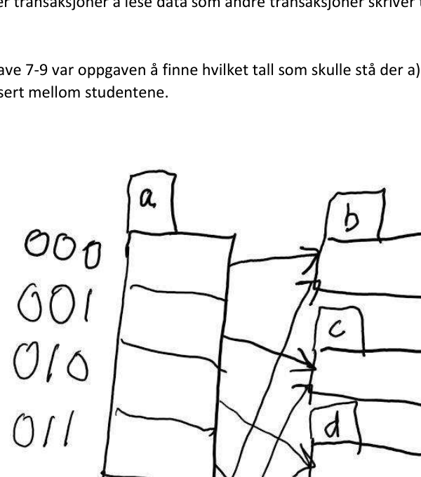

## 7. Extendible hashing

**Poeng:** 4 %

**Svar:** Global dybde `(a) = 3`.

## 8. Extendible hashing

**Poeng:** 4 %

**Svar:** Lokal dybde `(d) = 2`.

## 9. Extendible hashing

**Poeng:** 4 %

**Svar:** Lokal dybde `(f) = 3`.

For oppgave 10-13 stod det i oppgaven de fire sekvensene med nøkler som skulle settes inn, og en figur. Studentene skulle finne ut hvilken sekvens som ga B+-treet illustrert i oppgaven. Det var randomisert mellom studentene hvilken figur de fikk.

## 10. B+-tree

**Poeng:** 10 %

**Svar:** `2, 4, 7, 3, 5, 17, 13, 11, 18, 6, 8`.

Her var det en feil i figuren: den siste `5` på løvnivå skal være `6`. Dette ble opplyst med melding til alle under eksamen via Inspera. Svært mange studenter oppdaget feilen og ringte faglærer under eksamen. Et B+-tre skal ha unike søkenøkler.

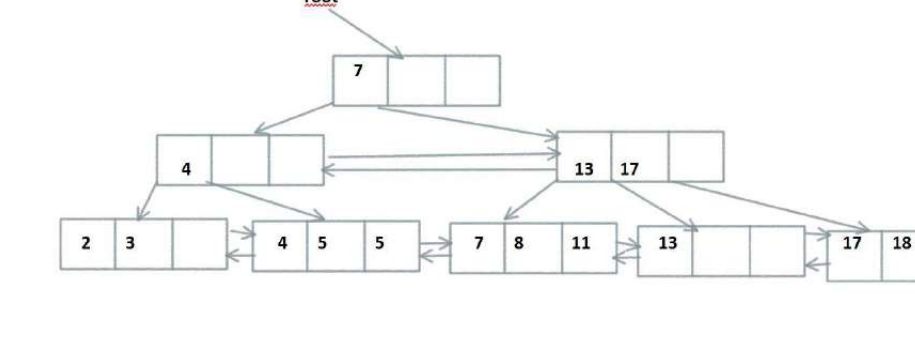

## 11. B+-tree

**Poeng:** 10 %

**Svar:** `2, 3, 4, 5, 6, 7, 8, 11, 13, 17, 18`.

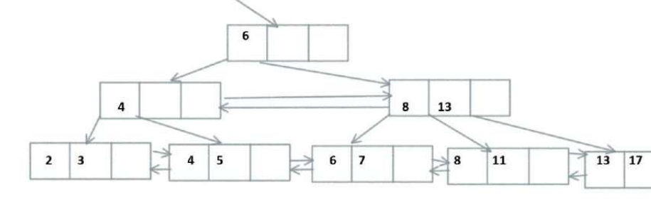

## 12. B+-tree

**Poeng:** 10 %

**Svar:** `11, 13, 2, 3, 17, 18, 4, 5, 8, 7, 6`.

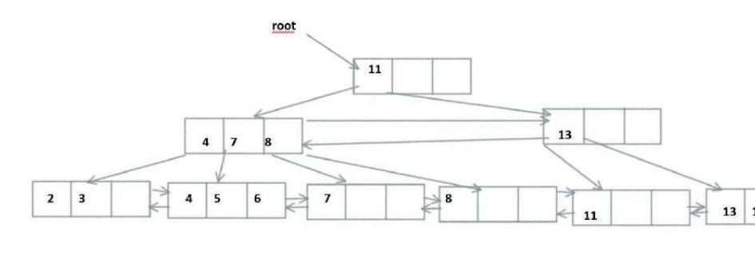

## 13. B+-tree

**Poeng:** 10 %

**Svar:** `7, 8, 6, 4, 5, 17, 18, 2, 3, 11, 13`.

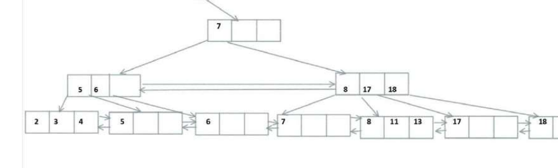

## 14. Recovery (ARIES)

**Poeng:** 6 %

**Svar:** `(B, 102)`, `(C, 106)` og `(A, 107)`.

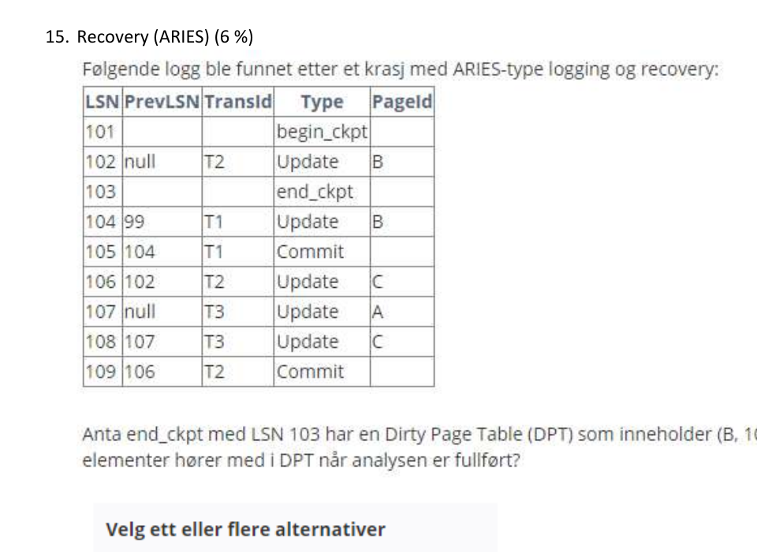

## 15. Recovery (ARIES)

**Poeng:** 6 %

**Svar:** `(B, 102)`, `(C, 106)` og `(A, 107)`.

## 16. Recovery (ARIES)

**Poeng:** 6 %

**Svar:** `(A, 97)`, `(C, 106)` og `(B, 108)`.

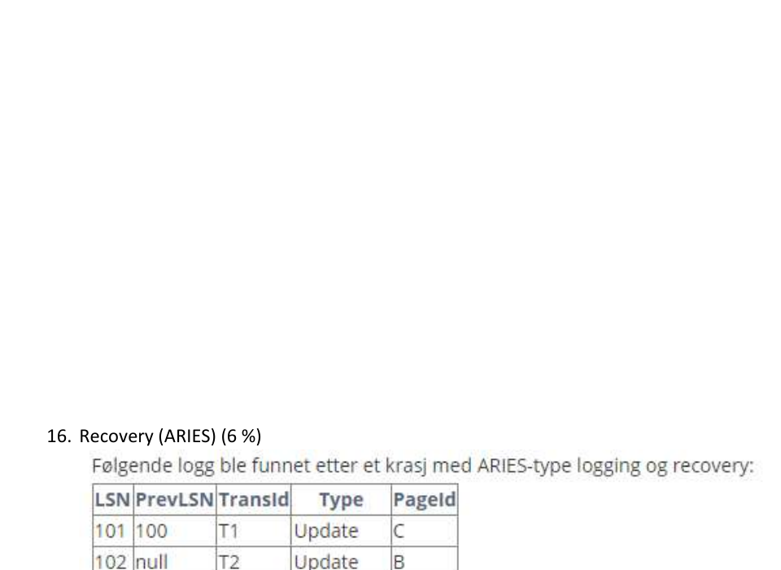

## 17. Access methods

**Poeng:** 3 %

**Svar:** 3.

## 18. Access methods

**Poeng:** 3 %

**Svar:** 1.11.

## 19. Access methods

**Poeng:** 3 %

**Svar:** 500.

## 20. 2PL Execution

**Poeng:** 5 %

**Svar:** `T3; T2; T1;`

## 21. 2PL Execution

**Poeng:** 5 %

**Svar:** `T2; T1; T3;`

Noen studenter ble forvirret av komma mellom `c1` og `c2`, men det skal være semikolon.

## 22. 2PL Execution

**Poeng:** 5 %

**Svar:** `T3; T2; T1;`

## 23. Join

**Poeng:** 5 %

**Svar:** 8012.

Minste tabell har alltid kun ett gjennomløp.

## 24. Join

**Poeng:** 5 %

**Svar:** 3016.

Minste tabell har alltid kun ett gjennomløp.

## 25. Join

**Poeng:** 5 %

**Svar:** 5012.

Minste tabell har alltid kun ett gjennomløp.

## 26. Miscellaneous

**Poeng:** 6 %

**Svar:** Blått kryss er rett svar.

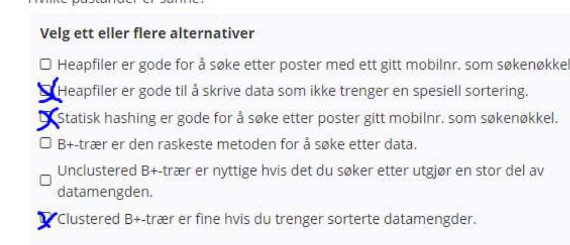

## 27. Miscellaneous

**Svar:** Blått kryss er rett svar.

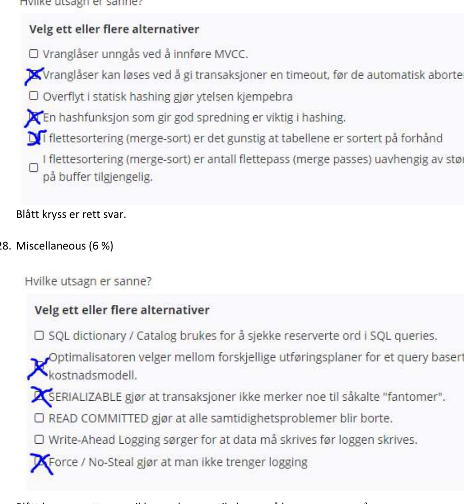

## 28. Miscellaneous

**Poeng:** 6 %

**Svar:** Blått kryss er rett svar. «ikke merker noe til» kan også leses som «unngår».

## 29. Miscellaneous

**Poeng:** 3 %

**Svar:** `LSN = 99`.

Eldste `RecLSN` i DPT.

## 30. Miscellaneous

**Poeng:** 3 %

**Svar:** 4 loggposter.

## 31. Miscellaneous

**Poeng:** 3 %

**Svar:** Page C.

I og med at den ikke er funnet i DPT i sjekkpunktloggposten.

## 32. Serializability

**Poeng:** 6 %

**Svar:** Blått kryss er rett svar.

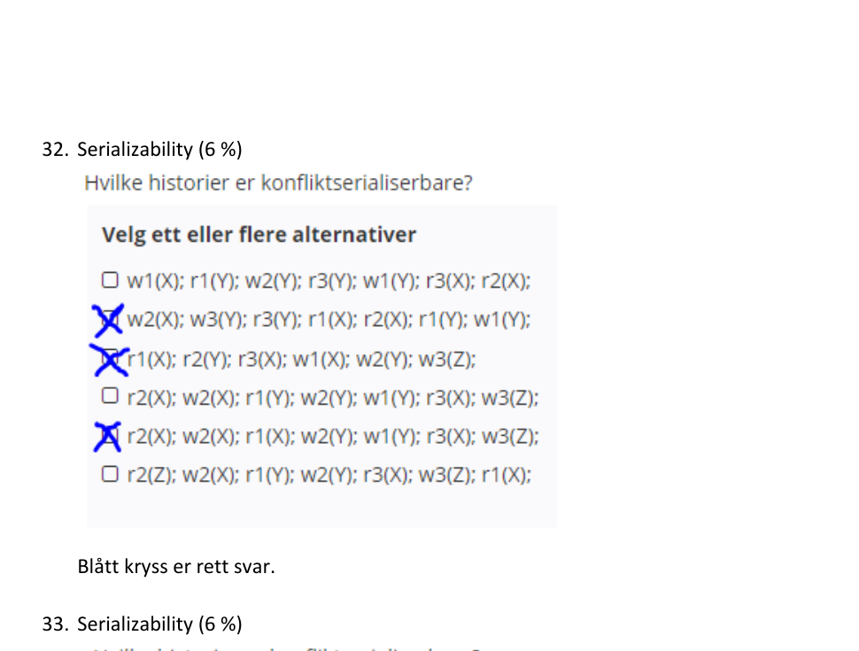

## 33. Serializability

**Poeng:** 6 %

**Svar:** Blått kryss er rett svar.

## 34. Serializability

**Poeng:** 6 %

**Svar:** Blått kryss er rett svar.

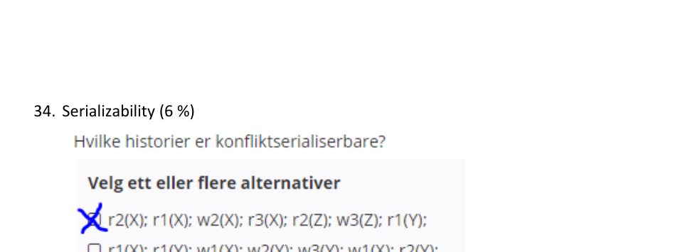

## 35. Datamodellering: BestPris

**Poeng:** 34 %

BestPris har informasjon om prisutviklingen for produkter, som vaskemaskiner eller mobiltelefoner. Et produkt registreres med en unik produkt-id, produktnavn og en kort spesifikasjon av produktet. BestPris har oversikt over leverandører som selger produkter som er registrert i databasen. Hver leverandør er registrert med en unik leverandør-id, leverandørnavn og en nettadresse til leverandørens nettsider. Alle produkt har minst en leverandør. Produktene er organisert i ulike produktkategorier. Produktkategoriene har en unik kategori-id og et kategorinavn. Kategoriene er organisert i et hierarki med to nivåer, som for eksempel kategorien fotoutstyr med underkategorier som kamerahus, objektiv og blits. Et produkt kan være i mange kategorier. For et produkt kan man registrere produsent. Produsentene har en unik produsent-id samt navn og nettadressen til produsentens nettsider. Et produkt trenger ikke å være registrert med produsent og har aldri flere enn en produsent. En produsent kan være registrert uten å være knyttet til noe produkt.

Det skal være mulig å registrere tester av et produkt, dersom det finnes tilgjengelige tester på nett. En test registreres med en unik test-id, overskrift, og nettadressen til testen. En test kan omfatte flere produkter, for eksempel flere vaskemaskiner. BestPris registrerer bare tester som gjelder ett eller flere produkter i BestPris sin database. Det er mulig å registrere seg som bruker (e-postadresse og navn) hos BestPris. Brukere får tilgang til å legge inn vurderinger av produkt. En vurdering består av en karakter (1-10) og en kort begrunnelse. En bruker kan ikke ha flere vurderinger av samme produkt, men det er mulig for brukeren å endre karakter eller begrunnelse.

BestPris holder oversikt over prisutviklingen for et produkt. For hver leverandør som selger et produkt, registreres prisen på produktet. Priser kan endres maks en gang per døgn. På den måten kan BestPris lage oversikt over gjeldende priser for et produkt og finne de laveste prisene. BestPris kan også lage oversikter over den historiske prisutvikling til et produkt; for både laveste pris og for en særskilt leverandør.

Lag en ER-modell (du kan bruke alle virkemidler som er med i pensum) for denne databasen. Gjør kort rede for eventuelle forutsetninger som du finner det nødvendig å gjøre.

## 36. Datamodellering: Vaksinering

**Poeng:** 34 %

Helsedirektoratet ønsker å utvikle en nasjonal database for å holde oversikt over vaksinasjoner. Vaksinasjonene organiseres av kommunene (kommunenummer og kommunenavn) som har et antall vaksinasjonssenter (senter-id og navn). Et vaksinasjonssenter hører til en kommune og senter-id er unikt innenfor denne kommunen. Vaksinasjonssenter kan være alt fra en stor «vaksinasjonsfabrikk» til et helsesykepleierkontor, det omfatter alle steder der det foretas vaksinasjoner.

Det nasjonale vaksinasjonsprogrammet har et antall vaksiner som registreres i systemet. Hver vaksine har en unik vaksine-id, navn, produsent og en kort beskrivelse. Vaksiner kan bare settes av registrerte vaksinesettere. En vaksinesetter kan være tilknyttet ett eller flere vaksinasjonssenter. En vaksinesetter har bare lov til å sette de vaksinene som vedkommende er autorisert til å sette. Vaksinesettere er registrert med en unik vaksinesetter-id, navn og mobilnummer.

De som får satt vaksiner registreres med en unik person-id, navn, fødselsår, kjønn og et mobilnummer. Alle vaksinasjoner blir registrert, med informasjon om personen som fikk satt vaksinen, vaksinasjonssenter, vaksinesetter og vaksine. I tillegg registreres dato og tid. Om det oppsto avvik ved vaksinasjonen registreres dette, i tillegg til en kort beskrivelse av avviket. En vaksinasjon identifiseres med et unikt vaksinasjon-nr.

Dersom det oppstår bivirkninger etter en vaksinasjon, kan dette registreres i systemet. Det finnes en oversikt over alle leger med unik lege-id, navn og mobilnummer. En bivirkning registreres av en lege og gjelder en person som har fått satt en eller flere vaksiner. En registrert bivirkning har et løpenummer som er unikt for personen som har fått bivirkningen. Ved registrering av en bivirkning kan legen legge inn en eller flere vaksinasjoner som kan være årsak til bivirkningen. I tillegg registreres dato, tid og en kort beskrivelse av problemene som har oppstått. Det er ingen restriksjoner på hvor mange bivirkninger som kan registreres.

Lag en ER-modell (du kan bruke alle virkemidler som er med i pensum) for denne databasen. Gjør kort rede for eventuelle forutsetninger som du finner det nødvendig å gjøre.

## 37. Datamodellering: Hotellbestillinger

**Poeng:** 34 %

Hotellkjeden SovGodt har hoteller som registreres med unikt navn, adresse, nettsideadresse og telefonnummer. Kjeden klassifiserer standarden på hotellene fra 1 til 5 stjerner. Hotellkjeden klassifiserer rommene som tilbys i et antall romklasser. Hver romklasse har et unikt klassenavn og en beskrivelse som definerer standarden på rommene i denne klassen. Et hotell trenger ikke å ha rom av alle romklasser.

Hvert hotell i kjeden har et antall hotellrom som leies ut til kunder. En kunde er registrert med et unikt kundenummer, navn, adresse og mobilnummer. Hotellkjeden kan ha ett eller flere fordelsprogram, en kunde kan være medlem i ett av disse. Fordelsprogram har et unikt navn og en beskrivelse. Alle hotellrom har et romnummer som er unikt for det aktuelle hotellet, kan ha et navn, har antall soveplasser og et areal i kvadratmeter. Hotellrom er registrert med romklasse, rompris og om rommet er røykfritt, handicap-vennlig, har utsikt eller er spesielt stille.

Kunder kan gjøre bestillinger på et hotell. En bestilling har en unik bestilling-id og bestillingsdato og bestillingstid. En bestilling vil bestå av en eller flere romreservasjoner, der en romreservasjon gjelder fra en ankomstdato til en avreisedato. En romreservasjon har et løpenummer som er unikt innenfor bestillingen. Det er selvsagt viktig å unngå dobbeltbooking av rom. For en romreservasjon registreres hvor mange personer som skal bo på hvert rom. Hotellkjeden er åpen for prisforhandlinger, det skal derfor registreres en totalpris for en samlet bestilling, denne prisen kan være rabattert i forhold til prisen på de rommene som inngår i bestillingen.

Kunder kan også legge inn vurderinger av kvaliteten på et hotell. En slik vurdering vil bestå av en tittel, en samlet vurdering fra 1 til 6 (best), vurderingsdato og en beskrivende tekst. Det er ingen begrensninger på hvor mange vurderinger en kunde kan gjøre, verken totalt eller for et bestemt hotell. Spesielt verdifulle kunder kan få VIP-status og vil få ekstraordinær god behandling ved bestilling og under opphold ved et av kjedens hoteller.

Lag en ER-modell (du kan bruke alle virkemidler som er med i pensum) for denne databasen. Gjør kort rede for eventuelle forutsetninger som du finner det nødvendig å gjøre.

## Datamodelleringsoppgaven

Under er det vist utkast til løsning for de tre ulike modelleringsoppgavene. Det skal legges vekt på at de ulike modell-virkemidlene brukes på riktig måte. God overordnet struktur i datamodellen tillegges større vekt enn mer ubetydelige feil og mangler. Det finnes en del alternative modelleringsvalg og alternative forutsetninger som kan være like riktige som de som er vist i løsningsskissene.

Dersom det gjøres hensiktsmessige forutsetninger, skal disse legges til grunn ved vurderingen av løsningen.

### Oppgave om vaksinering

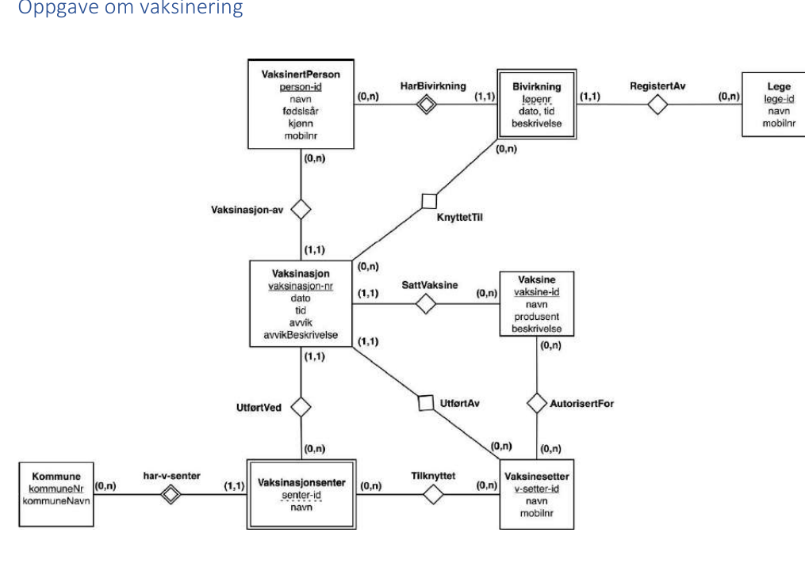

I løsningen har vi lagt til grunn følgende presiseringer av opplysningene i oppgaveteksten:

- Valg som er nødvendige for å spesifisere min-maks-restriksjoner for relasjonsklassene.

### Oppgave om hotellbestillinger

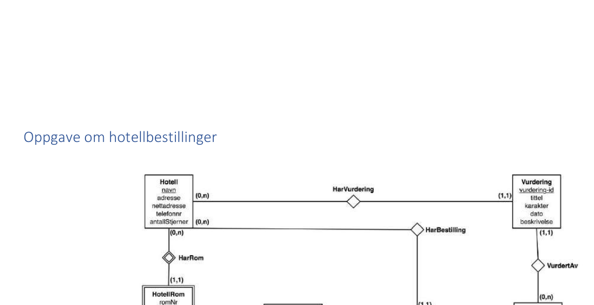

I løsningen har vi lagt til grunn følgende presiseringer av opplysningene i oppgaveteksten:

- Valg som er nødvendige for å spesifisere min-maks-restriksjoner for relasjonsklassene.

### Oppgave om produktpriser

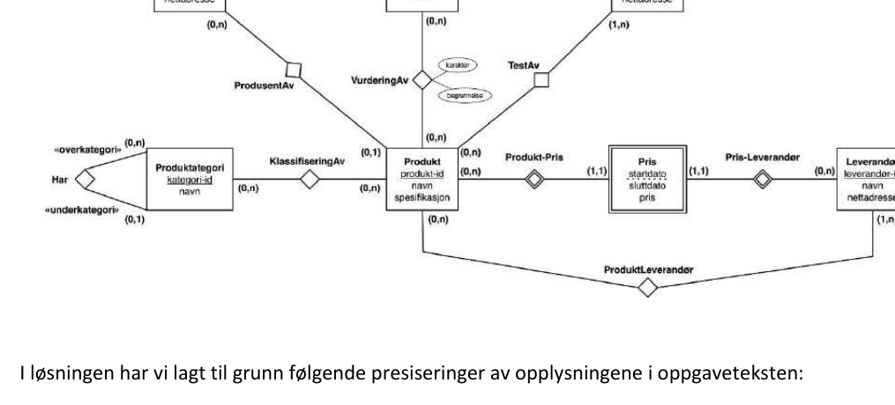

I løsningen har vi lagt til grunn følgende presiseringer av opplysningene i oppgaveteksten:

- Valg som er nødvendige for å spesifisere min-maks-restriksjoner for relasjonsklassene.
