# TDT4145 - vår 2022: Sensorveiledning

**Sensorveiledning TDT4145 eksamen 14. mai 2022**  
**Versjon:** 14. mai 2022

## Læringsutbyttebeskrivelser for TDT4145

### Kunnskaper

1. Databasesystemer: generelle egenskaper og systemstruktur.
2. Datamodellering med vekt på entity-relationship-modeller.
3. Relasjonsdatabasemodellen for databasesystemer, databaseskjema og dataintegritet.
4. Spørrespråk: Relasjonsalgebra og SQL.
5. Designteori for relasjonsdatabaser.
6. Systemdesign og programmering mot databasesystemer.
7. Datalagring, filorganisering og indeksstrukturer.
8. Utføring av databasespørringer.
9. Transaksjoner, samtidighet og robusthet mot feil.

### Ferdigheter

1. Datamodellering med entity-relationship-modellen.
2. Realisering av relasjonsdatabaser.
3. Databaseorientert programmering: SQL, relasjonsalgebra og database-programmering i Java.
4. Vurdering og forbedring av relasjonsdatabaseskjema med utgangspunkt i normaliseringsteori.
5. Analyse og optimalisering av ytelsen til databasesystemer.

### Generell kompetanse

1. Kjennskap til anvendelser av databasesystemer og forståelse for nytte og begrensninger ved slike systemer.
2. Modellering av og analytisk tilnærming til datatekniske problemer.

## Poenggrenser brukt

**Terskelverdier:**

- A: 88
- B: 76
- C: 64
- D: 52
- E: 37
- F: 0

Dette er foreløpig poenggrensene brukt ved sensur.

## 1. B-tre (10 %)

Løsningsskissen viser et B+-tre etter alle innsettingene. Det er plass til tre poster i hver blokk, og hver blokksplitt flytter over én post til den nye blokka til høyre.

**Tre-struktur:**

```
                          root
                           │
                         [ 9 |   ]
                        /         \
                  [ 5 |   ]      [ 12 | 19 ]
                 /        \      /     |     \
           [1|3| ]→[5|8| ]→[9|11| ]→[12|17| ]→[19|23|27]
```

Løvnivået er lenket sammen fra venstre til høyre med søskenpekere (`→`).

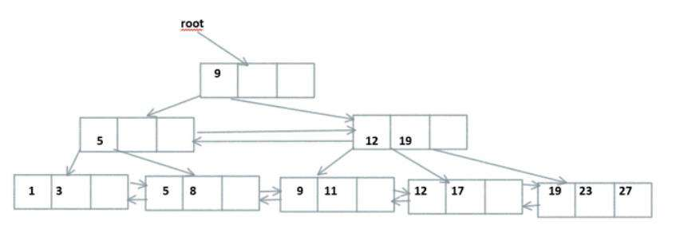

**Spørsmål:** Følgende sekvenser av innsettinger er tilgjengelige. Hvilken av disse gir B+-treet illustrert i oppgaven?

**Velg ett alternativ:**

- 17, 19, 8, 9, 1, 3, 12, 5, 11, 23, 27
- **✗ 1, 3, 5, 8, 9, 11, 12, 17, 19, 23, 27** (riktig svar — markert)
- 5, 12, 17, 1, 3, 19, 23, 27, 8, 9, 11

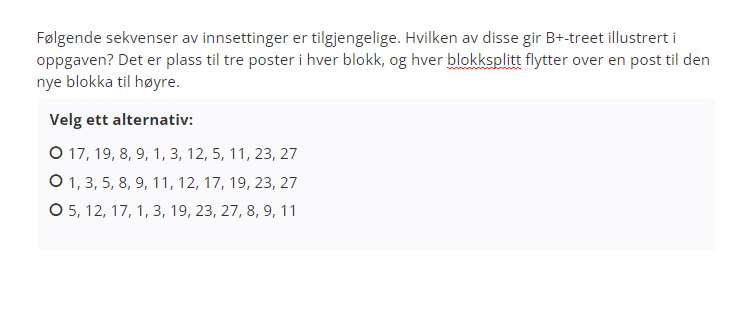

## 2. B+-tre (10 %)

Løsningsskissen viser et B+-tre etter alle innsettingene. Det er plass til tre poster i hver blokk, og hver blokksplitt flytter over én post til den nye blokka til høyre.

**Tre-struktur:**

```
                              root
                               │
                          [ 17 |    ]
                         /            \
                  [ 5 | 9 | 12 ]      [ 23 |    ]
                 / |    |     \        /        \
        [1|3| ]→[5|8| ]→[9|11| ]→[12| | ]→[17|19| ]→[23|27| ]
```

Løvnivået er lenket sammen fra venstre til høyre med søskenpekere (`→`).

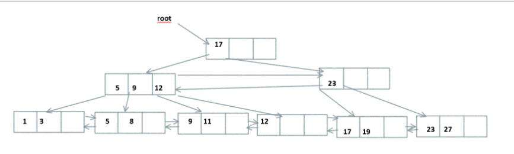

**Spørsmål:** Følgende sekvenser av innsettinger er tilgjengelige. Hvilken av disse gir B+-treet illustrert i oppgaven?

**Velg ett alternativ:**

- 17, 19, 8, 9, 1, 3, 12, 5, 11, 23, 27
- 1, 3, 5, 8, 9, 11, 12, 17, 19, 23, 27
- **✗ 5, 12, 17, 1, 3, 19, 23, 27, 8, 9, 11** (riktig svar — markert)


## 3. B+-tre (10 %)

Løsningsskissen viser et B+-tre etter alle innsettingene. Det er plass til tre poster i hver blokk, og hver blokksplitt flytter over én post til den nye blokka til høyre.

**Tre-struktur:**

```
                          root
                           │
                       [ 17 |    ]
                      /            \
                [ 8 | 9 ]         [ 19 |    ]
               /    |    \         /         \
        [1|3|5]→[8| | ]→[9|11|12]→[17| | ]→[19|23|27]
```

Løvnivået er lenket sammen fra venstre til høyre med søskenpekere (`→`).

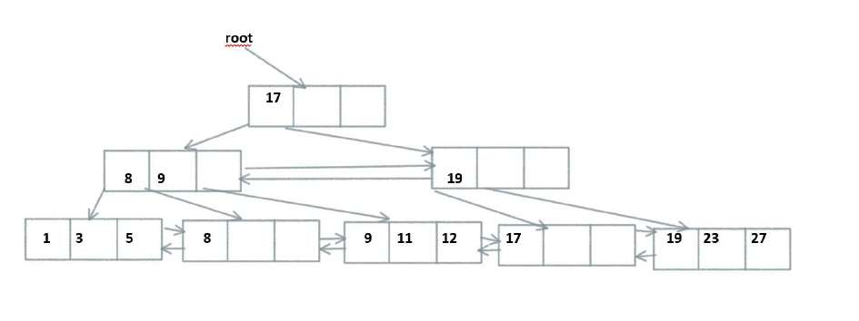

**Spørsmål:** Følgende sekvenser av innsettinger er tilgjengelige. Hvilken av disse gir B+-treet illustrert i oppgaven?

**Velg ett alternativ:**

- **✗ 17, 19, 8, 9, 1, 3, 12, 5, 11, 23, 27** (riktig svar — markert)
- 1, 3, 5, 8, 9, 11, 12, 17, 19, 23, 27
- 5, 12, 17, 1, 3, 19, 23, 27, 8, 9, 11


## 4. Extendible hashing (6 %)

Oppgaven viser fire alternative strukturer for extendible hashing (Alt 1 – Alt 4). Hver alternativ viser en katalog med globalt dybde og 8 oppslag (000 – 111) som peker til bøtter med lokal dybde og verdier.

**Alt 1:** Katalog med global dybde 3 (oppslag 000–111). Bøtter:
- bøtte (lokal dybde 2): 0, 24
- bøtte (lokal dybde 2): 1, 16
- bøtte (lokal dybde 2): 26, 10
- bøtte (lokal dybde 3): 3, 11
- bøtte (lokal dybde 3): 7

**Alt 2:** Katalog med global dybde 3 (oppslag 000–111). Bøtter:
- bøtte (lokal dybde 2): 0, 8
- bøtte (lokal dybde 2): 1, 17
- bøtte (lokal dybde 2): 26, 10
- bøtte (lokal dybde 3): 3, 11
- bøtte (lokal dybde 3): 7

**Alt 3:** Katalog med global dybde 3 (oppslag 000–111). Bøtter:
- bøtte (lokal dybde 2): 0, 8
- bøtte (lokal dybde 3): 1, 17
- bøtte (lokal dybde 2): 26, 10
- bøtte (lokal dybde 2): 3, 11
- bøtte (lokal dybde 3): 5

**Alt 4:** Katalog med global dybde 2 (oppslag 000–111). Bøtter:
- bøtte (lokal dybde 2): 0, 8
- bøtte (lokal dybde 2): 1, 17
- bøtte (lokal dybde 2): 33, 10
- bøtte (lokal dybde 3): 3, 11
- bøtte (lokal dybde 4): 7

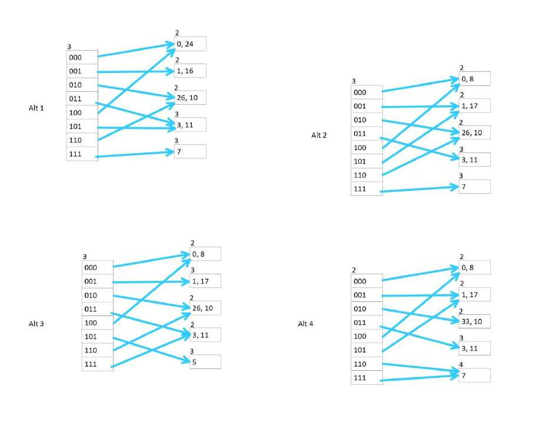

**Spørsmål:** Hvilke av figurene er lovlige strukturer i extendible hashing? Det kan være flere riktige svar.

**Velg ett eller flere alternativer:**

- Alternativ 1
- **✗ Alternativ 2** (riktig svar — markert)
- **✗ Alternativ 3** (riktig svar — markert)
- Alternativ 4

I denne oppgaven får du poeng for hvert riktige svar og trekk for hvert feil svar. Minimum 0 poeng på hele oppgaven.


## 5. Extendible hashing (6 %)

Oppgaven viser fire alternative strukturer for extendible hashing (Alt 1 – Alt 4).

**Alt 1:** Katalog med global dybde 3 (oppslag 000–111). Bøtter:
- bøtte (lokal dybde 2): 0, 8
- bøtte (lokal dybde 2): 1, 21
- bøtte (lokal dybde 2): 26, 10
- bøtte (lokal dybde 3): 3, 11
- bøtte (lokal dybde 3): 7

**Alt 2:** Katalog med global dybde 3 (oppslag 000–111). Bøtter:
- bøtte (lokal dybde 2): 8, 0
- bøtte (lokal dybde 2): 1, 17
- bøtte (lokal dybde 2): 26, 10
- bøtte (lokal dybde 3): 3, 11
- bøtte (lokal dybde 3): 7

**Alt 3:** Katalog med global dybde 3 (oppslag 000–111). Bøtter:
- bøtte (lokal dybde 2): 8, 0
- bøtte (lokal dybde 2): 1, 17
- bøtte (lokal dybde 2): 26, 10
- bøtte (lokal dybde 3): 11, 19
- bøtte (lokal dybde 3): 7

**Alt 4:** Katalog med global dybde 3 (oppslag 000–111). Bøtter:
- bøtte (lokal dybde 2): 0, 8
- bøtte (lokal dybde 2): 1, 17
- bøtte (lokal dybde 2): 26, 10
- bøtte (lokal dybde 3): 3, 11
- bøtte (lokal dybde 3): 7

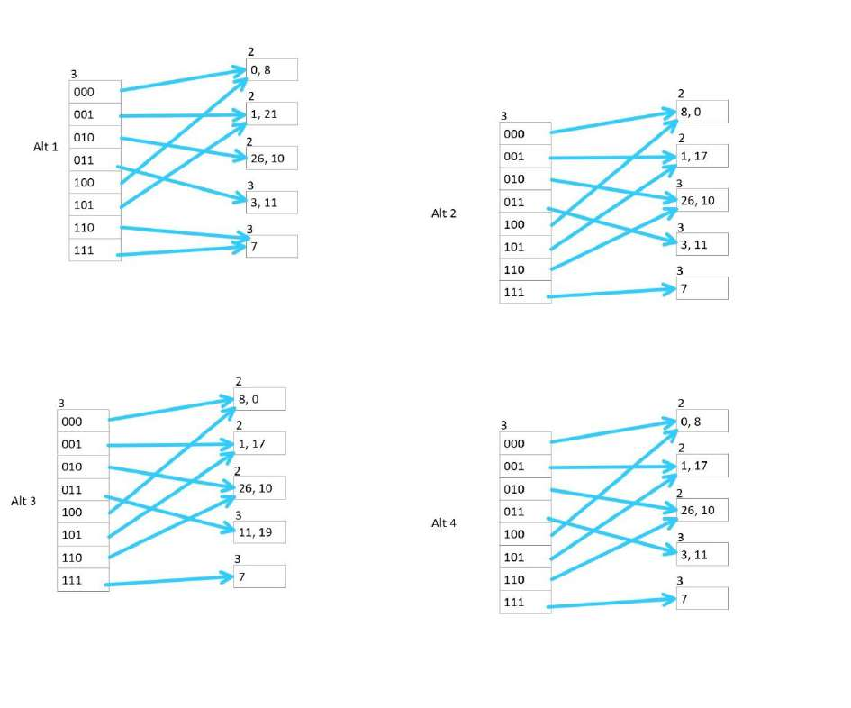

**Spørsmål:** Hvilke av figurene er lovlige strukturer i extendible hashing? Det kan være flere riktige svar.

**Velg ett eller flere alternativer:**

- Alternativ 1
- Alternativ 2
- **✗ Alternativ 3** (riktig svar — markert)
- **✗ Alternativ 4** (riktig svar — markert)

I denne oppgaven får du poeng for hvert riktige svar og trekk for hvert feil svar. Minimum 0 poeng på hele oppgaven.

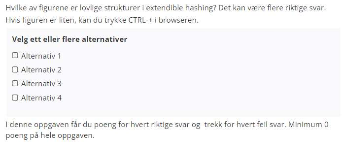

## 6. Extendible hashing (6 %)

Oppgaven viser fire alternative strukturer for extendible hashing (Alt 1 – Alt 4).

**Alt 1:** Katalog med global dybde 3 (oppslag 000–111). Bøtter:
- bøtte (lokal dybde 3): 0, 8
- bøtte (lokal dybde 2): 1, 17
- bøtte (lokal dybde 2): 26, 13
- bøtte (lokal dybde 3): 3, 11
- bøtte (lokal dybde 3): 7

**Alt 2:** Katalog med global dybde 3 (oppslag 000–111). Bøtter:
- bøtte (lokal dybde 2): 0, 8
- bøtte (lokal dybde 3): 1, 17
- bøtte (lokal dybde 2): 27, 10
- bøtte (lokal dybde 3): 3, 11
- bøtte (lokal dybde 3): 7

**Alt 3:** Katalog med global dybde 3 (oppslag 000–111). Bøtter:
- bøtte (lokal dybde 2): 0, 8
- bøtte (lokal dybde 3): 1, 17
- bøtte (lokal dybde 2): 26, 10
- bøtte (lokal dybde 2): 3, 11
- bøtte (lokal dybde 3): 5

**Alt 4:** Katalog med global dybde 3 (oppslag 000–111). Bøtter:
- bøtte (lokal dybde 2): 0, 8
- bøtte (lokal dybde 2): 1, 17
- bøtte (lokal dybde 2): 26, 10
- bøtte (lokal dybde 3): 3, 11
- bøtte (lokal dybde 3): 7

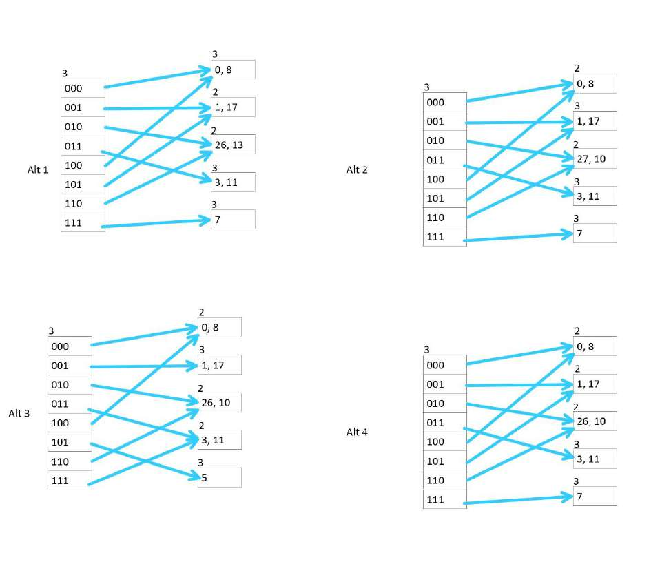

**Spørsmål:** Hvilke av figurene er lovlige strukturer i extendible hashing? Det kan være flere riktige svar.

**Velg ett eller flere alternativer:**

- Alternativ 1
- Alternativ 2
- **✗ Alternativ 3** (riktig svar — markert)
- **✗ Alternativ 4** (riktig svar — markert)

I denne oppgaven får du poeng for hvert riktige svar og trekk for hvert feil svar. Minimum 0 poeng på hele oppgaven.


## 7. Misc (6 %)

**Spørsmål:** Hva er riktig for ARIES?

**Velg ett eller flere alternativer:**

- no logging
- **✗ write-ahead logging** (riktig svar — markert)
- force, steal
- **✗ no-force, steal** (riktig svar — markert)
- no-force, no-steal
- force, no-steal

I denne oppgaven får du poeng for hvert riktige svar og trekk for hvert feil svar. Minimum 0 poeng på hele oppgaven.

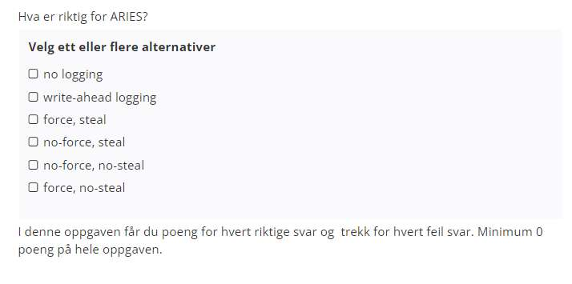

## 8. Misc (6 %)

**Spørsmål:** Hvilke alternativ er sanne?

**Velg ett eller flere alternativer:**

- **✗ Hvis du har konfliktserialiserbarhet, har du alltid serialiserbarhet.** (riktig — markert)
- Hvis du har serialiserbarhet, har du alltid konfliktserialiserbarhet
- **✗ 2PL impliserer serialiserbarhet** (riktig — markert)
- Serialiserbarhet krever at vi har 2PL
- Snapshot isolation lar to forskjellige transaksjoner skrive til samme dataelement samtidig
- **✗ Snapshot isolation lar transaksjoner lese dataelement som samtidig oppdateres av andre transaksjoner** (riktig — markert)

I denne oppgaven får du poeng for hvert riktige svar og trekk for hvert feil svar. Minimum 0 poeng på hele oppgaven.

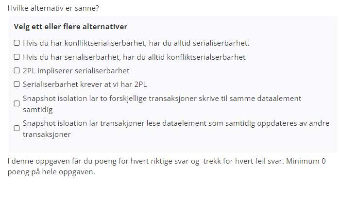

## 9. Misc (6 %)

**Spørsmål:** Hvilke alternativ er sanne?

**Velg ett eller flere alternativer:**

- DPT forteller hvor UNDO kan starte
- **✗ DPT forteller hvor REDO kan starte** (riktig — markert)
- **✗ Transaksjonstabellen forteller hvem som er vinnere og tapere av transaksjonene etter analysen** (riktig — markert)
- REDO starter ved eldste "levende" loggpost, dvs. eldste loggpost blant tapere.
- **✗ UNDO slutter ved eldste "levende" loggpost, dvs. eldste loggpost blant tapere.** (riktig — markert)
- PageLSN blir alltid oppdatert for alle loggposter ved REDO

I denne oppgaven får du poeng for hvert riktige svar og trekk for hvert feil svar. Minimum 0 poeng på hele oppgaven.

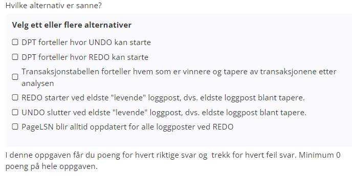

## 10. 2PL-utføring (5 %)

Databasesystemet får inn følgende sekvens av operasjoner. Vi innfører tofaselåsing (rigorous). I hvilken rekkefølge committer transaksjonene?

Viss flere transaksjoner blir vekt opp etter en låsventing, blir de vekt opp i den rekkefølgen de la seg til å vente, dvs. en kø.

```
r1(A); w2(B); r1(B); r3(A); w3(A); c1; c2; c3;
```

**Velg ett alternativ:**

- T1; T2; T3;
- T1; T3; T2;
- Vranglås mellom T1 og T3.
- **✗ T2; T1; T3;** (riktig svar — markert)
- T2; T3; T1;
- T3; T1; T2;
- T3; T2; T1;

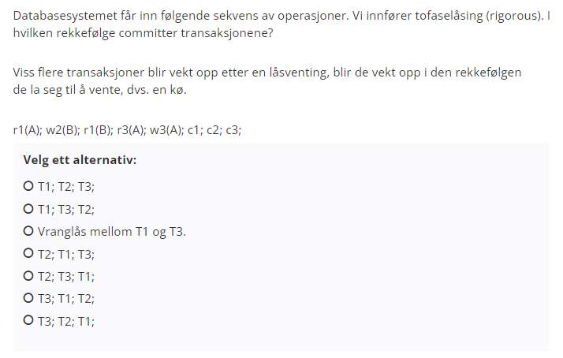

## 11. 2PL-utføring (5 %)

Databasesystemet får inn følgende sekvens av operasjoner. Vi innfører tofaselåsing (rigorous). I hvilken rekkefølge committer transaksjonene?

Viss flere transaksjoner blir vekt opp etter en låsventing, blir de vekt opp i den rekkefølgen de la seg til å vente, dvs. en kø.

```
r3(A); w2(B); r3(B); w1(A); w3(B); c1; c2; c3;
```

**Velg ett alternativ:**

- T1; T2; T3;
- T1; T3; T2;
- Vranglås mellom T1 og T3
- T2; T1; T3;
- **✗ T2; T3; T1;** (riktig svar — markert)
- T3; T1; T2;
- T3; T2; T1;

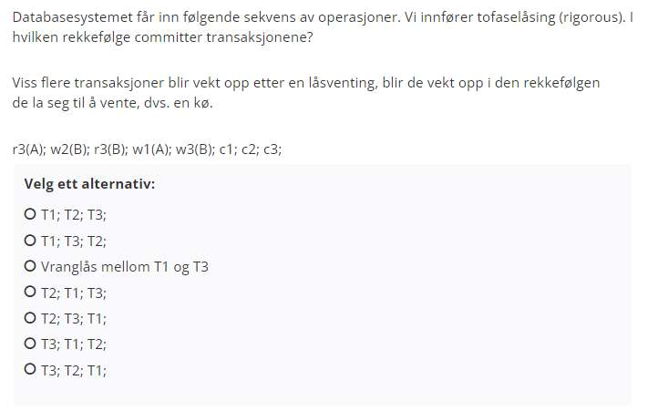

## 12. 2PL-utføring (5 %)

Databasesystemet får inn følgende sekvens av operasjoner. Vi innfører tofaselåsing (rigorous). I hvilken rekkefølge committer transaksjonene?

Viss flere transaksjoner blir vekt opp etter en låsventing, blir de vekt opp i den rekkefølgen de la seg til å vente, dvs. en kø.

```
r1(B); r3(B); w1(A); w2(A); w3(A); c1; c2; c3;
```

**Velg ett alternativ:**

- **✗ T1; T2; T3;** (riktig svar — markert)
- T1; T3; T2;
- Vranglås mellom T2 og T3
- T2; T1; T3;
- T2; T3; T1;
- T3; T1; T2;
- T3; T2; T1;

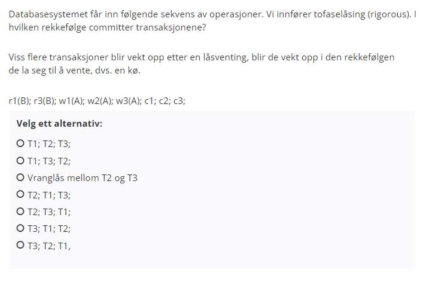

## 13. Konfliktserialiserbarhet (6 %)

**Spørsmål:** Hvilke historier er konfliktserialiserbare? Det kan være flere.

**Velg ett eller flere alternativer:**

- r1(X); r2(X); w1(X); w2(Y); r3(Z); w2(X);
- **✗ r2(Y); r1(Y); r3(Y); w1(X); w2(Z); w2(Y);** (riktig — markert)
- **✗ r3(X); w3(X); r1(Y); r2(Y); r3(Y); w2(Y);** (riktig — markert)
- w1(A); w2(B); r1(B); r3(A); w2(A); r1(A);
- **✗ w2(B); w1(A); r3(B); w3(B); r3(A); w2(C);** (riktig — markert)
- r1(C); w2(B); r1(B); r3(B); w1(B); w3(B);

I denne oppgaven får du poeng for hvert riktige svar og trekk for hvert feil svar. Minimum 0 poeng på hele oppgaven.

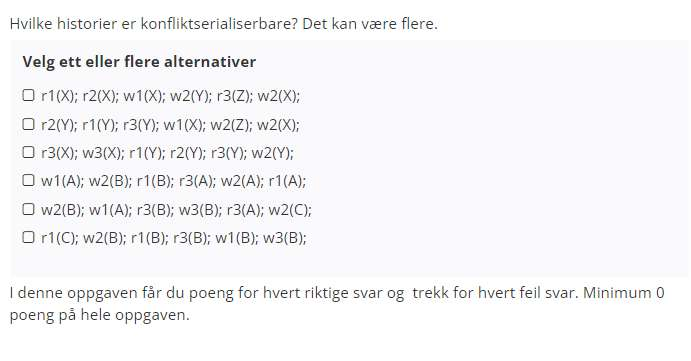

## 14. Konfliktserialiserbarhet (6 %)

**Spørsmål:** Hvilke historier er konfliktserialiserbare? Det kan være flere.

**Velg ett eller flere alternativer:**

- r1(X); w1(X); r2(X); r3(X); w2(Y); w3(Y);
- **✗ w2(X); r1(X); w1(X); r3(Y); w3(X); r2(Y);** (riktig — markert)
- **✗ r1(Z); r2(X); w3(Z); r1(X); w2(X); w3(X);** (riktig — markert)
- r1(A); r2(A); w3(B); r3(A); w3(A); w2(A);
- r2(B); w3(B); r1(A); w2(A); r3(Z); w1(Z);
- **✗ r1(A); w2(C); r3(C); w1(A); r2(A); w2(A);** (riktig — markert)

I denne oppgaven får du poeng for hvert riktige svar og trekk for hvert feil svar. Minimum 0 poeng på hele oppgaven.

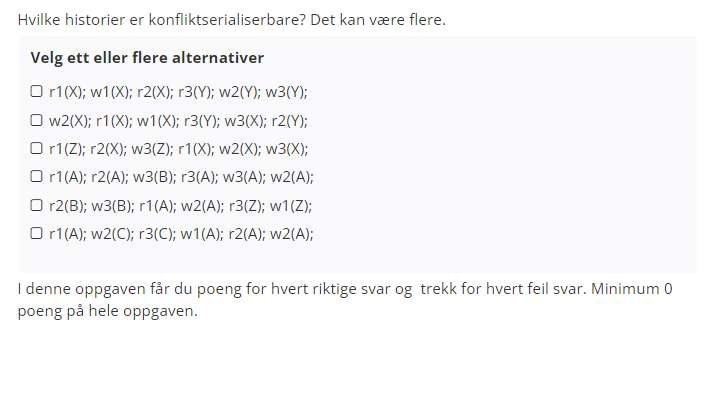

## 15. Konfliktserialiserbarhet (6 %)

**Spørsmål:** Hvilke historier er konfliktserialiserbare? Det kan være flere.

**Velg ett eller flere alternativer:**

- w1(X); r2(X); r1(Y); w3(X); w2(X); w1(Y);
- **✗ r1(Y); w2(Y); r1(X); w3(X); r3(Y); r1(Z);** (riktig — markert)
- **✗ w2(Y); r3(Y); r1(Z); w2(Z); w3(Z); w2(X);** (riktig — markert)
- r1(A); w2(B); r2(A); w3(A); r3(Z) w1(A);
- r3(Z); w2(Y); r1(Z); w1(Y); w2(Z); w2(X);
- **✗ w3(A); r2(A); r1(B); w1(B); w3(C); w2(C);** (riktig — markert)

I denne oppgaven får du poeng for hvert riktige svar og trekk for hvert feil svar. Minimum 0 poeng på hele oppgaven.

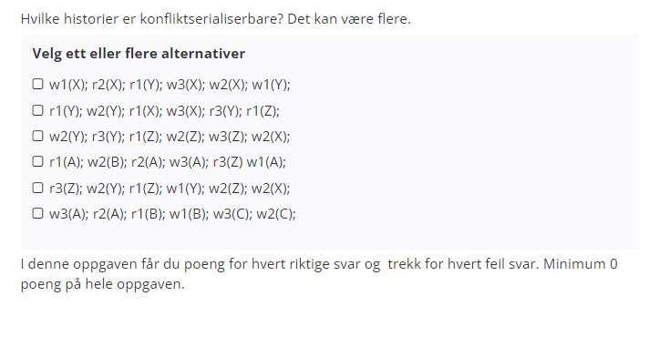

## 16. Gjenopprettbarhet (6 %)

**Spørsmål:** Hvilke historier er gjenopprettbare?

**Velg ett eller flere alternativer:**

- **✗ r1(X); r2(X); w1(Y); r2(Y); r3(Y); w3(Y); c1; c2; c3;** (riktig — markert)
- w2(X); r1(X); r3(X); w2(Y); r3(Y); w1(X); c1; c2; c3;
- **✗ w1(X); w1(Y); r2(Y); w3(Y); w1(Z); c1; c2; c3;** (riktig — markert)
- r2(X); w1(X); w2(Y); r1(Y); r3(Y); c1; r3(X); c2; c3;
- **✗ r1(Z); r2(Z); w1(Y); r3(Y); w3(Y); c1; w3(Z); c2; c3;** (riktig — markert)
- w3(Z); r1(Z); r1(Z); w2(Y); r3(Y); w3(Y); c1; c2; c3;

I denne oppgaven får du poeng for hvert riktige svar og trekk for hvert feil svar. Minimum 0 poeng på hele oppgaven.

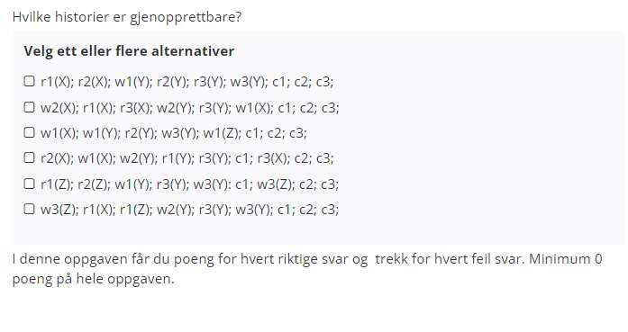

## 17. Gjenopprettbarhet (6 %)

**Spørsmål:** Hvilke historier er gjenopprettbare?

**Velg ett eller flere alternativer:**

- r1(X); w2(X); w1(X); w3(Y); r2(Y); w1(Y); c1; c2; c3;
- **✗ r1(X); w1(Y); r2(X); w2(X); r3(Z); w3(Y); c1; c2; c3;** (riktig — markert)
- **✗ r1(X); w1(X); r2(X); w3(Y); w1(Y); c1; c2; c3;** (riktig — markert)
- w2(Y); r1(Y); w2(X); r3(X); w3(X); w3(X); c1; c2; c3;
- **✗ w2(Y); r2(X); w1(X); c1; w2(X); r3(X); c2; c3;** (riktig — markert)
- r1(X); w2(Y); r1(Y); w3(Z); r1(Z); w1(Z); c1; c2; c3;

I denne oppgaven får du poeng for hvert riktige svar og trekk for hvert feil svar. Minimum 0 poeng på hele oppgaven.

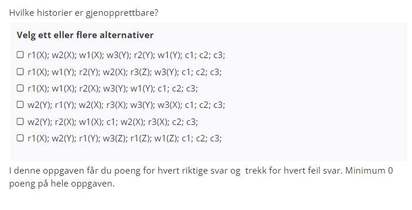

## 18. Misc (6 %)

For en tabell Student (studnr, navn, epost) har vi ei heapfil med 2000 blokker som lagrer tabellen, og et unclustered B+-tre for nøkkelen studnr. B+-treet har 500 blokker på løvnivå og høyde 3. Verdiene av epost er ikke unike.

**Spørsmål:** Hvilke alternativ er sanne?

**Velg ett eller flere alternativer:**

- "SELECT * FROM Student" gir 2003 aksesser til blokker
- **✗ "SELECT navn FROM Student WHERE studnr=10001" gir 4 aksesser til blokker.** (riktig — markert)
- **✗ "SELECT studnr FROM Student ORDER BY studnr" gir 502 aksesser til blokker.** (riktig — markert)
- "SELECT studnr FROM Student WHERE navn='Hans Hansen'" gir 4 aksesser til blokker.
- **✗ "SELECT epost, navn FROM Student WHERE epost='ole@stud.ntnu.no'" gir 2000 aksesser til blokker** (riktig — markert)
- "INSERT INTO Student VALUES (10002, 'Ole Olesen', 'ole@stud.ntnu.no')" gir 503 aksesser til blokker og tre skrivinger.

I denne oppgaven får du poeng for hvert riktige svar og trekk for hvert feil svar. Minimum 0 poeng på hele oppgaven.

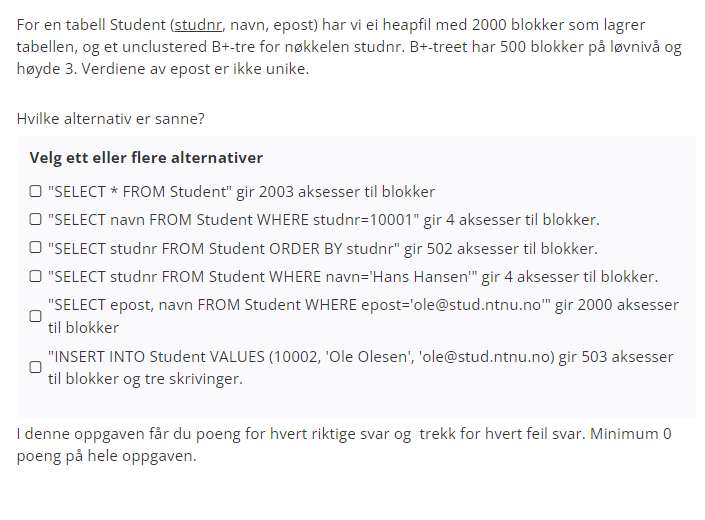

Her er det et poeng at epost ikke er unik, eller ville det siste svaret vært 1000 i gjennomsnitt. Det er en litt tvilsom antagelse, men står oppgitt i oppgaven. F.eks. hvis man registrerer "ukjent" når man ikke har epost, så er den ikke unik.

## 19. Misc (6 %)

Vi har en tabell Ansatt(aid, navn, epost) som er lagret i et clustered B+-tre hvor primærnøkkel i tabellen og søkenøkkel i B+-treet er aid. B+-treet har 2000 blokker på løvnivå og har høyde 3.

**Spørsmål:** Hvilke alternativ er sanne?

**Velg ett eller flere alternativer:**

- **✗ "SELECT navn FROM Ansatt WHERE aid=1001" gir 3 blokker som aksesseres.** (riktig — markert)
- "SELECT epost FROM Ansatt WHERE aid=1001" gir 2002 blokker som aksesseres.
- "SELECT epost FROM Ansatt WHERE epost='johan@company.com'" gir 1002 blokker som aksesseres.
- "SELECT navn, epost FROM Ansatt WHERE navn='Hans Hansen' AND epost='hans@company.com'" gir 4 blokker som aksesseres.
- **✗ "SELECT aid FROM Ansatt ORDER BY aid ASC" gir 2002 blokker som aksesseres.** (riktig — markert)
- **✗ "INSERT INTO Ansatt VALUES (1002, 'Jon Jonsen', 'jon@company.com')" gir typisk 3 blokker som aksesseres og ei som skrives.** (riktig — markert)

I denne oppgaven får du poeng for hvert riktige svar og trekk for hvert feil svar. Minimum 0 poeng på hele oppgaven.

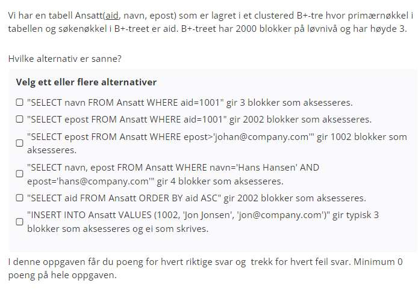

## 20. Misc (6 %)

Vi har ei clustered hashfil hvor gjennomsnittlige antall aksesser er 1,2 blokker når du aksseser på søkenøkkel. Tabellen Person(pnr, navn, epost) er lagra i den clustered hashfila med pnr som søkenøkkel. Det er 2000 blokker totalt i hashfila.

**Spørsmål:** Hvilke alternativ er sanne?

**Velg ett eller flere alternativer:**

- "SELECT epost FROM Person WHERE navn='Hans Hansen'" gir i gjennomsnitt 1,2 blokker som aksesseres.
- **✗ Queries av typen "SELECT epost FROM Person WHERE pnr='20026834123'" gir 1,2 blokker som aksesseres i gjennomsnitt.** (riktig — markert)
- "SELECT navn FROM Person WHERE navn>'Ole Olesen'" gir 1000 blokker som aksesseres.
- **✗ Queries av typen "INSERT INTO Person VALUES ('04070312345','Olav Rex','olav@slottet.no')" gir 1,2 blokker som aksesserses i gjennomsnitt og ei blokk som skrives.** (riktig — markert)
- **✗ "SELECT navn FROM Person WHERE pnr > '10029912345'" gir 2000 blokker som aksesseres.** (riktig — markert)
- Queries av typen "SELECT navn, epost FROM Person WHERE aid='10109812345'" gir gjennomsnitlig 2000 blokker som aksesserest.

I denne oppgaven får du poeng for hvert riktige svar og trekk for hvert feil svar. Minimum 0 poeng på hele oppgaven.

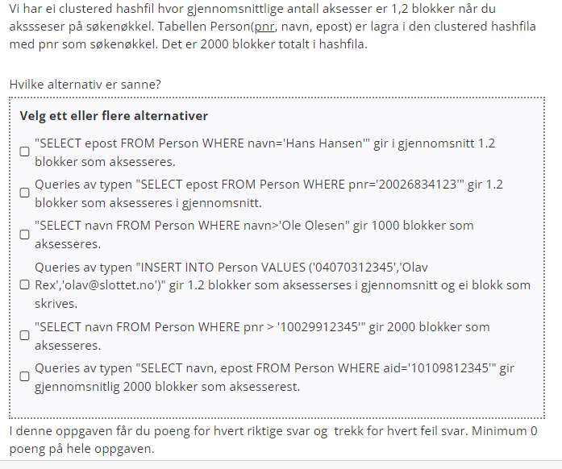

Her var det en feil i det siste queriet. De skulle vært pnr, ikke aid. Det ble sendt ut melding til alle studenter om dette, selv om det gjelder kun 1/3 av studentene.

## 21. Recovery (ARIES) (4 %)

Loggen er som følger:

| LSN | PrevLSN | TransID | Type      | PageID |
|-----|---------|---------|-----------|--------|
| 101 |         |         | End_ckpt  |        |
| 102 | Null    | T1      | Update    | A      |
| 103 | Null    | T2      | Update    | B      |
| 104 | 102     | T1      | Commit    |        |
| 105 | 103     | T2      | Update    | B      |
| 106 | 105     | T2      | Update    | C      |
| 107 | Null    | T3      | Update    | C      |
| 108 | 106     | T2      | Update    | A      |

Anta loggen over etter et krasj med ARIES. Etter analysen har DPT følgende innhold: (A, 98), (B, 103), (C, 106) og datablokkene har følgende PageLSN (A, 98), (B, 97), (C, 107). Hvilke loggposter blir det gjort REDO for?

**Velg ett eller flere alternativer:**

- **✗ LSN=102** (riktig — markert)
- **✗ LSN=103** (riktig — markert)
- **✗ LSN=105** (riktig — markert)
- LSN=106
- LSN=107
- **✗ LSN=108** (riktig — markert)

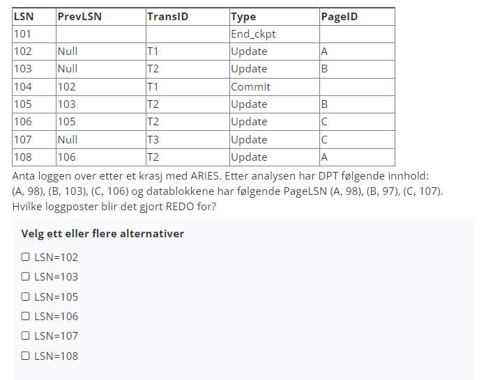

## 22. Recovery (ARIES) (4 %)

Loggen er som følger:

| LSN | PrevLSN | TransID | Type      | PageID |
|-----|---------|---------|-----------|--------|
| 101 |         |         | End_ckpt  |        |
| 102 | Null    | T1      | Update    | A      |
| 103 | Null    | T2      | Update    | B      |
| 104 | 102     | T1      | Commit    |        |
| 105 | 103     | T2      | Update    | B      |
| 106 | 105     | T2      | Update    | C      |
| 107 | Null    | T3      | Update    | C      |
| 108 | 106     | T2      | Update    | A      |

Anta loggen over etter et krasj med ARIES. Etter analysen har DPT følgende innhold: (A, 108), (B, 98), (C, 106) og datablokkene har følgende PageLSN (A, 102), (B, 103), (C, 97). Hvilke loggposter blir det gjort REDO for?

**Velg ett eller flere alternativer:**

- LSN=102
- LSN=103
- **✗ LSN=105** (riktig — markert)
- **✗ LSN=106** (riktig — markert)
- **✗ LSN=107** (riktig — markert)
- **✗ LSN=108** (riktig — markert)

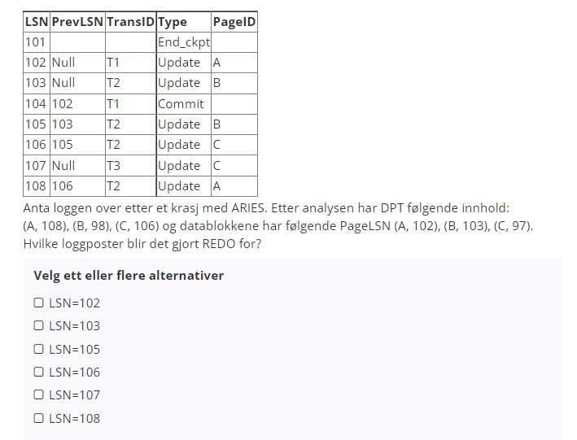

## 23. Recovery (ARIES) (4 %)

Loggen er som følger:

| LSN | PrevLSN | TransID | Type      | PageID |
|-----|---------|---------|-----------|--------|
| 101 |         |         | End_ckpt  |        |
| 102 | Null    | T1      | Update    | A      |
| 103 | Null    | T2      | Update    | B      |
| 104 | 102     | T1      | Commit    |        |
| 105 | 103     | T2      | Update    | B      |
| 106 | 105     | T2      | Update    | C      |
| 107 | Null    | T3      | Update    | C      |
| 108 | 106     | T2      | Update    | A      |

Anta loggen over etter et krasj med ARIES. Etter analysen har DPT følgende innhold: (A, 102), (B, 103), (C, 96) og datablokkene har følgende PageLSN (A, 98), (B, 105), (C, 96). Hvilke loggposter blir det gjort REDO for?

**Velg ett eller flere alternativer:**

- **✗ LSN=102** (riktig — markert)
- LSN=103
- LSN=105
- **✗ LSN=106** (riktig — markert)
- **✗ LSN=107** (riktig — markert)
- **✗ LSN=108** (riktig — markert)

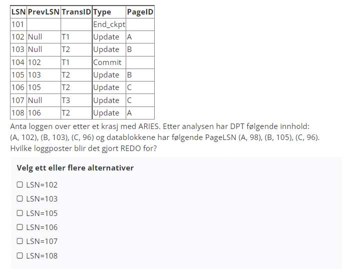

## 24. Join (5 %)

To tabeller Klasse og Student skal joines ved en nested loop join. Bufferet har 6 plasser til blokker, tabellen Klasse har 12 blokker og tabellen Student har 1000 blokker. Hvor mange lesinger av blokker skjer ved joinen?

**Velg ett alternativ:**

- 1012
- 2024
- 3036
- 2012
- **✗ 3012** (riktig svar — markert)

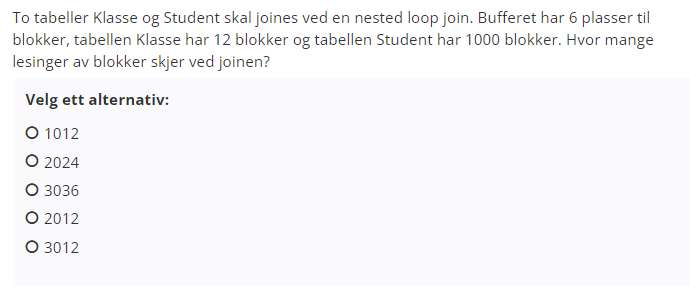

## 25. Join (5 %)

To tabeller Klasse og Student skal joines ved en nested loop join. Bufferet har 8 plasser til blokker, tabellen Klasse har 12 blokker og tabellen Student har 1400 blokker. Hvor mange lesinger av blokker skjer ved joinen?

**Velg ett alternativ:**

- 1512
- 2824
- **✗ 2812** (riktig svar — markert)
- 4524
- 1520

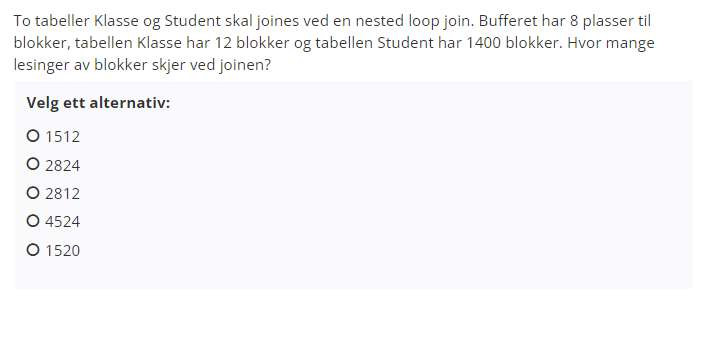

## 26. ER-modellering (34 %)

Lag en ER-modell (du kan bruke alle virkemidler som er med i pensum, også spesialisering og kategorier) ut fra følgende situasjonsbeskrivelse («miniverden»):

Eiendomsselskapet Bo-i-ro forvalter en rekke bygninger som hver har en unik bygnings-id, en gateadresse, et postnummer og et poststed. For hver bygning registrerer man antall etasjer og samlet areal. Bygningene er delt inn i rom. Et rom har et romnummer som er unikt innenfor bygningen, et areal og ligger i en av bygningens etasjer. For å overvåke tilstanden i bygningene, kan man måle ulike miljøparametre, for eksempel lufttemperatur, relativ luftfuktighet og CO2. Bo-i-ro holder oversikt over de miljøparameterne som kan være aktuelle, der hver parametertype har en unik parameter-id, et navn, en måleenhet og en kort beskrivelse. For alle aktuelle miljøparametre, er det slik at en måling består av en enkelt tallverdi.

For å gjøre målinger av miljøparametre bruker Bo-i-ro sensorer. Hver sensor er av en bestemt sensormodell, for eksempel «SmartLab CO2 reader». En sensormodell har en unik sensormodell-id og et produktnavn. Hver sensormodell kan måle en eller flere miljøparametre, og dette holder man rede på. Man kan ha mange sensorer av samme sensormodell. Hver sensor har et sensornummer som er unikt innenfor Bo-i-ro. For hver sensor registrerer man år og måned for innkjøp. En sensor som er tatt i bruk, er plassert i et bestemt rom i en av selskapets bygninger. Når man monterer en sensor, registrerer man en kort beskrivelse av plasseringen i rommet, for eksempel «midt i taket». Det kan være mange sensorer (også av samme sensormodell) i et rom. Det er ikke et krav at alle rom må ha sensorer.

Det skal være mulig å registrere miljøparametre uten at man (ennå) har registrert en sensormodell som kan gjøre slike målinger. Det skal også være mulig å registrere en sensormodell uten at man har en sensor av denne modellen. For å gjøre modelleringen enklere, kan du anta at en sensor aldri blir flyttet når den først har blitt tatt i bruk. En sensor har status «ubrukt» frem til den tas i bruk. Da settes status til «aktiv» og man registrerer år og måned. Når en sensor tas ut av bruk, får den statusen «pensjonert» og man registrerer år og måned når dette skjer.

For et rom registreres de miljøparametrene som skal måles for rommet, og det registreres en minimumsverdi og en maksimumsverdi for målinger av hver type. Målinger utenfor disse (normal-)intervallene skal registreres som avvik. For alle sensorer som er i aktiv bruk, registreres de målingene som gjøres. Målinger har et unikt måling-nummer, en verdi for den aktuelle parametertypen, dato og tid. Dersom målingen er utenfor normalområdet for rommet, registreres det at målingen representerer et avvik. Hvis en sensor måler flere ulike miljøparametre, for eksempel både temperatur og luftfuktighet, skal dette registreres som to eller flere separate målinger.

Gjør kort rede for eventuelle forutsetninger som du finner det nødvendig å gjøre.

Under er det vist utkast til løsning for de tre ulike modelleringsoppgavene. Det skal legges vekt på at de ulike modell-virkemidlene brukes på riktig måte. God (overordnet) «struktur» i datamodellen tillegges større vekt enn mer ubetydelige feil og mangler. Det finnes en del alternative modelleringsvalg og alternative forutsetninger som kan være like riktige som de som er vist i løsningsskissene.

Dersom det gjøres hensiktsmessige forutsetninger, skal disse legges til grunn ved vurderingen av løsningen.

**ER-diagram (tekstuell representasjon):**

**Entiteter:**

- **Bygning** — attributter: BygningID (PK), Adresse, PostNr, PostSted, AntEtasjer, Areal
- **Rom** (svak entitet, identifisert av Bygning + RomNr) — attributter: RomNr (delvis PK), Areal, Etasje
- **Miljøparameter** — attributter: ParamID (PK), Navn, Enhet, Beskrivelse
- **Sensormodell** — attributter: ModellID (PK), ProdNavn
- **Sensor** — attributter: SensorNr (PK), Status, InnKjøp (År, Mnd), Aktivering (År, Mnd), Pensjon (År, Mnd)
- **Måling** — attributter: MålingNr (PK), Verdi, Avvik, Dato, Tid

**Relasjoner (med kardinaliteter):**

- **HarRom**: Bygning (1,n) — (1,1) Rom. Rom er svak entitet under Bygning (identifying relationship).
- **SkalHaMålingAv**: Rom (0,n) — (0,n) Miljøparameter, med attributtene MinVerdi og MaksVerdi (relasjonsattributter for normalområdet for hvert rom/parameter-par).
- **HarSensor**: Rom (0,n) — (0,1) Sensor, med attributtet Plassering (kort beskrivelse av plassering i rommet). En sensor er plassert i høyst ett rom; et rom kan ha mange (eller ingen) sensorer.
- **SensorType**: Sensor (1,1) — (0,n) Sensormodell. Hver sensor er av nøyaktig én sensormodell; en sensormodell kan ha mange (eller ingen) sensorer.
- **KanMålesAv**: Sensormodell (0,n) — (0,n) Miljøparameter. Holder rede på hvilke parametre en sensormodell kan måle.
- **MåltAv**: Måling (1,1) — (0,n) Sensor. Hver måling er gjort av nøyaktig én sensor.
- **MålingAv**: Måling (1,1) — (0,n) Miljøparameter. Hver måling angir verdi for nøyaktig én parametertype.

**Merknader:** Sensor har sammensatte attributter for innkjøps-, aktiverings- og pensjoneringstidspunkt (År/Mnd). Status angir om sensoren er «ubrukt», «aktiv» eller «pensjonert». Rom modelleres som svak entitet siden romnummer kun er unikt innenfor en bygning.

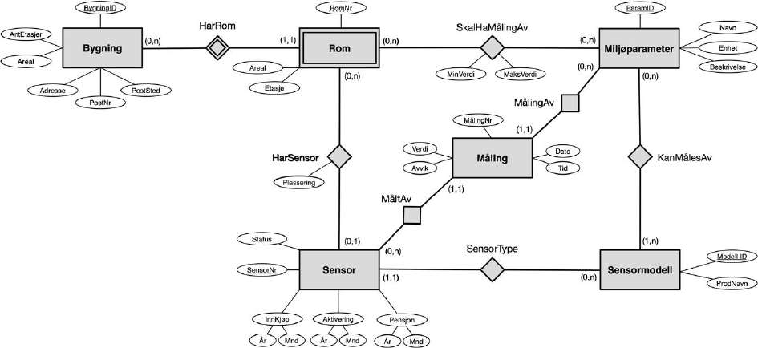

## 27. ER-modellering (34 %)

Lag en ER-modell (du kan bruke alle virkemidler som er med i pensum, også spesialisering og kategorier) ut fra følgende situasjonsbeskrivelse («miniverden»):

Politiet ønsker å lage en database over fartsmålinger i trafikken. En fartsmåling bestemmer hastigheten til et kjøretøy. En fartsmåling har et unikt løpenummer. I tillegg til løpenummer og hastighet registreres dato og tid for målingen, og det er mulig å legge inn et notat som dokumenterer relevante omstendigheter. Fartsmålinger gjøres teknisk av såkalte «fotobokser» som er fastmontert ved veien, eller ved hjelp av mobile lasermålere som betjenes av ansatte i politiet.

Automatisk fartskontroll ved hjelp av fotobokser er enten punktmåling eller strekningsmåling. Ved punktmåling måles farten idet kjøretøyet passerer fotoboksen. Dersom kjøretøyet holder høyere hastighet enn fartsgrensen på stedet, tas det bilde av kjøretøyet. Dette bildet lagres som en del av fartsmålingen for å identifisere kjøretøy og fører. Ved strekningsmåling måler man gjennomsnittsfarten mellom to fotobokser. Dette gjøres ved at man tar bilde av kjøretøyet og registrerer passeringstid når kjøretøyet passerer den første fotoboksen. Når kjøretøyet etter hvert passerer den andre fotoboksen, registreres passeringstid og det tas et nytt bilde av kjøretøyet. Ut fra passeringstidene og avstanden mellom de to fotoboksene, beregnes gjennomsnittshastigheten på strekningen. Dersom gjennomsnittsfarten er høyere enn fartsgrensen på strekningen, lagres passeringstidene, de to bildene og beregnet hastighet.

En fotoboks er registrert i systemet med et unikt fotoboksnummer og GPS-koordinater (breddegrad og lengdegrad) for boksens plassering. Dersom to fotobokser utgjør et par i forbindelse med strekningsmåling, skal dette registreres og man lagrer også avstanden mellom de to fotoboksene. Systemet skal holde oversikt over alle fartsgrenser (30, 40, 50, ...) som er i bruk på norske veier. En fartsgrense registreres med en unik fartsgrense-id og en høyeste tillatt hastighet i km/t. For hver fotoboks skal det registreres hvilken fartsgrense som gjelder på stedet.

Fartsmåling ved hjelp av mobil lasermåler gjøres ved at en ansatt i politiet bruker lasermåleren til å måle hastigheten på et kjøretøy som passerer. Dersom kjøretøyet holder høyere fart enn fartsgrensen, blir kjøretøyet stoppet og man sikrer seg registreringsnummer på kjøretøyet og førerens identitet. Når fartsmålingen gjøres ved mobil lasermåler, må man registrere GPS-koordinater (breddegrad og lengdegrad) for stedet der målingen gjennomføres.

Systemet skal bare lagre fartsmålinger der kjøretøyet har holdt høyere hastighet enn fartsgrensen. For alle fartsmålinger skal det registreres hvilken fartsgrense som gjelder på stedet for fartsmålingen.

Bildene fra fotoboksene brukes til å identifisere kjøretøy og fører av kjøretøyet. Man har oversikt over alle registrerte kjøretøy som er lagret med unikt registreringsnummer, bilmerke, bilmodell, farge og fødselsnummer for eier. For hver fartsmåling blir det etter hvert registrert hvilket kjøretøy som er målt, bortsett fra i tilfeller der det er umulig å få klarhet i dette. Dersom man klarer å finne ut hvem som kjørte kjøretøyet da fartsmålingen ble foretatt, blir fødselsnummer for bilfører registrert for fartsmålingen.

Gjør kort rede for eventuelle forutsetninger som du finner det nødvendig å gjøre.

Under er det vist utkast til løsning for de tre ulike modelleringsoppgavene. Det skal legges vekt på at de ulike modell-virkemidlene brukes på riktig måte. God (overordnet) «struktur» i datamodellen tillegges større vekt enn mer ubetydelige feil og mangler. Det finnes en del alternative modelleringsvalg og alternative forutsetninger som kan være like riktige som de som er vist i løsningsskissene.

Dersom det gjøres hensiktsmessige forutsetninger, skal disse legges til grunn ved vurderingen av løsningen.

**ER-diagram (tekstuell representasjon):**

**Entiteter:**

- **Fartsgrense** — attributter: FartsgrenseID (PK), Hastighet
- **Fartsmåling** — attributter: LøpeNr (PK), Hastighet, Dato, Tid, Notat, FørerID. Spesialisert via en disjunkt total spesialisering (ISA, markert med «D») i tre subentiteter:
  - **Punktmåling** — attributter: Bilde
  - **Strekningsmåling** — attributter: Hastighet (beregnet gjennomsnitt på strekningen) og to relasjoner FørsteMåling/AndreMåling som hver har Bilde og Tid
  - **Lasermåling** — attributter: GPS-koord (sammensatt av Bredde og Lengde)
- **Kjøretøy** — attributter: RegNr (PK), Bilmerke, Bilmodell, Farge, Eier (fødselsnummer)
- **Fotoboks** — attributter: BoksNr (PK), GPS-koord (sammensatt av Bredde og Lengde)

**Relasjoner (med kardinaliteter):**

- **FartsgrensePåStedet**: Fartsgrense (0,n) — (1,1) Fartsmåling. Hver fartsmåling registreres med fartsgrensen som gjelder på stedet.
- **MålingAv**: Fartsmåling (0,1) — (0,n) Kjøretøy. En fartsmåling kan være knyttet til høyst ett kjøretøy (men ikke alltid identifisert).
- **UtførtAv**: Punktmåling (1,1) — (0,n) Fotoboks. Hver punktmåling utføres av nøyaktig én fotoboks.
- **FørsteMåling**: Strekningsmåling (1,1) — (0,n) Fotoboks (rolle «Første»). Bilde og Tid lagres på relasjonen.
- **AndreMåling**: Strekningsmåling (1,1) — (0,n) Fotoboks (rolle «Andre»). Bilde og Tid lagres på relasjonen.
- **BoksPar**: Fotoboks (0,1) — (0,1) Fotoboks med rollene «Første» og «Andre», og attributtet Avstand. Beskriver par av fotobokser som inngår i en strekningsmåling.
- **FartsgrenseVedFotoboks**: Fartsgrense (0,n) — (1,1) Fotoboks. For hver fotoboks registreres gjeldende fartsgrense.

**Merknader:** Spesialiseringen av Fartsmåling er total og disjunkt (markert med «D» i ER-diagrammet) — hver fartsmåling er enten en punktmåling, en strekningsmåling eller en lasermåling. Bilde fra punktmåling/strekningsmåling brukes for å identifisere kjøretøy og fører. FørerID er et valgfritt attributt på Fartsmåling som inneholder fødselsnummer dersom fører er identifisert.

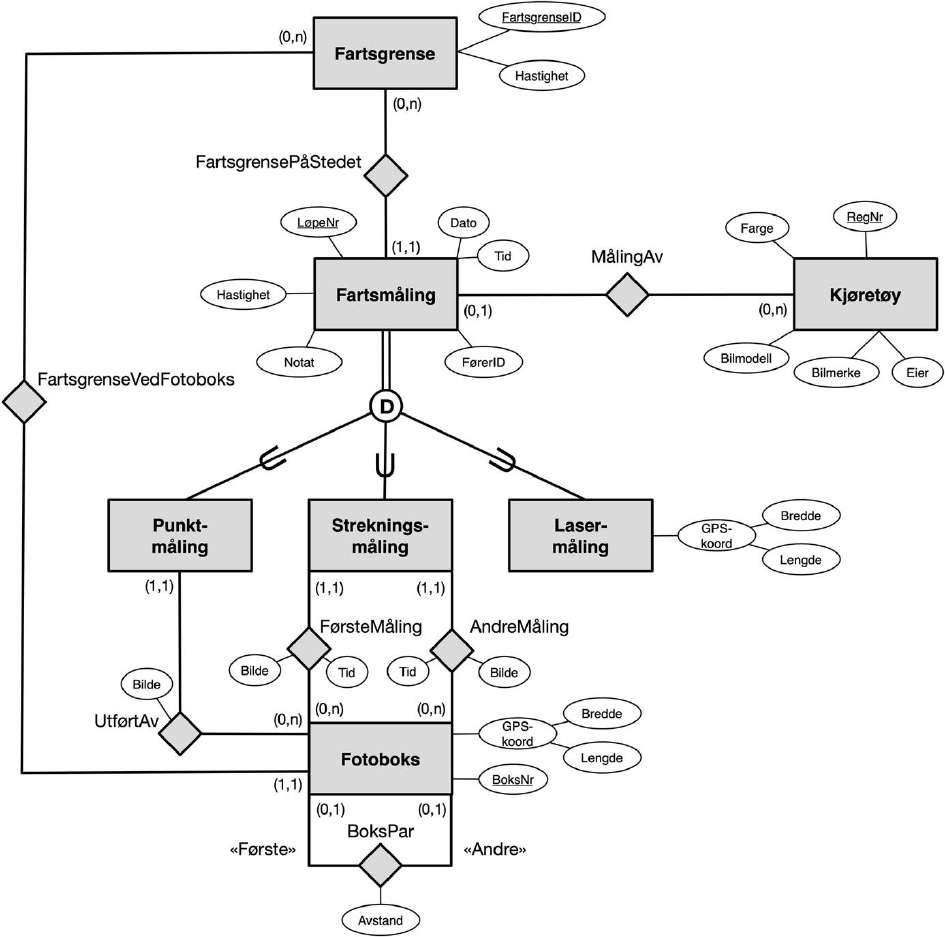

## 28. Kommentarer (0 %)

Denne "oppgaven" er en mulighet for å informere om omstendigheter som du tenker er helt nødvendige å kommunisere til sensor, for at din besvarelse skal bli riktig vurdert. Dette kan for eksempel gjelde antakelser som det var tvingende nødvendig å gjøre.

Du skal ikke bruke dette feltet til å gi generelle kommentarer til eksamen, det kan gjøres i Piazza eller i e-post til faglærer.
