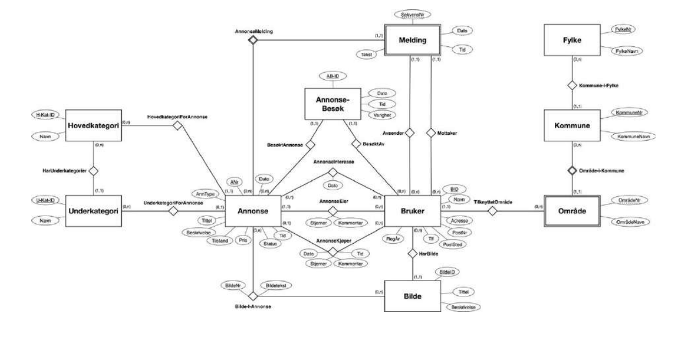
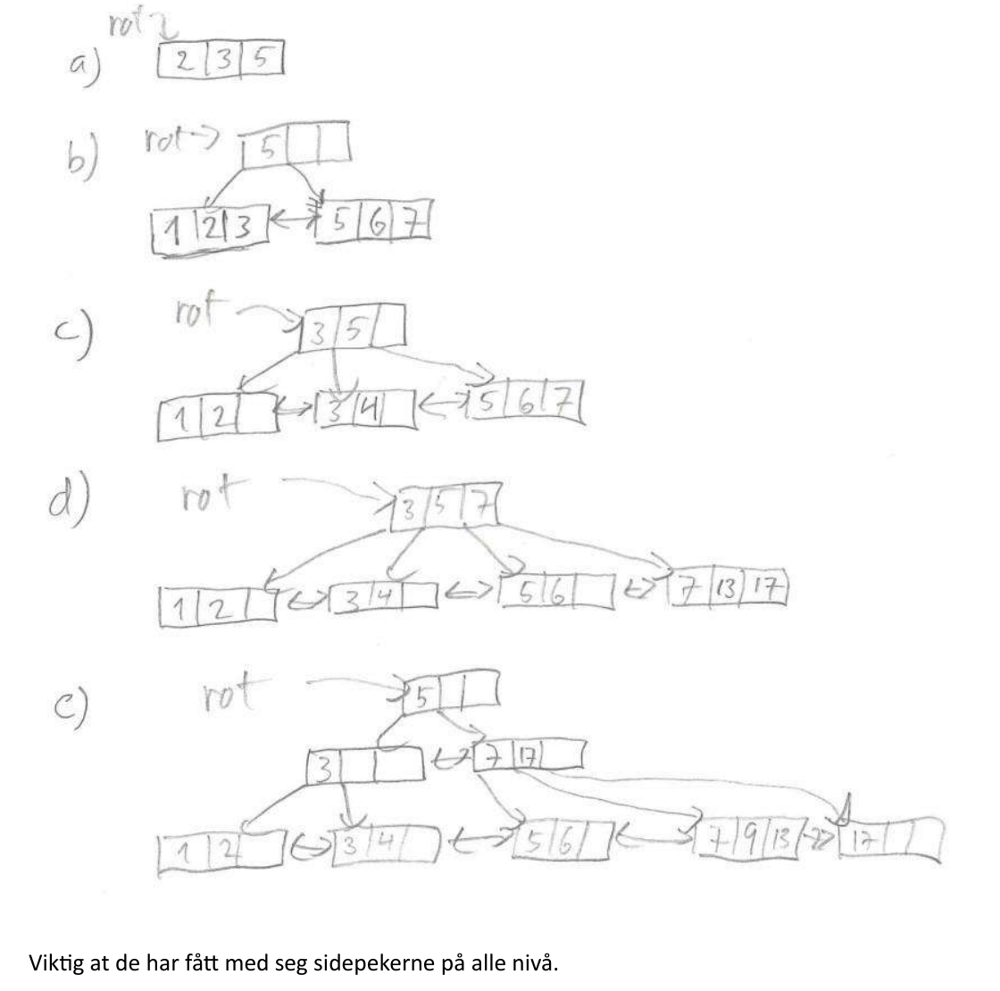
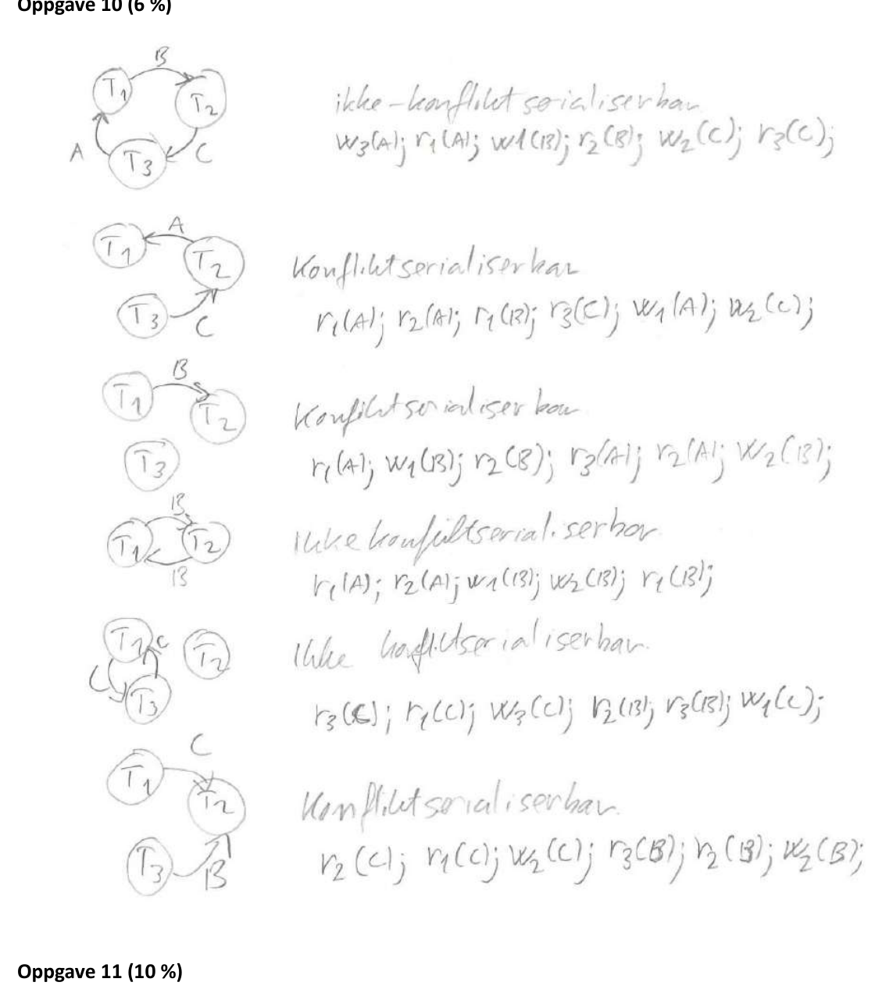

# TDT4145 - kont eksamen 2023: Sensurveiledning

**TDT4145 Datamodellering og databasesystemer**

**Dato:** 17. august 2023

## Læringsutbyttebeskrivelser for TDT4145

Kunnskaper:

1. Databasesystemer: generelle egenskaper og systemstruktur.
2. Datamodellering med vekt på entity-relationship-modeller.
3. Relasjonsdatabasemodellen for databasesystemer, databaseskjema og dataintegritet.
4. Spørrespråk: Relasjonsalgebra og SQL.
5. Designteori for relasjonsdatabaser.
6. Systemdesign og programmering mot databasesystemer.
7. Datalagring, filorganisering og indeksstrukturer.
8. Utføring av databasespørringer.
9. Transaksjoner, samtidighet og robusthet mot feil.

Ferdigheter:

1. Datamodellering med entity-relationship-modellen.
2. Realisering av relasjonsdatabaser.
3. Databaseorientert programmering: SQL, relasjonsalgebra og database-programmering i Python.
4. Vurdering og forbedring av relasjonsdatabaseskjema med utgangspunkt i normaliseringsteori.
5. Analyse og optimalisering av ytelsen til databasesystemer.

Generell kompetanse:

1. Kjennskap til anvendelser av databasesystemer og forståelse for nytte og begrensninger ved slike systemer.
2. Modellering av og analytisk tilnærming til datatekniske problemer.

## Poenggrenser

Poenggrensene brukt i denne sensuren:

- A: 88 poeng
- B: 76 poeng
- C: 64 poeng
- D: 53 poeng
- E: 40 poeng

## Oppgave 1

På neste side er det vist et utkast til datamodell. Det skal legges vekt på at de ulike modellvirkemidlene brukes på riktig måte. God (overordnet) «struktur» i datamodellen tillegges større vekt enn mer ubetydelige feil og mangler. Det finnes en del alternative modelleringsvalg og alternative forutsetninger som kan være like riktige som de som er vist i løsningsskissen.

Dersom det gjøres hensiktsmessige forutsetninger, skal disse legges til grunn ved vurderingen av løsningen.



## Oppgave 2 (15 %)



Viktig at de har fått med seg sidepekerne på alle nivå.

## Oppgave 3 (3 %)

**Svar:** 3.

Rett ned B+-treet.

## Oppgave 4 (3 %)

Her får vi følgende tabell:

|     |     |
| --- | --- |
| 16  | 12  |
| 17  | 13  |
| 10  | 14  |
| 11  | 15  |

Overløpsblokk:

|     |     |
| --- | --- |
| 18  |     |

Da får vi følgende uttrykk:

```text
8 * 1 aksess + 1 * 2 aksess = 10 aksesser
```

Da får vi `10 / 9 = 1.11`.

## Oppgave 5 (3 %)

**Svar:** 450.

Vi må scanne gjennom alle blokkene.

## Oppgave 6 (6 %)

Følgende er riktig: `(SI = SNAPSHOT ISOLATION)`.

- SI lar transaksjoner lese data som er låst av skrivetransaksjoner.
- SI tillater at to transaksjoner leser samme dataelement.
- SI tillater mer samtidighet enn SERIALIZABLE.

## Oppgave 7 (3 %)

**Svar:** Gjenopprettbar (recoverable).

## Oppgave 8 (3 %)

**Svar:** ACA.

## Oppgave 9 (3 %)

**Svar:** Gjenopprettbar (recoverable).

## Oppgave 10 (6 %)



## Oppgave 11 (10 %)

Etter analysen:

**Transtabell:** `(T1, 103, Commit)`, `(T2, 108, Commit)`, `(T3, 106, In progress)`.

**DPT:** `(A, 101)`, `(B, 102)`, `(C, 107)`.

## Oppgave 12 (10 %)

C har `PageLSN = 107` da den ikke trenger REDO.

A trenger redo av loggpost 106, og da må `PageLSN` være mindre enn 106. Vi ser på loggen at det finnes ingen andre loggposter som opererer på A. Da må `PageLSN` for A være mindre enn 103, som er den eldste loggposten vist i figuren.
