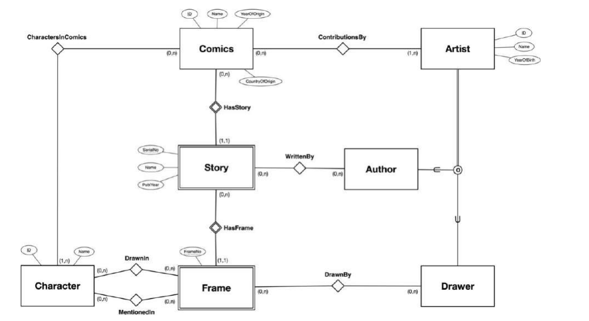

# TDT4145 - vår 2023: Sensurveiledning

## Oppgave 1

Kandidatnøkler: BDE

## Oppgave 2

C og D er kandidatnøkler (og supernøkler) for R. Oppfyller derfor 4NF og alle lavere normalformer.

## Oppgave 3

R1 og R2 har ingen felles attributter. Sammenstilling av R1 og R2 må derfor gjøres ved kartesisk produkt. For de fleste forekomster av R, vil dette frembringe tupler som ikke er i R. Dekomponeringen har derfor ikke tapsløst-join-egenskapen.

## Oppgave 4

Den gitte spørringen sammenstiller Photo-tabellen og Photographer-tabellen med equijoin der `Photo.PhotographerID = Photographer.ID`. Alternativ A sammenstiller med kartesisk produkt som vil gi en annen resultattabell. Alternativ B vil joine tabellene på betingelsen `ID = ID` som vil gi en annen resultattabell. Alternativ C sammenstiller tabellene på samme måte som den opprinnelige spørringen og gjør den samme gruppering og aggregering av resultattabellen. Dette alternativet gir alltid det samme resultatet som den originale spørringen.

## Oppgave 5

Siden spesialiseringen er delvis, må vi ha en tabell for Vehicle-klassen. Spørsmålet er om vi skal samle alt i Vehicle-tabellen eller ha tabeller for subklassene Truck og Bus i tillegg.

**A: Samling i Vehicle-tabellen:**

```text
Vehicle(VID, Manufacturer, Model, MaxLoad, NoOfAxels, NoOfPassengerSeats,
MaxNoStandingPassengers, Type)
```

Der `Type` kan ha verdiene `NULL`, `Truck` eller `Bus`.

**B: Tabeller for subklassene gir:**

```text
Vehicle(VID, Manufacturer, Model)
Truck(VID, MaxLoad, NoOfAxels)
Bus(VID, NoOfPassengerSeats, MaxNoStandingPassengers)
```

Fordeler med A:

- Alt samlet i en tabell, ikke behov for join

Ulemper med A:

- NULL-verdier for de attributtene som ikke er relevante for et kjøretøy
- Vehicle-tabellen tar mer plass enn i alternativ B

Fordeler med B:

- Unngår NULL-verdier for attributter som ikke er relevante
- De enkelte tabellene tar hver for seg mindre plass enn en stor Vehicle-tabell

Ulemper med B:

- Må joine tabeller for å sammenstille alle data om ett eller flere kjøretøy
- Bruker samlet sett mer plass

Ved vurdering vektlegges at de to alternativene klargjøres og argumentasjon for fordeler og ulemper ved de to alternativene. Det ene alternativet foretrekkes ikke som sådan foran det andre.

## Oppgave 6

Forslag på ER-modell:



Forutsetninger:

- Vi kan registrere tegneserie uten at de har registrert noen historie
- Vi kan registrere historier uten at de har registrert noen rammer
- En historie må være knyttet til en tegneserie, kan ikke være knyttet til flere tegneserier
- En ramme må være knyttet til en historie, kan ikke være knyttet til flere historier
- Vi kan ha historier med uten å kjenne forfatter(ne) og rammer uten å kjenne tegner(ne)
- Vi kan registrere forfattere uten å vite hvilke historier de har bidratt til og tegnere uten å vite hvilke rammer de har bidratt til.

Vurdering:

Det skal legges vekt på at de ulike modell-virkemidlene brukes på riktig måte. God (overordnet) «struktur» i datamodellen tillegges større vekt enn mer ubetydelige feil og mangler. Det finnes en del alternative modelleringsvalg og alternative forutsetninger som kan være like riktige som de som er vist i løsningsskissen.

Dersom det gjøres hensiktsmessige forutsetninger, skal disse legges til grunn ved vurderingen av løsningen.
