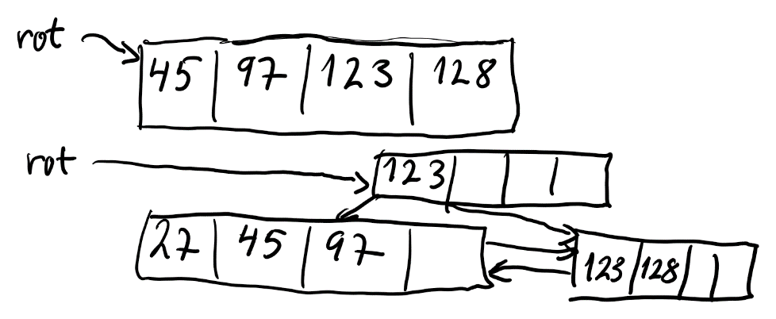
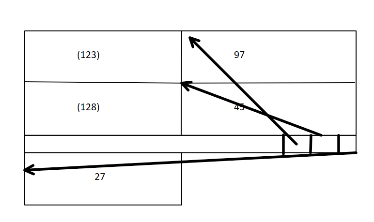
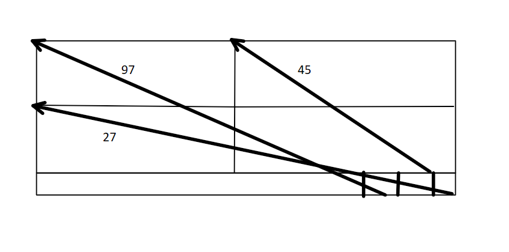
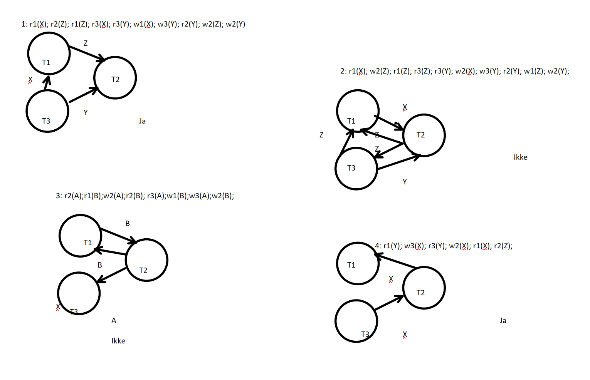
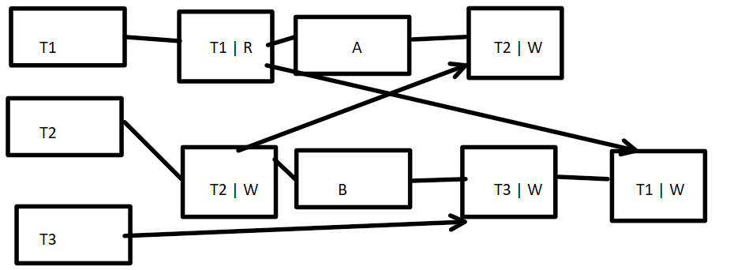
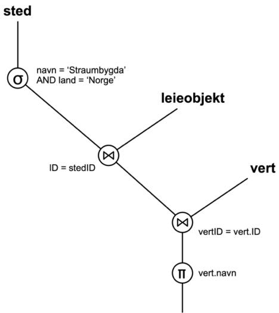
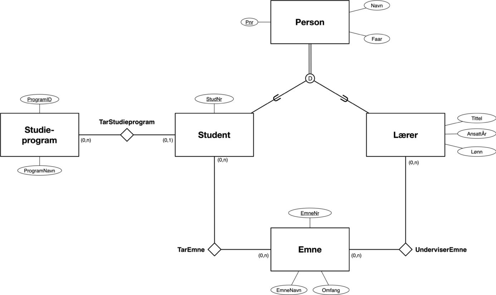

# TDT4145 - kontinuasjon august 2024: Sensurveiledning

**TDT4145 Datamodellering og databasesystemer**

**Dato:** 10. aug 2024

Sensurveiledning eksamenskont, (oppdatert 16. mai 2025)

## Læringsutbyttebeskrivelser for TDT4145

Kunnskaper:

1. Databasesystemer: generelle egenskaper og systemstruktur.
2. Datamodellering med vekt på entity-relationship-modeller.
3. Relasjonsdatabasemodellen for databasesystemer, databaseskjema og dataintegritet.
4. Spørrespråk: Relasjonsalgebra og SQL.
5. Designteori for relasjonsdatabaser.
6. Systemdesign og programmering mot databasesystemer.
7. Datalagring, filorganisering og indeksstrukturer.
8. Utføring av databasespørringer.
9. Transaksjoner, samtidighet og robusthet mot feil.

Ferdigheter:

1. Datamodellering med entity-relationship-modellen.
2. Realisering av relasjonsdatabaser.
3. Databaseorientert programmering: SQL, relasjonsalgebra og database-programmering i Python.
4. Vurdering og forbedring av relasjonsdatabaseskjema med utgangspunkt i normaliseringsteori.
5. Analyse og optimalisering av ytelsen til databasesystemer.

Generell kompetanse:

1. Kjennskap til anvendelser av databasesystemer og forståelse for nytte og begrensninger ved slike systemer.
2. Modellering av og analytisk tilnærming til datatekniske problemer.

## Poenggrenser

Poenggrensene brukt i denne sensuren:

- A: 88 poeng
- B: 76 poeng
- C: 64 poeng
- D: 53 poeng
- E: 35 poeng

## 1. B+-tre (10 %)

B+-treet tegnet før splitt og etter at alle poster er satt inn.

Før splitt (rotløvblokk full med fire nøkler):

```text
        rot → [ 45 | 97 | 123 | 128 ]
```

Etter splitt og innsetting av siste post (sluttilstand):

```text
                        rot → [ 123 | | ]
                              /         \
                  [ 27 | 45 | 97 | ] →  [ 123 | 128 | | ]
```

Sidepekeren mellom løvblokkene går fra venstre mot høyre.



## 2. Blokk-layout / kompaktering (10 %)

Under er først blokka vist uten å ha slettet noen poster ved splittingen. Dermed vil den siste posten få plass utenfor blokka. Rekkefølgen på postene er viktig. Postene havner i innsettingsrekkefølgen i blokka, men pekervektoren på slutten har postene/nøklene sorterte. I den øverste figuren er de to slettede postene antydet med parenteser rundt nøklene, mens i den siste figuren viser blokka slik den blir etter at den er kompaktert, slik at det blir plass til alle postene/nøklene. Dette må skje før den siste posten settes inn (27), slik at den får plass. Med i figuren kunne vi tatt med flip/flop, BlockId, pageLSN, prev og next-pekere og evt. andre felter, som f.eks. nRecs (antall poster). Størrelsen på boksene i figuren er omtrentlig slik at 4 * 1000 er 4000 og 96 bytes er igjen til pekervektor og andre blokkfelter. Det holder med 2 bytes til hver peker i pekervektoren.

Blokka før kompaktering — postene `(123)` og `(128)` er slettet (markert med parenteser); 97 og 45 ligger igjen i innsettingsrekkefølgen, og pekervektoren nederst peker sortert til de gjenværende postene. Den siste posten 27 får ikke plass før blokka kompakteres:



Blokka etter kompaktering — de slettede postene (123) og (128) er fjernet, 97, 45 og 27 ligger i innsettingsrekkefølgen i blokka, og pekervektoren nederst peker sortert (27, 45, 97) til hver post:



## 3. Clustered og unclustered B+-tre (16 %)

En tilsvarende oppgave som ved ordinær eksamen, men denne gang med delspørsmål med konkrete tall. Her må vi regne med at noen studenter regner annerledes på fyllgrad. Neste år er regnemetode for fyllgrad tatt med i pensum. Noen studenter har antatt bruk av heapfil, men det er feil. Dette er som i MySQL/InnoDB. Postene lagres i B+-trær, og sekundærindekser er også (unclustered) B+-trær. Da er pekerne fra sekundindeksen nøklene brukt i det clustered B+-treet. Når du slår opp i sekundærindeksen, må du da slå opp i primærindeksen etterpå.

a) `4096*2/3 = 2730,67`. Gir 27 poster per blokk. Da får vi **1482 blokker på level=0**.

b) 29 byte per post. `25 + 4 byte` (nøkkel til clustered B+-tre). Vi får da 94 poster per blokk. Like mange poster i det unclustered B+-treet som i det clustered. Vi får da **426 blokker på level=0**.

c) Vi må regne ut høyden på B+-treet (clustered). Hver post level>0 er 12 byte (`4 + 8`). Da får vi 227 poster per blokk. 7 blokker på level=1 og 1 blokk på level=2. Da får vi **totalt 3 blokker aksessert** for queriet.

d) I det unclustered B+-treet er postene 29 byte, mens postene på level>0 er 33 byte (`25 + 8 byte`). 82 poster per blokk. 6 blokker på level=1. 1 blokk på level=2. Da får vi **6 blokker totalt** (3 i unclustered og så 3 i clustered B+-tre).

## 4. Klassifisering av historier (3 %)

**Svar:**

- H1: recoverable
- H2: ACA
- H3: Strict

## 5. Konfliktserialiserbarhet (4 %, 2 poeng for hvert rett og -2 for hvert feil svar)

To av historiene er konfliktserialiserbare da presedensgrafen ikke har sykel:

- **Historie 1:** `r1(X); r2(Z); r1(Z); r3(X); r3(Y); w1(X); w3(Y); r2(Y); w2(Z); w2(Y)` — Kanter: T3→T1 (X), T1→T2 (Z), T3→T2 (Y). Ingen syklus. **Ja — konfliktserialiserbar.**
- **Historie 2:** `r1(X); w2(Z); r1(Z); r3(Z); r3(Y); w2(X); w3(Y); r2(Y); w1(Z); w2(Y);` — Kanter: T1↔T2 (X, Z), T2↔T3 (Z), T3→T2 (Y). Sykel mellom T1 og T2 (og mellom T2 og T3). **Ikke konfliktserialiserbar.**
- **Historie 3:** `r2(A); r1(B); w2(A); r2(B); r3(A); w1(B); w3(A); w2(B);` — Kanter: T1↔T2 (B, ww/wr), T2→T3 (A), T3→T2 (A). Sykel mellom T1 og T2 (og mellom T2 og T3 via A). **Ikke konfliktserialiserbar.**
- **Historie 4:** `r1(Y); w3(X); r3(Y); w2(X); r1(X); r2(Z);` — Kanter: T3→T2 (X), T3→T1 (X), T2→T1 (X). Ingen syklus. **Ja — konfliktserialiserbar.**

Sensors håndtegnede grafer markerer historie 1 og 4 med «Ja», og historie 2 og 3 med «Ikke».



## 6. Låsesystem (7 %)

Det følgende låsesystemet blir lagd: A og B er elementer som låses. T1, T2, T3 er transaksjoner som har låser. `T1 | R` betyr leselås for T1. `T2 | W` betyr skrivelås for T2.

Låsetabell — venstre kolonne er transaksjoner som har lås, midten er elementet som er låst, høyre er transaksjoner som ønsker lås:

```text
HAR LÅS         ELEMENT         ØNSKER LÅS

T1 ── T1 | R ── A ──────────── T2 | W
                  \
                   \──────────── T1 | W
                  /
T2 ── T2 | W ── B ── T3 | W
T3 ────────────/
```

T1 har leselås på A og venter på å oppgradere til skrivelås (W) på A. T2 har skrivelås på B og venter på skrivelås på A. T3 venter på skrivelås på B (som T2 holder).



## 7. ARIES Recovery — Redo-fasen (5 %)

Vi må først beregne DPT etter analysen. Så ser vi på hver loggpost:

- **102:** Må lese inn blokka da `LSN >= recLSN`. Ikke redo da `PageLSN >= LSN`.
- **103:** Må lese inn blokka da `LSN >= recLSN`. Ikke redo da `PageLSN >= LSN`.
- **104:** Må lese inn blokka da `LSN >= recLSN`. Ikke redo da `PageLSN >= LSN`.
- **105:** Må lese inn blokka da `LSN >= recLSN`. Ikke redo da `PageLSN >= LSN`.
- **107:** Må lese inn blokka da `LSN >= recLSN`. **Redo** da `PageLSN < LSN`.

## 8. ARIES Recovery — rekkefølge på Redo og Undo (5 %)

Undo må skje etter Redo fordi databasen må være i en konsistent tilstand når undo skal skje, på den måten at endringen som skal undoes er allerede gjort. I det forrige eksemplet ville undo før redo, gjort at T2 ville ha undoet sin loggpost med `LSN=107` først. Da ville ikke databasen ha riktig tilstand for element D til å gjøre undo da 107 ikke ennå er redoet.

## 9. Relasjonsalgebra (5 %)

Relasjonsalgebratre som tilsvarer SQL-spørringen i oppgave 10 (her med stedet `'Straumbygda'` som eksempel):

```text
                    π vert.navn
                        |
                       ⋈ vertID = vert.ID
                      / \
                     ⋈   vert
            ID = stedID
                / \
              σ    leieobjekt
   navn = 'Straumbygda'
   AND land = 'Norge'
              |
             sted
```



## 10. SQL (10 %)

```sql
select leieobjekt.ID, leieobjekt.navn, avg(antallStjerner) AS
'gjennomsnitt'
from sted inner join leieobjekt on (ID=stedID) inner join anmeldelse
on (leieobjekt.ID = objektID)
where sted.navn = 'Utskarpen' and sted.land = 'Norge'
group by leieobjekt.ID, leieobjekt.navn
order by gjennomsnitt DESC
```

Det er ikke nødvendig å ha med `leieobjekt.navn` i «group by»-delen, og det er ikke nødvendig å lage aliaset «gjennomsnitt».

## 11. Normalisering / dekomponering (10 %)

`resultat(UtøverID, Arena, Dato, Øvelse, Resultat)` — **BCNF** fordi «venstresiden» i alle ikke-trivielle funksjonelle avhengigheter er en supernøkkel.

`utøver(UtøverID, Navn, Alder)` — **BCNF** fordi «venstresiden» i alle ikke-trivielle funksjonelle avhengigheter er en supernøkkel.

`arenaer(Arena, Sted)` — **BCNF** fordi «venstresiden» i alle ikke-trivielle funksjonelle avhengigheter er en supernøkkel.

Dekomponeringen har **attributtbevaring** fordi alle attributter i `friidrettResultat` er med i minst en (komponent-)tabell.

Dekomponeringen har **bevaring av funksjonelle avhengigheter** fordi alle funksjonelle avhengigheter i `friidrettResultat` er representert i minst en (komponent-)tabell:

- `Arena -> Sted` i `arenaer`-tabellen
- `UtøverID -> Navn, Alder` i `utøver`-tabellen
- `UtøverID, Arena, Dato, Øvelse -> Resultat` i `resultat`-tabellen

Dekomponeringen har **tapsløst-join-egenskapen** fordi `resultat`-tabellen og `utøver`-tabellen joiner tapsløst (felles attributt `UtøverID` er supernøkkel i `utøver`-tabellen). Dette join-resultatet joiner så tapsløst med `arenaer`-tabellen (felles attributt `Arena` er supernøkkel i `arenaer`-tabellen).

Tapsløst-join-egenskapen kan også vises ved å bruke «tabell-metoden».

## 12. Funksjonelle avhengigheter / multiverdiavhengigheter (5 %)

**Svar:** `(xt-1, 23 mm, ef-42)`, `(xt-1, 50 mm, ef-42)`, `(xt-5, 23 mm, ef-42)`, `(xt-5, 23 mm, ef-60)`, `(xt-5, 35 mm, ef-42)` og `(xt-5, 35 mm, ef-60)`.

## 13. ER-modellering (10 %)

I denne løsningen har vi lagt til grunn følgende antagelser, ut over det som går frem av relasjonsmodellen:

- Alle personer er enten student eller lærer
- En person kan ikke være både student og lærer
- Studieprogram kan eksistere uten studenter som tar programmet, og programmet kan ha mange studenter
- En lærer trenger ikke å undervise emner
- En student trenger ikke å ta emner
- Et emne trenger ikke å ha studenter og trenger heller ikke å ha noen lærer som underviser emnet

Det er greit å gjøre andre forutsetninger så lenge de er i overenstemmelse med relasjonsmodellen, og det er samsvar mellom forutsetninger og foreslått ER-modell.

Forslag på ER-modell:

**Entities:**

- `Person` — superklasse. Attributter: `Pnr` (PK), `Navn`, `Faar` (fødselsår). Disjoint, total spesialisering (`d`) til `Student` og `Lærer`.
- `Student` — subklasse av `Person`. Attributter: `StudNr`.
- `Lærer` — subklasse av `Person`. Attributter: `Tittel`, `AnsattÅr`, `Lønn`.
- `Studieprogram` — attributter: `ProgramID` (PK), `ProgramNavn`.
- `Emne` — attributter: `EmneNr` (PK), `EmneNavn`, `Omfang`.

**Relationships:**

- `TarStudieprogram` mellom `Studieprogram` og `Student`. Kardinalitet: Studieprogram (0,n) — Student (0,1). En student tar høyst ett studieprogram, et studieprogram kan ha mange (eller ingen) studenter.
- `TarEmne` mellom `Student` og `Emne`. Kardinalitet: Student (0,n) — Emne (0,n).
- `UnderviserEmne` mellom `Lærer` og `Emne`. Kardinalitet: Lærer (0,n) — Emne (0,n).
- Spesialiseringen fra `Person` til `Student`/`Lærer` er disjoint (`d`) og total (dobbeltlinje fra `Person` til `d`-sirkelen): hver person er enten student eller lærer, men ikke begge.


