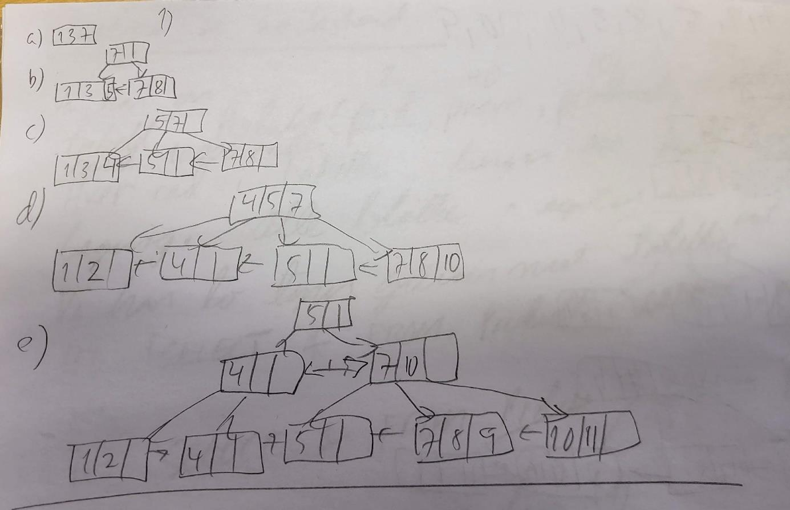
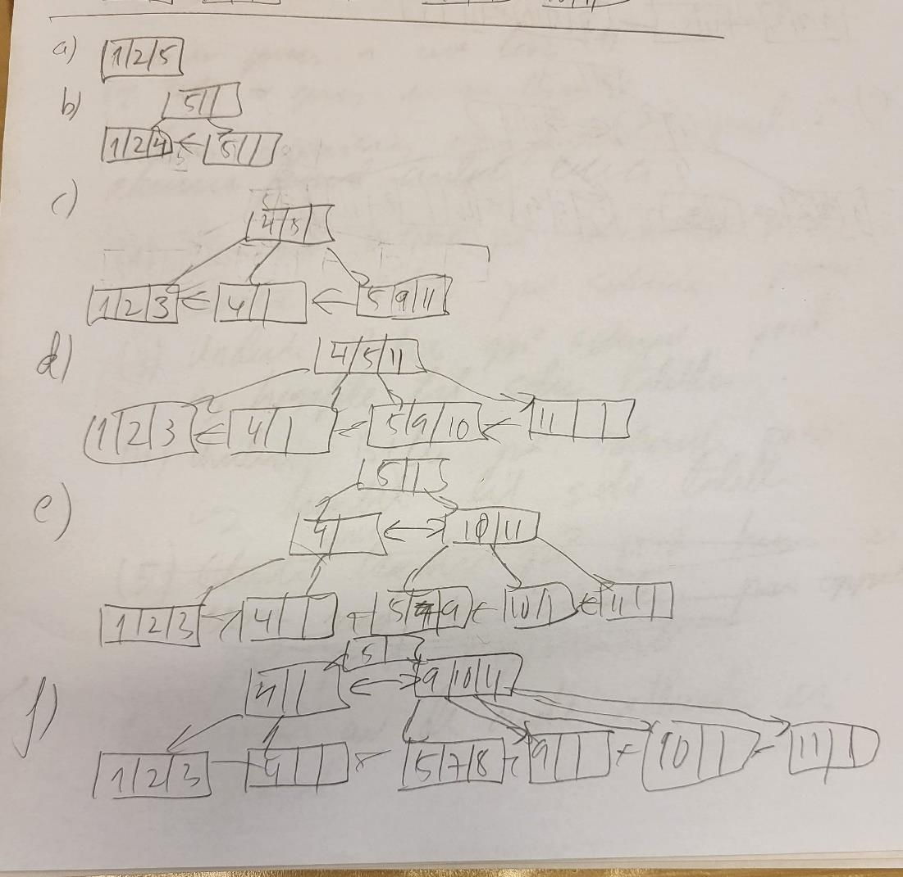
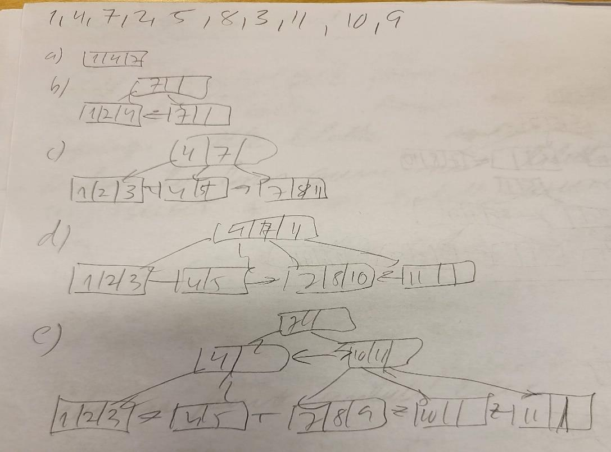
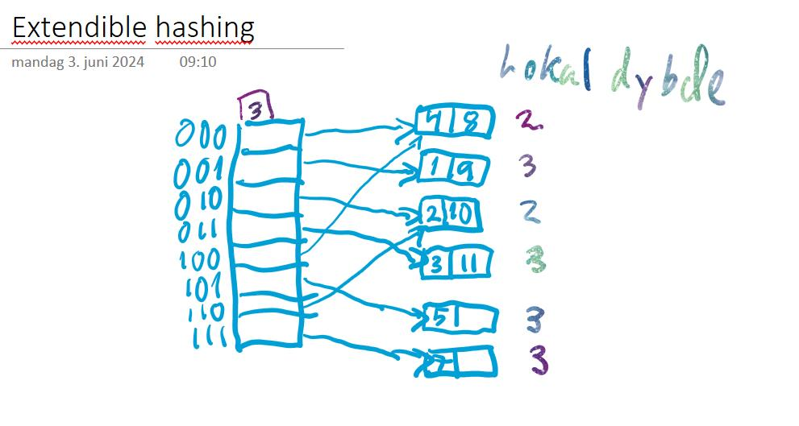
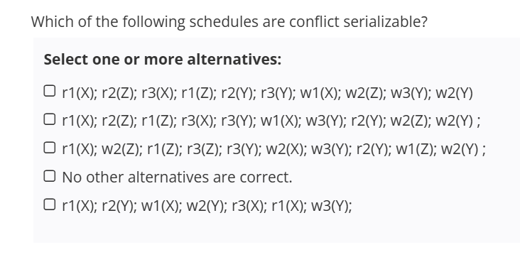
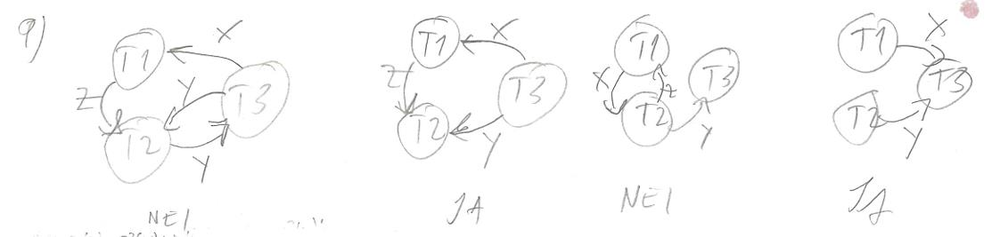
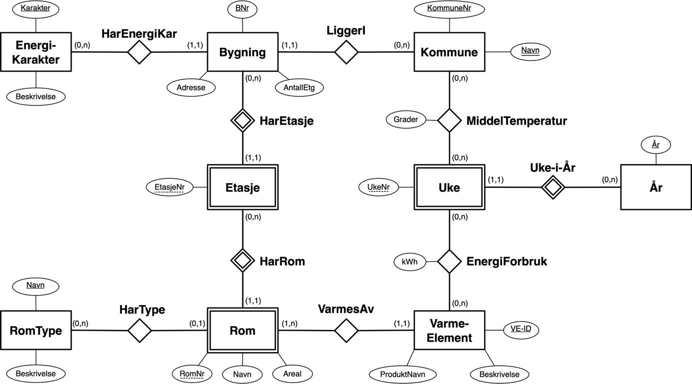

# TDT4145 - vår 2024: Sensurveiledning

**TDT4145 Datamodellering og databasesystemer**

Slutteksamen 2024: Sensurveiledning, versjon 5. juni 20024

Foreløpig utgave, med forbehold om feil.

Læringsutbyttebeskrivelse finnes på emnets nettside og pensum for slutteksamen er som beskrevet i emnets pensumliste. Læringsmateriell og oversikt over læringsaktiviteter finnes på emnets Blackboard-sider.

Oppgavene utgjør til sammen 100 poeng. For hver av de 15 tellende oppgavene er det oppgitt hvor mange poeng oppgaven teller med. For flervalgs-oppgavene gis plusspoeng for riktige svar og minuspoeng for gale svar, slik at ingen oppgave får mindre enn 0 poeng.

## Løsning til oppgavene

## 1. B+trees

**Poeng:** 10 poeng for riktig svar, 0 for uriktig svar.

```text
1, 3, 7, 8, 5, 4, 2, 10, 11, 9
```

Tilstander rett før hver splitt og slutt-tre for denne innsettingssekvensen (gir IKKE måltreet):

a) `[1|3|7]` (rotløvblokk full).

b) Splitt ved 8:

```text
            root → [ 7 | | ]
                  /        \
          [ 1 | 3 ] →     [ 7 | 8 | ]
```

c) Splitt ved 4 (løvblokk `[1|3|5]` splittes):

```text
            root → [ 5 | 7 | ]
                  /     |     \
          [ 1 | 3 | 4 ] → [ 5 | | ] → [ 7 | 8 | ]
```

d) Splitt ved 2 og fortsatt etter 10:

```text
            root → [ 4 | 5 | 7 ]
                  /    |    |    \
          [ 1 | 2 ] → [ 4 | | ] → [ 5 | | ] → [ 7 | 8 | 10 ]
```

e) Endelig (etter 11, 9 og rotsplitt):

```text
                       root → [ 5 | | ]
                              /        \
                       [ 4 | | ]        [ 7 | 10 | ]
                       /    \           /    |    \
              [1|2] → [4| ] → [5| ] → [7|8|9] → [10|11| ]
```

Dette treet har en intern node `[4| ]` med kun en separator og samsvarer ikke med oppgavens måltre.



```text
1, 2, 5, 4, 3, 11, 9, 10, 7, 8
```

Tilstander rett før hver splitt og slutt-tre for denne innsettingssekvensen (gir IKKE måltreet):

a) `[1|2|5]`.

b) Splitt ved 4:

```text
            root → [ 5 | | ]
                  /        \
          [ 1 | 2 | 4 ] → [ 5 | | ]
```

c) Splitt ved 3 (løvblokk `[1|2|3|4]` splittes):

```text
            root → [ 4 | 5 | ]
                  /    |     \
          [ 1 | 2 | 3 ] → [ 4 | | ] → [ 5 | 9 | 11 ]
```

d) Splitt ved 11 og 10 (gir mer fyll):

```text
            root → [ 4 | 5 | 11 ]
                  /    |    |    \
          [1|2|3] → [4| ] → [5|9|10] → [11| | ]
```

e) Splitt ved 7 (med rot-splitt):

```text
                       root → [ 5 | | ]
                              /        \
                       [ 4 | | ]        [ 10 | 11 | ]
                       /    \            /    |    \
              [1|2|3] → [4| ] → [5|7|9] → [10| ] → [11| ]
```

f) Endelig etter 8:

```text
                       root → [ 5 | | ]
                              /        \
                       [ 4 | | ]        [ 9 | 10 | 11 ]
                       /    \           /     |     |     \
              [1|2|3] → [4| ] → [5|7|8] → [9| ] → [10| ] → [11| ]
```

Treet har høyere venstreside med kun én post i `[4| ]`-noden — samsvarer ikke med måltreet.



```text
1, 4, 7, 2, 5, 8, 3, 11, 10, 9
```

**Riktig svar.**

Tilstander rett før hver splitt og slutt-tre — gir måltreet i oppgaven:

a) `[1|4|7]`.

b) Splitt ved 2:

```text
            root → [ 7 | | ]
                  /        \
          [ 1 | 2 | 4 ] → [ 7 | | ]
```

c) Splitt ved 5 (løvblokk `[1|2|4|5]` splittes):

```text
            root → [ 4 | 7 | ]
                  /    |     \
          [ 1 | 2 | 3 ] → [ 4 | 5 | ] → [ 7 | 8 | 11 ]
```

d) Splitt ved 11:

```text
            root → [ 4 | 7 | 11 ]
                  /    |    |    \
          [1|2|3] → [4|5| ] → [7|8|10] → [11| | ]
```

e) Endelig (etter 9):

```text
                       root → [ 7 | | ]
                              /        \
                       [ 4 | | ]        [ 10 | 11 | ]
                       /    \           /    |    \
              [1|2|3] → [4|5| ] → [7|8|9] → [10| ] → [11| ]
```

Dette samsvarer med måltreet i oppgaven og er derfor riktig svar.



## 2. Extendible hashing

**Poeng:** 5 poeng for riktig svar, 0 for uriktig svar.

**Svar:** 4.

Innsettingssekvens: `1, 2, 5, 4, 3, 11, 9, 10, 7, 8`. Hashfunksjon `h(K) = K MOD 8`. Hver blokk har plass til 2 nøkler. Sluttilstand med global dybde 3 (åtte directory-pekere `000`–`111`):

```text
directory  local depth   block content
  000  ─►  ld=2          { 8 }              (deles av 000 og 100)  [se merknad]
  001  ─►  ld=3          { 1, 9 }           (lokal dybde 3) ◄
  010  ─►  ld=2          { 2, 10 }          (deles av 010 og 110)
  011  ─►  ld=3          { 3, 11 }          (lokal dybde 3) ◄
  100  ─►  (samme som 000)
  101  ─►  ld=3          { 5 }              (lokal dybde 3) ◄
  110  ─►  (samme som 010)
  111  ─►  ld=3          { 7 }              (lokal dybde 3) ◄
```

Antall blokker med lokal dybde 3: 4.



## 3. 2PL - lock setting

**Poeng:** 5 poeng for riktig svar, 0 poeng for uriktig svar.

```text
T1                       T2                       T3
rl1(A)
r1(A)
                         wl2(B)
                         w2(B)
                                                  rl3(A)
                                                  r3(A)
trylock1(A)              rl2(C)
                         r2(C)
                         c2; unlock(B,C)
                                                  c3; unlock(A)
wl1(A);
W1(A);
c1; unlock(A)
```

**Svar:** `T2; T3; T1;`

## 4. SNAPSHOT ISOLATION

**Poeng:** 5 poeng for riktig svar, 0 for uriktig svar.

**Svar:** 10.

«Gamle transaksjoner» leser kopier av de gamle verdiene som blir endret undervegs av andre transaksjoner.

## 5. ARIES RECOVERY

**Poeng:** 1 poeng per riktig svar, -1 poeng per uriktig svar.

**Svar:** `(B,102)`, `(C,104)`, `(E,109)`, `(F,110)`.

## 6. ARIES RECOVERY

**Poeng:** 2 poeng per riktig svar, -1 poeng for uriktig svar.

**Svar:**

- `(112, PrevLSN=110, T3, CLR of 110, PageID=F)`
- `(113, PrevLSN=112, T3, Abort)`

## 7. ARIES RECOVERY

**Poeng:** 3 poeng per riktig svar, -2 poeng for per uriktig svar.

**Svar:** A, D.

Pages som ikke var i DPT, men som var referert i loggen før Ckpt-loggposten.

## 8. Clustered og unclustered B+trær

**Poeng:** 15 poeng for rett svar, 0 poeng for uriktig svar.

Oppgave hvor du kombinerer to forskjellige queries, og kun ett av attributtene i WHERE-betingelsene er indeksert. Det var en liten skrivefeil i oppgaven for et av queries, hvor det stod WHER i stedet for WHERE.

```text
Product(prId, pName, producer, model)
```

`prId` - 8 byte, `pName` - 40 byte, `producer` - 40 byte, `model` - 32 byte. Total 120 byte per record. 10000 rader i tabellen og hver blokk er 4096 byte.

### Clustered B+-tre på prId

Må regne ut antall blokker og høyde.

- 22 poster per blokk løvnivå. Post 120 byte. `Floor((4096*2/3)/120)`
- 170 poster per blokk level>0. Post `8+8 byte = 16 byte`. `Floor((4096*2/3)/16)`
- 455 blokker level 0 (440 blokker hvis du regner 2/3 fyllgrad av hele datamengden)
- 3 blokker level 1
- 1 blokk level 2

```text
0,7*3 + 0,3*(2 + ceiling(0,5*455)) = 71,1
```

0,5 pga gjennomsnittlig lese halve løvnivå (unik verdi).

### Clustered B+-tre på pName

- 22 poster per blokk løvnivå
- 56 poster per blokk level>0. Post `40+8 byte = 48 byte`. `Floor((4096*2/3)/48)`
- 455 blokker level 0 (440 hvis du regner 2/3 fyllgrad av hele datamengden)
- 9 blokker level 1
- 1 blokk level 2

```text
0,7*(2 + ceiling(0,5*455)) + 0,3*3 = 161,9
```

0,5 pga gjennomsnittlig lese halve løvnivå (unik verdi).

### Unclustered B+-tre på prId med heapfil

Beste løsning slik problemet er formulert.

Heapfil:

- 34 poster per blokk
- 295 blokker totalt

B+-tre:

- Post level 0 = `8 + 12 byte (RecordId) = 20 byte`
- 136 poster per blokk
- 74 blokker level 0 (74 hvis du regner 2/3 fyllgrad på hele datamengden)
- Post level>0: `8 + 8 byte (BlockId) = 16 byte`
- 1 blokk level 1

```text
0,7*3 (B+-tre + heap) + 0,3*ceiling(0,5*295) = 46,5
```

0,5 pga gjennomsnittlig lese halve heapfil.

### Unclusterd B+-tre på pName med heapfil

Samme heapfil som i forrige.

B+-tre:

- Post = `40 + 12 byte (RecordId) = 52 byte`
- 52 poster per blokk level 0
- 193 blokker level 0 (191 blokker hvis du regner 2/3 fyllgrad på hele datamengden)
- Post level>0 `40 + 8 byte = 48 byte`
- 56 poster per blokk level > 0
- 4 blokker level 1
- 1 blokk level 2

```text
0,7*ceiling(0,5*295) + 0,3*4 = 104,8
```

0,5 pga gjennomsnittlig lese halve heapfil.

## 9. Conflict serializability

**Poeng:** 3 poeng per riktig svar, -3 poeng per uriktig svar.

Sensurfasitens markering av alternativene:

| Alternativ | Schedule | Markering |
| --- | --- | --- |
| A | `r1(X); r2(Z); r3(X); r1(Z); r2(Y); r3(Y); w1(X); w2(Z); w3(Y); w2(Y)` | Ikke markert |
| B | `r1(X); r2(Z); r1(Z); r3(X); r3(Y); w1(X); w3(Y); r2(Y); w2(Z); w2(Y) ;` | **Markert (konfliktserialiserbar)** |
| C | `r1(X); w2(Z); r1(Z); r3(Z); r3(Y); w2(X); w3(Y); r2(Y); w1(Z); w2(Y) ;` | Ikke markert |
| D | No other alternatives are correct. | Ikke markert |
| E | `r1(X); r2(Y); w1(X); w2(Y); r3(X); r1(X); w3(Y);` | **Markert (konfliktserialiserbar)** |



Konfliktgrafer for hvert alternativ (noder T1, T2, T3; kanter merket med dataelement):

- **Graf A** for `r1(X); r2(Z); r3(X); r1(Z); r2(Y); r3(Y); w1(X); w2(Z); w3(Y); w2(Y)`:
  Kanter: T3→T1 (X, rw fra r3(X) før w1(X)); T1→T2 (Z, rw fra r1(Z) før w2(Z)); T2→T3 (Y, rw fra r2(Y) før w3(Y)); T3→T2 (Y, rw fra r3(Y) før w2(Y); ww fra w3(Y) før w2(Y)).
  Sykluser: T1→T2→T3→T1, og T2↔T3 (Y). **NEI** — ikke konfliktserialiserbar.
- **Graf B** for `r1(X); r2(Z); r1(Z); r3(X); r3(Y); w1(X); w3(Y); r2(Y); w2(Z); w2(Y)`:
  Kanter: T3→T1 (X, rw fra r3(X) før w1(X)); T1→T2 (Z, rw fra r1(Z) før w2(Z)); T3→T2 (Y, wr fra w3(Y) før r2(Y); ww fra w3(Y) før w2(Y)).
  T2 har bare innkommende kanter; ingen syklus. **JA** — konfliktserialiserbar.
- **Graf C** for `r1(X); w2(Z); r1(Z); r3(Z); r3(Y); w2(X); w3(Y); r2(Y); w1(Z); w2(Y)`:
  Kanter: T1→T2 (X, rw fra r1(X) før w2(X)); T2→T1 (Z, wr fra w2(Z) før r1(Z); ww fra w2(Z) før w1(Z)); T2→T3 (Z, wr fra w2(Z) før r3(Z)); T3→T1 (Z, rw fra r3(Z) før w1(Z)); T3→T2 (Y, rw fra r3(Y) før w2(Y); wr fra w3(Y) før r2(Y); ww fra w3(Y) før w2(Y)).
  Sykluser: T1↔T2 (X og Z) og T2↔T3 (Z og Y). **NEI** — ikke konfliktserialiserbar.
- **Graf E** for `r1(X); r2(Y); w1(X); w2(Y); r3(X); r1(X); w3(Y);`:
  Kanter: T1→T3 (X, wr fra w1(X) før r3(X)); T2→T3 (Y, ww fra w2(Y) før w3(Y); rw fra r2(Y) før w3(Y)).
  T3 har bare innkommende kanter; ingen syklus. **JA** — konfliktserialiserbar.

(Sensors håndtegnede grafer markerer A og C med «NEI», B og E med «JA».)



## 10. Relational Algebra

**Poeng:** 2 poeng per riktig svar, -2 poeng per uriktig svar.

**Svar:** A, B, E.

## 11. SQL

**Poeng:** 2,5 poeng for riktig svar, -2,5 poeng for uriktig svar.

**Svar:** B, D.

## 12. Functional Dependencies

**Poeng:** 1,5 poeng for riktig svar, -1,5 poeng for uriktig svar.

**Svar:** X=1, Y<>1.

## 13. Normal Forms

**Poeng:** 4 poeng for riktig svar.

**Svar:** 3NF.

## 14. Normalization

**Poeng:** 1,33 poeng for riktig svar, -1,33 poeng for uriktig svar.

**Svar:** Attribute preservation, FD preservation, BCNF.

## 15. Data Modeling

Under er det vist et utkast til datamodell. Det skal legges vekt på at de ulike modell-virkemidlene brukes på riktig måte. God (overordnet) «struktur» i datamodellen tillegges større vekt enn mer ubetydelige feil og mangler. Det finnes en del alternative modelleringsvalg og alternative forutsetninger som kan være like riktige som de som er vist i løsningsskissen.

Dersom det gjøres hensiktsmessige forutsetninger, skal disse legges til grunn ved vurderingen av løsningen.

- I modellen vår har vi lagt til grunn at man kan registrere bygninger uten at etasjeplanen er klar og at etasjer kan registreres uten rom. Vi har antatt at rom kan finnes uten romtype. Det er like riktig å velge (1,1)-restriksjoner for disse.
- AntallEtg kan alternativt modelleres som et avledet attributt, siden man kan finne antall etasjer gjennom å telle HarEtasje-relasjoner.
- Vi har markert at Navn er en alternativ nøkkel for Kommune-entitetsklassen ved å bruke dobbel understreking. Dette har ikke vært vist i eksempler i løpet av emnet så vi kan ikke forvente at studentene gjør det samme. Enkel understreking eller tekstlig forklaring godtas som en fullgod løsning.

Forslag på ER-modell:

**Entities:**

- `Bygning` — attributter: `BNr` (PK), `Adresse`, `AntallEtg` (kan også modelleres som avledet attributt)
- `Kommune` — attributter: `KommuneNr` (PK), `Navn` (alternativ nøkkel, dobbel understreking)
- `EnergiKarakter` — attributter: `Karakter` (PK), `Beskrivelse`
- `Etasje` — svak entitet identifisert av Bygning via `HarEtasje`. Attributter: `EtasjeNr` (delvis nøkkel)
- `Rom` — svak entitet identifisert av Etasje via `HarRom`. Attributter: `RomNr` (delvis nøkkel), `Navn`, `Areal`
- `RomType` — attributter: `Navn` (PK), `Beskrivelse`
- `Varme-Element` — attributter: `VE-ID` (PK), `ProduktNavn`, `Beskrivelse`
- `Uke` — svak entitet identifisert av År via `Uke-i-År`. Attributter: `UkeNr` (delvis nøkkel)
- `År` — attributter: `År` (PK)

**Relationships:**

- `HarEnergiKar` mellom `EnergiKarakter` og `Bygning`. Kardinalitet: EnergiKarakter (0,n) — Bygning (1,1).
- `LiggerI` mellom `Bygning` og `Kommune`. Kardinalitet: Bygning (1,1) — Kommune (0,n).
- `HarEtasje` mellom `Bygning` og `Etasje`. Kardinalitet: Bygning (0,n) — Etasje (1,1) (identifiserende).
- `HarRom` mellom `Etasje` og `Rom`. Kardinalitet: Etasje (0,n) — Rom (1,1) (identifiserende).
- `HarType` mellom `RomType` og `Rom`. Kardinalitet: RomType (0,n) — Rom (0,1).
- `VarmesAv` mellom `Rom` og `Varme-Element`. Kardinalitet: Rom (1,n) — Varme-Element (1,1).
- `EnergiForbruk` mellom `Varme-Element` og `Uke`, med attributt `kWh`. Kardinalitet: Varme-Element (0,n) — Uke (0,n).
- `MiddelTemperatur` mellom `Kommune` og `Uke`, med attributt `Grader`. Kardinalitet: Kommune (0,n) — Uke (0,n).
- `Uke-i-År` mellom `Uke` og `År`. Kardinalitet: Uke (1,1) — År (0,n) (identifiserende for svak entitet Uke).



## Terskelverdier for karakterer

Tar utgangspunkt i de veiledende terskelverdiene og vil bli justert ut fra studentprestasjonene før sensuren avsluttes:

- A: minst 89 poeng
- B: minst 77 poeng
- C: minst 65 poeng
- D: minst 53 poeng
- E: minst 41 poeng

## Bruk av kommentaroppgaven

Oppgave 16 som teller 0 poeng, er en mulighet for studenten til å forklare sine antakelser og andre aspekter ved egen besvarelse. Automatisk utregnet poenguttelling for en oppgave justeres manuelt dersom innholdet i kommentaroppgaven tilsier at det gir en riktigere vurdering av studentens svar.
