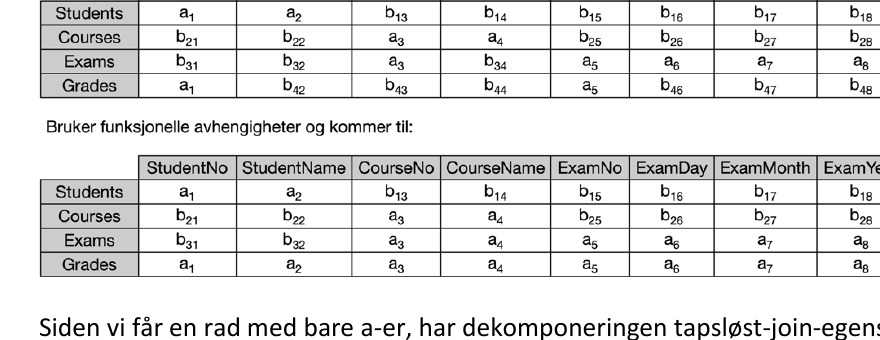
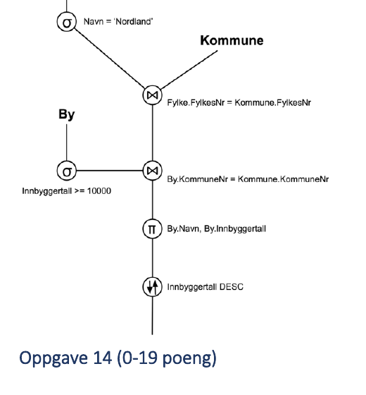
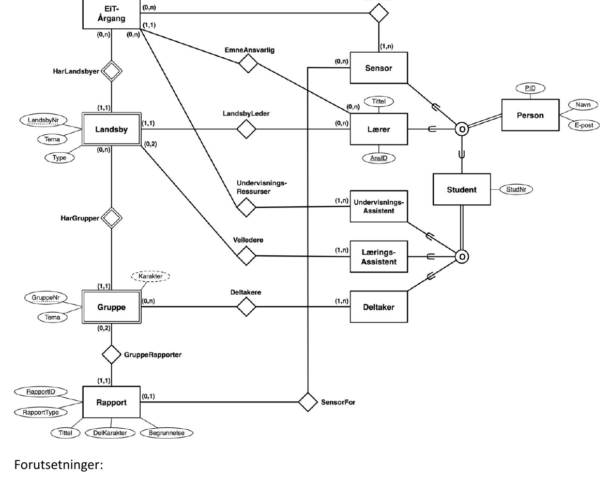

# TDT4145 - vår 2025: Sensurveiledning

**TDT4145 Datamodellering og databasesystemer**

Læringsutbyttebeskrivelse finnes på emnets nettside og pensum for midtsemesterprøven er som beskrevet i emnets pensumliste. Læringsmateriell og oversikt over læringsaktiviteter finnes på emnets Blackboard-sider.

Oppgavene utgjør til sammen 100 poeng. For hver av de 14 tellende oppgavene er omfanget i poeng oppgitt. På flervalgsoppgaver gis det plusspoeng for riktige svar og minuspoeng for gale svar, men slik at ingen oppgave får mindre enn 0 poeng.

## Løsning til oppgavene

_Med forbehold om feil._

## 1. B+-trees

**Poeng:** 5 poeng for riktig svar, 0 poeng for uriktig svar.

**Svar:** 919.

Metoden er beskrevet i pensum. Regner ut for en blokk først. `4096 * 2 / 3 = 2730.67`. Deler på poststørrelsen 120. Får da 22 poster per blokk. Regner ut hvor mange blokker man trenger. `20200 / 22 = 918.18`. Avrunder alltid oppover her. Får da 919 blokker.

## 2. B+-trees

**Poeng:** 5 poeng per riktig svar, 0 poeng for uriktig svar.

**Svar:** 5.

Hver post er her `4 + 8 byte = 12 byte` (kjent via SQL dictionary). `2730.67 / 12 = 227` poster per blokk. `919 / 227` gir 4.0485 blokker, som blir avrundet oppover til 5.

## 3. Access paths

**Poeng:** 5 poeng for riktig svar, 0 poeng for uriktig svar.

**Svar:** 3.

Her søker vi oss rett ned det clusterede B+-treet.

## 4. Access paths

**Poeng:** 5 poeng for riktig svar, 0 poeng for uriktig svar.

**Svar:** 6.

Her søker vi oss først ned i det unclustered B+-treet, som gir 3 blokker. Så finner vi nøkkelen til Johannesen-posten. Må da søke oss ned det clusterede B+-treet. 3 blokker. Til sammen gir det 6 blokker. Det er et poeng at det kun er en Johannesen i databasen. Ellers ville vi fått `Antall Johannesen * 3` for å søke i det clustered B+-treet.

## 5. Access paths

**Poeng:** 5 poeng for riktig svar, 0 poeng for uriktig svar.

**Svar:** 502.

Index only query. Leser oss ned og bakover det unclusterede B+-treet. 2 ned og 500 bakover. Trenger ikke lese den bakerste level-0-blokka både nedover og bortover.

## 6. Konfliktserialiserbare historier

**Poeng:** 3 per riktig svar, -2 poeng per uriktig svar.

**Svar:** To stk. konfliktserialiserbare:

- `r2(A); r1(B); w2(A); r3(A); w1(B); w3(A); r2(B); w2(B);`
- `r1(B); w3(A); r3(B); w2(A); r1(A);`

## 7. ARIES

**Poeng:** 2 poeng for riktig svar, -2 poeng per uriktig svar.

**Svar:** `(A, recLSN=102)`, `(B, recLSN=103)`, `(D, recLSN=109)`, `(E, recLSN=110)`.

C vil ikke være med da den ikke finnes i sjekkpunktet.

## 8. ARIES

**Poeng:** 4 poeng for riktig svar, -2 poeng per uriktig svar.

**Svar:** A og B.

Dette fortelles av DPT i sjekkpunktloggposten. I og med at vi vet at `(A, LSN=101)` finnes i loggen og ikke i sjekkpunktet, vet vi at denne er skrevet til disk. Det samme kan vi si om `(B, LSN=103)`. Altså disse to vet vi med sikkerhet at ble skrevet ut før krasjet.

Vi har valgt å gi full score til de som kun svare med B. Dette fordi det er skjedd oppdateringer til A etter at den ble skrevet, og noen studenter mener dette: Men spørsmålet i oppgaven er "Ut i fra dette og loggen over, hvilke datablokker (Pages) kan vi med sikkerhet si ble skrevet ut før krasjen?", og svaret på dette er dermed både ja og nei til om vi kan si med sikkerhet at A er skrevet ut: Ja, oppdateringen i LSN 101 av A er skrevet til disk. Og nei, oppdateringen i LSN 102 av A kan vi ikke vite med sikkerhet er skrevet til disk fordi den er i DPT i sjekkpunktloggen.

Hadde det derimot vært svaralternativer som tillot å presisere dette, så hadde saken vært en annen. Men det blir feil å ha ja/nei-svaralternativer til et spørsmål som ikke kan besvares med ja/nei.

Vår mening er derimot at: Noen studenter mener at loggposten med LSN=102 sier at A ikke ble skrevet til disk, men dette er ikke rett, da vi vet A ble skrevet til disk med PageLSN=101. I og med at ARIES har en helt uavhengig dataskriving i forhold til loggskriving og sjekkpunkting, vet vi ikke noe annet enn det som står i DPT. Denne oppgaven tester om studentene har forstått betydningen av informasjonen i DPT. Det å tenke på dataskriving som en del av commitprosessering er en vanlig misforståelse blant studenter. I prinsippet kan alle datasidene her (A, B, C, D og E) være skrevet til disk, men de eneste vi kan si noe sikkert om er A og B. Men som sagt vi har tatt hensyn til at noen studenter ikke forstod hva vi spurte om. Mange studenter hadde forstått spørsmålet og svart riktig her.

## 9. Lock setting

**Poeng:** 7 poeng per riktig svar, 0 poeng for uriktig svar.

**Svar:** `w3(X); r2(Y); r3(Y); r2(X); r1(X);`

## 10. Lock setting

**Poeng:** 7 poeng per riktig svar, 0 poeng for uriktig svar.

**Svar:** `T3; T2; T1`

## 11. BCNF

**Poeng:** 4 poeng for riktig svar, 0 poeng for uriktig svar.

## Oppgave 12 (0-8 poeng)

```text
Students(StudentNo, StudentName)

Courses(CourseNo, CourseName)

Exams(ExamNo, CourseNo, ExamDay, ExamMonth, ExamYear)
-- CourseNo er fremmednøkkel mot Courses-tabellen

Grades(StudentNo, ExamNo, Grade)
-- StudentNo er fremmednøkkel mot StudentsTabellen
-- ExamNo er fremmednøkkel mot ExamsTabellen
```

- Attributtbevaring fordi alle attributter i Exam er med i minst en av deltabellene.
- Bevaring av funksjonelle avhengigheter fordi alle avhengighetene i F er ivaretatt gjennom primærnøklene i deltabellene.
- Tapsløst join fordi:

  a. Vi kan finne en måte å joine deltabellene sammen til exam-tabellen (utgangspunktet), slik at de felles attributtene til operand-tabellene i hver join er en supernøkkel i minst en av operandtabellene. For eksempel:

  ```text
  ((Grades join Exams) join Courses) join Students
  ```

  b. Vi kan vise det med tabellmetoden:

  Utgangspunkt:

  |          | StudentNo | StudentName | CourseNo | CourseName | ExamNo | ExamDay | ExamMonth | ExamYear | Grade |
  | -------- | --------- | ----------- | -------- | ---------- | ------ | ------- | --------- | -------- | ----- |
  | Students | a1        | a2          | b13      | b14        | b15    | b16     | b17       | b18      | b19   |
  | Courses  | b21       | b22         | a3       | a4         | b25    | b26     | b27       | b28      | b29   |
  | Exams    | b31       | b32         | a3       | b34        | a5     | a6      | a7        | a8       | b39   |
  | Grades   | a1        | b42         | b43      | b44        | a5     | b46     | b47       | b48      | a9    |

  Bruker funksjonelle avhengigheter og kommer til:

  |          | StudentNo | StudentName | CourseNo | CourseName | ExamNo | ExamDay | ExamMonth | ExamYear | Grade |
  | -------- | --------- | ----------- | -------- | ---------- | ------ | ------- | --------- | -------- | ----- |
  | Students | a1        | a2          | b13      | b14        | b15    | b16     | b17       | b18      | b19   |
  | Courses  | b21       | b22         | a3       | a4         | b25    | b26     | b27       | b28      | b29   |
  | Exams    | b31       | b32         | a3       | a4         | a5     | a6      | a7        | a8       | b39   |
  | Grades   | a1        | a2          | a3       | a4         | a5     | a6      | a7        | a8       | a9    |



Siden vi får en rad med bare a-er, har dekomponeringen tapsløst-join-egenskapen.

Det er fullt ut tilstrekkelig å vise det med en av metodene.

- BCNF fordi alle _ikke-trivielle_ funksjonelle avhengigheter har primærnøkkelen i tabellen som en delmengde av «venstreside-attributtene» (primærnøkkelen er per definisjon en supernøkkel).

## Oppgave 13 (0-8 poeng)

Relasjonsalgebra-tre (lest nedenfra og opp – grunnlag for spørringen er By, Kommune og Fylke):

```text
              τ Innbyggertall DESC
                       |
              π By.Navn, By.Innbyggertall
                       |
              ⋈ By.KommuneNr = Kommune.KommuneNr
              /                                \
   σ Innbyggertall >= 10000           ⋈ Fylke.FylkesNr = Kommune.FylkesNr
              |                          /                              \
             By                    σ Navn = 'Nordland'              Kommune
                                          |
                                        Fylke
```

Treet selekterer først Fylke der `Navn = 'Nordland'`, joiner med Kommune på `Fylke.FylkesNr = Kommune.FylkesNr`, deretter joines resultatet med By (filtrert på `Innbyggertall >= 10000`) på `By.KommuneNr = Kommune.KommuneNr`, før det projiseres på `By.Navn, By.Innbyggertall` og sorteres synkende på `Innbyggertall`.



## Oppgave 14 (0-19 poeng)

**Entiteter:**

- `EiT-Årgang` med attributter: År (PK)
- `Landsby` (svak entitet, identifiseres med EiT-Årgang) med attributter: LandsbyNr (delvis nøkkel), Tema, Type
- `Gruppe` (svak entitet, identifiseres med Landsby) med attributter: GruppeNr (delvis nøkkel), Tema
- `Rapport` med attributter: RapportID (PK), RapportType, Tittel, DelKarakter, Begrunnelse
- `Person` med attributter: PID (PK), Navn, E-post
- `Sensor` (sub-klasse av Person)
- `Lærer` (sub-klasse av Person) med ekstra attributter: Tittel, AnsID
- `Student` (sub-klasse av Person) med ekstra attributt: StudNr
- `Undervisnings-Assistent` (sub-klasse av Student)
- `Lærings-Assistent` (sub-klasse av Student)
- `Deltaker` (sub-klasse av Student)

**ISA/spesialisering:**

- Person har en spesialisering med disjunkte sub-klasser Sensor, Lærer og Student (delvis dekning).
- Student har en spesialisering med overlappende sub-klasser Undervisnings-Assistent, Lærings-Assistent og Deltaker (delvis dekning).

**Relasjoner:**

- `HarLandsbyer` (binær mellom EiT-Årgang og Landsby): EiT-Årgang-siden (0,n), Landsby-siden (1,1) (svak relasjon)
- `HarGrupper` (binær mellom Landsby og Gruppe): Landsby-siden (0,n), Gruppe-siden (1,1) (svak relasjon)
- `EmneAnsvarlig` (binær mellom EiT-Årgang og Lærer): EiT-Årgang-siden (1,1), Lærer-siden (0,n)
- `Sensorer` (binær mellom EiT-Årgang og Sensor): EiT-Årgang-siden (1,n), Sensor-siden (0,n)
- `LandsbyLeder` (binær mellom Landsby og Lærer): Landsby-siden (1,1), Lærer-siden (0,n)
- `Undervisnings-Ressurser` (binær mellom Landsby og Undervisnings-Assistent): Landsby-siden (1,n), Undervisnings-Assistent-siden (0,n)
- `Veiledere` (binær mellom Landsby og Lærings-Assistent): Landsby-siden (1,n), Lærings-Assistent-siden (0,2)
- `Deltakere` (binær mellom Gruppe og Deltaker): Gruppe-siden (1,n), Deltaker-siden (0,2)
- `GruppeRapporter` (binær mellom Gruppe og Rapport): Gruppe-siden (1,1), Rapport-siden – med derivert/avledet attributt Karakter
- `SensorFor` (binær mellom Sensor og Rapport): Rapport-siden (0,1), Sensor-siden (0,n)



Forutsetninger:

- Vi registrerer bare personer som har minst en rolle i EiT.
- Vi registrerer bare studenter som har minst en studentrolle i EiT.
- En student kan være deltaker i flere grupper så lenge gruppene tilhører ulike EiT-årganger.
- Studentdeltakerne i en landsby registreres gjennom at studentene registreres som deltaker i en av landsbyens grupper.
- Rapporter kan registreres uten at det samtidig registreres hvem som skal være sensor for rapporten.

Restriksjoner som _ikke_ uttrykkes gjennom diagrammet:

- Gruppe-tema må være innenfor landsbyens overordnede tema.
- Innenfor en EiT-årgang er studentrollene gjensidig utelukkende.
- En student kan bare være deltaker i en studentgruppe per EiT-årgang.
- En student kan bare være læringsassistent for en landsby per EiT-årgang.
- En rapport kan ikke få Delkarakter eller Begrunnelse uten at det er registrert en sensor for rapporten.
- Innenfor en EiT-årgang er rollene sensor, lærer og student gjensidig utelukkende.

## Terskelverdier for karakterer

- A: minst 89 poeng
- B: minst 77 poeng
- C: minst 65 poeng
- D: minst 53 poeng
- E: minst 36 poeng

## Bruk av kommentaroppgaven

Oppgave 15 som teller 0 poeng, er en mulighet for studenten til å forklare sine antakelser og andre aspekter ved egen besvarelse. Automatisk utregnet poenguttelling for en oppgave justeres manuelt dersom innholdet i kommentaroppgaven tilsier at det gir en riktigere vurdering av studentens svar.
